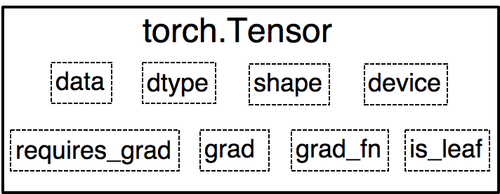

# PyTorch 学习笔记

> [参考书籍](https://tingsongyu.github.io/PyTorch-Tutorial-2nd/chapter-1/1.6-JupyterNotebook-install.html) | [参考仓库](https://github.com/TingsongYu/PyTorch-Tutorial-2nd) | [官方文档](https://docs.pytorch.org/docs/stable/torch.html)

---

## 第一章：环境配置

本章介绍 PyTorch 的安装和环境配置，包括如何检查和使用不同的计算设备（CPU、CUDA、MPS）。

### 1.1 安装 PyTorch

#### 1.1.1 选择合适的版本

访问 PyTorch 官网：https://pytorch.org/get-started/locally/

根据您的系统选择：

- **操作系统**：Linux / Mac / Windows
- **包管理器**：Conda（推荐）/ Pip
- **Python 版本**：推荐 3.8-3.11
- **计算平台**：CPU / CUDA（NVIDIA GPU）

#### 1.1.2 安装步骤

**方式1：使用 Conda（推荐）**

```bash
# 创建虚拟环境
conda create -n ml python=3.11

# 激活环境
conda activate ml

# CPU 版本
conda install pytorch torchvision torchaudio cpuonly -c pytorch

# GPU 版本（CUDA 11.8）
conda install pytorch torchvision torchaudio pytorch-cuda=11.8 -c pytorch -c nvidia

# GPU 版本（CUDA 12.1）
conda install pytorch torchvision torchaudio pytorch-cuda=12.1 -c pytorch -c nvidia

# Mac (Apple Silicon) - 支持 MPS 加速
pip3 install torch torchvision
```

**方式2：使用 Pip**

```bash
# CPU 版本
pip3 install torch torchvision torchaudio

# GPU 版本（CUDA 11.8）
pip3 install torch torchvision torchaudio --index-url https://download.pytorch.org/whl/cu118

# GPU 版本（CUDA 12.1）
pip3 install torch torchvision torchaudio --index-url https://download.pytorch.org/whl/cu121
```

**安装 Jupyter（可选）**

```bash
pip install jupyter
python -m ipykernel install --user --name ml
```

#### 1.1.3 验证安装

```python
import torch

print(f"PyTorch 版本: {torch.__version__}")
print(f"CUDA 可用: {torch.cuda.is_available()}")

if torch.cuda.is_available():
    print(f"CUDA 版本: {torch.version.cuda}")
    print(f"GPU 数量: {torch.cuda.device_count()}")
    print(f"GPU 名称: {torch.cuda.get_device_name(0)}")

# Mac Apple Silicon
if hasattr(torch.backends, 'mps'):
    print(f"MPS 可用: {torch.backends.mps.is_available()}")
```

#### 1.1.4 常见问题

**Q1: 如何查看我的 CUDA 版本？**

```bash
# 查看驱动支持的最高 CUDA 版本
nvidia-smi

# 查看已安装的 CUDA toolkit 版本
nvcc --version
```

**Q2: 安装后 import torch 报错？**

```bash
# 卸载后重新安装
pip uninstall torch torchvision torchaudio
pip install torch torchvision torchaudio
```

**Q3: 如何在 Jupyter 中使用虚拟环境？**

```bash
# 安装 ipykernel
pip install ipykernel

# 将环境添加到 Jupyter
python -m ipykernel install --user --name=ml --display-name="Python (ml)"

# 启动 Jupyter
jupyter notebook
# 然后在 Kernel 菜单中选择 "Python (ml)"
```

### 1.2 检查可用设备

在不同平台上，PyTorch 支持的设备不同：

- **Windows/Linux**: 通常使用 CUDA (NVIDIA GPU) 或 CPU
- **Mac (Apple Silicon)**: 使用 MPS (Metal Performance Shaders) 或 CPU
- **Mac (Intel)**: 仅支持 CPU

#### 设备检查 API 对照表

| 设备类型       | 检查方法                              | 参数说明                          | 返回值                                      | 用法示例                                                               |
| -------------- | ------------------------------------- | --------------------------------- | ------------------------------------------- | ---------------------------------------------------------------------- |
| **CPU**  | 无需检查                              | -                                 | 始终可用                                    | `device = torch.device("cpu")`                                       |
| **CUDA** | `torch.cuda.is_available()`         | 无参数                            | `bool`: True 表示 CUDA 可用               | `if torch.cuda.is_available(): device = torch.device("cuda")`        |
| **CUDA** | `torch.cuda.device_count()`         | 无参数                            | `int`: 返回可用 GPU 数量                  | `print(f"GPU 数量: {torch.cuda.device_count()}")`                    |
| **CUDA** | `torch.cuda.get_device_name(index)` | `index (int)`: GPU 索引，默认 0 | `str`: GPU 名称                           | `print(f"GPU 名称: {torch.cuda.get_device_name(0)}")`                |
| **MPS**  | `torch.backends.mps.is_available()` | 无参数                            | `bool`: True 表示 MPS 可用                | `if torch.backends.mps.is_available(): device = torch.device("mps")` |
| **MPS**  | `torch.backends.mps.is_built()`     | 无参数                            | `bool`: True 表示 PyTorch 已构建 MPS 支持 | `print(f"MPS 已构建: {torch.backends.mps.is_built()}")`              |

#### 通用设备检查代码

```python
import torch

def get_device():
    """
    自动检测并返回最佳可用设备
  
    Returns:
        torch.device: 可用的设备对象
    """
    if torch.backends.mps.is_available() if hasattr(torch.backends, 'mps') else False:
        return torch.device("mps")
    elif torch.cuda.is_available():
        return torch.device("cuda")
    else:
        return torch.device("cpu")

# 使用示例
device = get_device()
print(f"使用设备: {device}")
```

#### 完整设备信息检查代码

```python
import torch

print("=" * 60)
print("PyTorch 设备检查")
print("=" * 60)
print(f"PyTorch 版本: {torch.__version__}")

# CPU 信息
print(f"\n【CPU】")
print(f"  可用: True (始终可用)")
print(f"  设备: {torch.device('cpu')}")

# CUDA 信息
print(f"\n【CUDA】")
print(f"  可用: {torch.cuda.is_available()}")
if torch.cuda.is_available():
    print(f"  GPU 数量: {torch.cuda.device_count()}")
    for i in range(torch.cuda.device_count()):
        print(f"  GPU {i}: {torch.cuda.get_device_name(i)}")
    print(f"  当前设备: cuda:{torch.cuda.current_device()}")

# MPS 信息 (Mac Apple Silicon)
print(f"\n【MPS】")
mps_available = torch.backends.mps.is_available() if hasattr(torch.backends, 'mps') else False
mps_built = torch.backends.mps.is_built() if hasattr(torch.backends, 'mps') else False
print(f"  可用: {mps_available}")
print(f"  已构建: {mps_built}")
if mps_available:
    print(f"  设备: {torch.device('mps')}")

# 推荐设备
print(f"\n【推荐设备】")
if mps_available:
    recommended = torch.device("mps")
    print(f"  {recommended} (Apple Silicon GPU)")
elif torch.cuda.is_available():
    recommended = torch.device("cuda")
    print(f"  {recommended} (NVIDIA GPU)")
else:
    recommended = torch.device("cpu")
    print(f"  {recommended} (CPU)")

print("=" * 60)
```

#### 使用设备创建和移动 Tensor

| 操作                      | 方法                                  | 参数说明                     | 用法示例                                                 |
| ------------------------- | ------------------------------------- | ---------------------------- | -------------------------------------------------------- |
| **创建时指定设备**  | `torch.tensor(data, device=device)` | `device`: 设备对象或字符串 | `t = torch.tensor([1, 2, 3], device="mps")`            |
| **创建时指定设备**  | `torch.zeros(size, device=device)`  | `device`: 设备对象或字符串 | `t = torch.zeros(3, 3, device=device)`                 |
| **移动现有 Tensor** | `tensor.to(device)`                 | `device`: 设备对象或字符串 | `t = t.to("mps")` 或 `t = t.to(torch.device("mps"))` |
| **移动现有 Tensor** | `tensor.cuda()`                     | 无参数                       | `t = t.cuda()` (移动到默认 CUDA 设备)                  |
| **移动现有 Tensor** | `tensor.cpu()`                      | 无参数                       | `t = t.cpu()` (移动到 CPU)                             |
| **移动现有 Tensor** | `t = t.to('mps')`                   | 无参数                       | `t = t.to('mps')` (移动到 MPS 设备，仅 Mac)            |
| **查看设备**        | `tensor.device`                     | 属性，非方法                 | `print(t.device)` 输出: `device(type='mps')`         |

**完整示例：**

```python
import torch

# 自动获取最佳设备
if torch.backends.mps.is_available() if hasattr(torch.backends, 'mps') else False:
    device = torch.device("mps")
elif torch.cuda.is_available():
    device = torch.device("cuda")
else:
    device = torch.device("cpu")

# 方法1: 创建时指定设备
t1 = torch.tensor([1, 2, 3], device=device)
print(f"t1 设备: {t1.device}")

# 方法2: 创建后移动到设备
t2 = torch.tensor([4, 5, 6])
t2 = t2.to(device)
print(f"t2 设备: {t2.device}")

# 方法3: 使用字符串指定设备
t3 = torch.zeros(2, 3, device="mps" if torch.backends.mps.is_available() else "cpu")
print(f"t3 设备: {t3.device}")

# 方法4: 移动回 CPU
t4 = t3.cpu()
print(f"t4 设备: {t4.device}")
```

---

## 第二章：核心模块

本章介绍 PyTorch 的核心模块，包括张量（Tensor）和自动微分（Autograd）系统。

### 2.1 核心数据结构：Tensor

- Tensor(张量), 多维矩阵, 是pytorch中最核心的数据结构，用于表达各类数据，如输入数据、模型的参数、模型的特征图、模型的输出等。这里边有一个很重要的数据，就是模型的参数。对于模型的参数，我们需要更新它们，而更新操作需要记录梯度，梯度的记录功能正是被张量所实现的（求梯度是autograd实现的）.

**参考文档：** [PyTorch Tensor 官方文档](https://docs.pytorch.org/docs/stable/torch.html)

**什么是 Tensor？**

Tensor（张量）是 PyTorch 中最核心的数据结构，可以理解为多维数组。在深度学习中，Tensor 用于表达各类数据：

- **输入数据**：如图像、文本等
- **模型参数**：如权重矩阵、偏置向量等
- **特征图**：神经网络中间层的输出
- **模型输出**：如分类概率、回归值等

对于模型的参数，我们需要更新它们，而更新操作需要记录梯度。梯度的记录功能正是被张量所实现的（求梯度是 autograd 实现的）。

#### 2.1.1 张量的结构



Tensor 主要有以下八个**主要属性**：

| 属性                    | 类型         | 说明                                                                                                   |
| ----------------------- | ------------ | ------------------------------------------------------------------------------------------------------ |
| **data**          | Tensor       | 多维数组，最核心的属性，其他属性都是为其服务的                                                         |
| **dtype**         | torch.dtype  | 多维数组的数据类型，如 torch.float32、torch.int64 等                                                   |
| **shape**         | torch.Size   | 多维数组的形状，如 (3, 4) 表示 3 行 4 列                                                               |
| **device**        | torch.device | tensor 所在的设备，如 cpu、cuda、mps                                                                   |
| **grad**          | Tensor       | 对应于 data 的梯度，形状与 data 一致                                                                   |
| **grad_fn**       | Function     | 记录创建该 Tensor 时用到的 Function，该 Function 在反向传播计算中使用，是自动求导的关键                |
| **requires_grad** | bool         | 指示是否计算梯度，默认为 False                                                                         |
| **is_leaf**       | bool         | 指示节点是否为叶子节点。为叶子节点时，反向传播结束，其梯度仍会保存；非叶子节点的梯度被释放，以节省内存 |

#### 2.1.2 张量的创建

张量的创建有多种方式，包括直接创建、依据数值创建、依概率分布创建等。本节提供完整的创建方法参考和实用示例。

##### 快速参考表

| 创建方式             | 函数                   | 主要用途                      | 示例                                     |
| -------------------- | ---------------------- | ----------------------------- | ---------------------------------------- |
| **从数据创建** | `torch.tensor()`     | 从列表、数组等创建            | `torch.tensor([1, 2, 3])`              |
| **从 NumPy**   | `torch.from_numpy()` | 从 NumPy 数组创建（共享内存） | `torch.from_numpy(np_arr)`             |
| **未初始化**   | `torch.empty()`      | 创建未初始化的张量（最快）    | `torch.empty(3, 4)`                    |
| **全零张量**   | `torch.zeros()`      | 创建全零张量                  | `torch.zeros(3, 4)`                    |
| **全一张量**   | `torch.ones()`       | 创建全一张量                  | `torch.ones(2, 3)`                     |
| **填充值**     | `torch.full()`       | 创建指定值的张量              | `torch.full((2, 3), 5.0)`              |
| **单位矩阵**   | `torch.eye()`        | 创建单位矩阵                  | `torch.eye(3)`                         |
| **等差数列**   | `torch.arange()`     | 创建等差数列                  | `torch.arange(0, 10, 2)`               |
| **等分序列**   | `torch.linspace()`   | 创建等分序列                  | `torch.linspace(0, 1, 5)`              |
| **对数序列**   | `torch.logspace()`   | 创建对数等分序列              | `torch.logspace(0, 2, 5)`              |
| **均匀分布**   | `torch.rand()`       | [0, 1) 均匀分布               | `torch.rand(3, 4)`                     |
| **标准正态**   | `torch.randn()`      | 标准正态分布                  | `torch.randn(3, 4)`                    |
| **整数随机**   | `torch.randint()`    | 整数均匀分布                  | `torch.randint(0, 10, (3, 4))`         |
| **正态分布**   | `torch.normal()`     | 自定义正态分布                | `torch.normal(0, 1, (3, 4))`           |
| **随机排列**   | `torch.randperm()`   | 随机排列                      | `torch.randperm(10)`                   |
| **伯努利**     | `torch.bernoulli()`  | 伯努利分布                    | `torch.bernoulli(torch.tensor([0.3]))` |

##### 一、直接创建（从已有数据）

###### 1. torch.tensor()

**功能：** 从 Python 列表、元组、NumPy 数组等创建张量。

**函数签名：**

```python
torch.tensor(data, dtype=None, device=None, requires_grad=False, pin_memory=False)
```

**主要参数：**

| 参数                    | 类型         | 说明                                                              | 默认值   |
| ----------------------- | ------------ | ----------------------------------------------------------------- | -------- |
| **data**          | array_like   | tensor 的初始数据，可以是 list, tuple, numpy array, scalar 等     | 必需     |
| **dtype**         | torch.dtype  | tensor 的数据类型，如 torch.float32, torch.int64 等（见下方详解） | 自动推断 |
| **device**        | torch.device | tensor 所在的设备，如 cpu, cuda, mps                              | cpu      |
| **requires_grad** | bool         | 是否需要计算梯度                                                  | False    |
| **pin_memory**    | bool         | 是否将 tensor 存于锁页内存（用于 GPU 加速）                       | False    |

**dtype 参数详解：**

PyTorch 支持多种数据类型，选择合适的 dtype 对性能和精度都有重要影响。

| dtype              | 别名             | 说明               | 字节数 | 数值范围        | 使用场景                       |
| ------------------ | ---------------- | ------------------ | ------ | --------------- | ------------------------------ |
| `torch.float32`  | `torch.float`  | 单精度浮点（默认） | 4      | ±3.4e38        | **深度学习训练（推荐）** |
| `torch.float64`  | `torch.double` | 双精度浮点         | 8      | ±1.7e308       | 科学计算、高精度要求           |
| `torch.float16`  | `torch.half`   | 半精度浮点         | 2      | ±65504         | 混合精度训练、推理加速         |
| `torch.bfloat16` | -                | Brain Float16      | 2      | 同 float32 范围 | 混合精度训练（更稳定）         |
| `torch.int64`    | `torch.long`   | 64位整数           | 8      | -2^63 ~ 2^63-1  | **标签、索引（推荐）**   |
| `torch.int32`    | `torch.int`    | 32位整数           | 4      | -2^31 ~ 2^31-1  | 标签、索引                     |
| `torch.int16`    | `torch.short`  | 16位整数           | 2      | -32768 ~ 32767  | 节省内存                       |
| `torch.int8`     | -                | 8位整数            | 1      | -128 ~ 127      | 量化模型                       |
| `torch.uint8`    | -                | 8位无符号整数      | 1      | 0 ~ 255         | **图像数据（推荐）**     |
| `torch.bool`     | -                | 布尔型             | 1      | True / False    | 掩码、条件判断                 |

**dtype 使用建议：**

```python
import torch

# 深度学习训练：使用 float32（默认，平衡精度和速度）
weights = torch.randn(10, 10, dtype=torch.float32)

# 标签/索引：使用 int64 或 long
labels = torch.tensor([0, 1, 2, 3], dtype=torch.int64)

# 图像数据：使用 uint8（0-255 范围）
image = torch.randint(0, 256, (3, 224, 224), dtype=torch.uint8)

# 混合精度训练：使用 float16 或 bfloat16
with torch.cuda.amp.autocast():  # 自动混合精度
    output = model(input.half())  # half() 转换为 float16

# 布尔掩码：使用 bool
mask = torch.tensor([True, False, True, False], dtype=torch.bool)
```

**dtype 自动推断规则：**

```python
# 整数 → int64
t1 = torch.tensor([1, 2, 3])
print(t1.dtype)  # torch.int64

# 浮点数 → float32
t2 = torch.tensor([1.0, 2.0, 3.0])
print(t2.dtype)  # torch.float32

# 布尔值 → bool
t3 = torch.tensor([True, False])
print(t3.dtype)  # torch.bool

# 混合类型 → 提升到更高精度
t4 = torch.tensor([1, 2.0])  # int 和 float 混合
print(t4.dtype)  # torch.float32
```

**示例：**

```python
import torch
import numpy as np

# 从列表创建
t1 = torch.tensor([1, 2, 3])
print(f"从列表: {t1}, dtype: {t1.dtype}")  # tensor([1, 2, 3]), dtype: torch.int64

# 从嵌套列表创建（2D）
t2 = torch.tensor([[1., -1.], [1., -1.]])
print(f"2D张量: {t2}, shape: {t2.shape}")  # shape: torch.Size([2, 2])

# 从 NumPy 数组创建（会复制数据）
arr = np.array([[1, 2, 3], [4, 5, 6]])
t3 = torch.tensor(arr)
print(f"从NumPy: {t3}, dtype: {t3.dtype}")

# 指定数据类型
t4 = torch.tensor([1, 2, 3], dtype=torch.float32)
print(f"指定dtype: {t4}, dtype: {t4.dtype}")  # dtype: torch.float32

# 指定设备
t5 = torch.tensor([1, 2, 3], device='cuda' if torch.cuda.is_available() else 'cpu')
print(f"指定device: {t5.device}")

# 需要梯度
t6 = torch.tensor([1., 2., 3.], requires_grad=True)
print(f"requires_grad: {t6.requires_grad}")  # True
```

**注意事项：**

- `torch.tensor()` 会**复制数据**，修改原数据不会影响张量
- 数据类型会自动推断，但可以通过 `dtype` 参数指定
- 对于大数组，建议使用 `torch.from_numpy()` 以避免复制

###### 2. torch.from_numpy()

**功能：** 从 NumPy 数组创建张量，**共享内存**（不复制数据）。

**函数签名：**

```python
torch.from_numpy(ndarray) → Tensor
```

**重要特性：**

- ✅ **共享内存**：修改 NumPy 数组会影响张量，反之亦然
- ✅ **零拷贝**：性能更好，适合大数组
- ⚠️ **仅支持 CPU**：创建的张量只能在 CPU 上
- ⚠️ **仅支持连续数组**：NumPy 数组必须是 C-contiguous

**示例：**

```python
import torch
import numpy as np

arr = np.array([[1, 2, 3], [4, 5, 6]])
t = torch.from_numpy(arr)

print("初始状态:")
print(f"NumPy array:\n{arr}")
print(f"Tensor:\n{t}")

# 修改 NumPy 数组，Tensor 也会改变
print("\n修改 NumPy 数组:")
arr[0, 0] = 999
print(f"NumPy array:\n{arr}")
print(f"Tensor:\n{t}")  # Tensor 也被修改了

# 修改 Tensor，NumPy 数组也会改变
print("\n修改 Tensor:")
t[0, 1] = -999
print(f"NumPy array:\n{arr}")  # NumPy 数组也被修改了
print(f"Tensor:\n{t}")
```

**对比：torch.tensor() vs torch.from_numpy()**

| 特性               | `torch.tensor()`   | `torch.from_numpy()` |
| ------------------ | -------------------- | ---------------------- |
| **内存**     | 复制数据             | 共享内存               |
| **性能**     | 较慢（需要复制）     | 较快（零拷贝）         |
| **设备**     | 可指定 CPU/GPU/MPS   | 仅 CPU                 |
| **修改影响** | 独立，互不影响       | 相互影响               |
| **适用场景** | 小数据、需要独立副本 | 大数据、需要高性能     |

##### 二、依据数值创建（固定值或序列）

这类函数用于创建具有特定数值模式的张量。

###### 0. torch.empty() / torch.empty_like() ⚡ 性能最优

**功能：** 创建**未初始化**的张量（值未定义，可能是任意值）。这是**最快的创建方式**，适合后续会完全填充的场景。

**函数签名：**

```python
torch.empty(*size, out=None, dtype=None, layout=torch.strided, device=None, requires_grad=False)
torch.empty_like(input, dtype=None, layout=None, device=None, requires_grad=False)
```

**主要参数：**

| 参数             | 类型         | 说明                                  |
| ---------------- | ------------ | ------------------------------------- |
| **size**   | int...       | 张量的形状                            |
| **input**  | Tensor       | 参考张量，创建的张量与 input 形状相同 |
| **dtype**  | torch.dtype  | 数据类型，默认 torch.float32          |
| **device** | torch.device | 设备位置                              |

**重要特性：**

- ⚡ **性能最优**：不初始化内存，只分配空间，速度最快
- ⚠️ **值未定义**：张量中的值是未初始化的，可能是任意值（包括 NaN、Inf）
- ✅ **适合场景**：后续会完全填充数据的场景，如批量创建后统一赋值

**示例：**

```python
import torch

# 创建未初始化的 3x4 矩阵（值未定义）
t1 = torch.empty(3, 4)
print(f"empty(3, 4):\n{t1}")  # 值可能是任意数

# 创建后立即填充（推荐用法）
t2 = torch.empty(3, 4)
t2.fill_(5.0)  # 或 t2[:] = 5.0
print(f"填充后:\n{t2}")  # 全为 5.0

# 批量创建时性能对比
import time

# 方法1：使用 zeros（较慢，需要初始化）
start = time.time()
for _ in range(1000):
    t = torch.zeros(1000, 1000)
time1 = time.time() - start

# 方法2：使用 empty + fill（较快）
start = time.time()
for _ in range(1000):
    t = torch.empty(1000, 1000)
    t.fill_(0)
time2 = time.time() - start

print(f"zeros 耗时: {time1:.4f}s")
print(f"empty+fill 耗时: {time2:.4f}s")
print(f"性能提升: {time1/time2:.2f}x")

# 使用 empty_like
x = torch.randn(2, 3)
t3 = torch.empty_like(x)
t3.fill_(0)
print(f"empty_like shape: {t3.shape}")
```

**性能对比：**

| 方法              | 速度        | 内存初始化        | 适用场景         |
| ----------------- | ----------- | ----------------- | ---------------- |
| `torch.empty()` | ⚡⚡⚡ 最快 | ❌ 不初始化       | 后续会完全填充   |
| `torch.zeros()` | ⚡⚡ 较快   | ✅ 初始化为0      | 需要零初始化     |
| `torch.ones()`  | ⚡⚡ 较快   | ✅ 初始化为1      | 需要1初始化      |
| `torch.full()`  | ⚡ 较慢     | ✅ 初始化为指定值 | 需要特定值初始化 |

**最佳实践：**

- 如果后续会完全覆盖数据，使用 `torch.empty()` + 填充
- 如果需要零初始化，直接使用 `torch.zeros()`
- 批量创建时，`torch.empty()` 性能优势明显

###### 1. torch.zeros() / torch.zeros_like()

**功能：** 创建全零张量。

**函数签名：**

```python
torch.zeros(*size, out=None, dtype=None, layout=torch.strided, device=None, requires_grad=False)
torch.zeros_like(input, dtype=None, layout=None, device=None, requires_grad=False)
```

**主要参数：**

| 参数             | 类型         | 说明                                  |
| ---------------- | ------------ | ------------------------------------- |
| **size**   | int...       | 张量的形状，可以是多个整数或元组      |
| **input**  | Tensor       | 参考张量，创建的张量与 input 形状相同 |
| **dtype**  | torch.dtype  | 数据类型，默认 torch.float32          |
| **device** | torch.device | 设备位置                              |
| **out**    | Tensor       | 输出张量（可选，用于原地操作）        |

**示例：**

```python
import torch

# 创建 3x4 的全零矩阵
t1 = torch.zeros(3, 4)
print(f"zeros(3, 4):\n{t1}")

# 创建 2x3x4 的全零张量
t2 = torch.zeros(2, 3, 4)
print(f"zeros(2, 3, 4) shape: {t2.shape}")

# 指定数据类型
t3 = torch.zeros(3, 4, dtype=torch.int64)
print(f"zeros with int64 dtype: {t3.dtype}")

# 使用 zeros_like
x = torch.randn(2, 3)
t4 = torch.zeros_like(x)
print(f"zeros_like shape: {t4.shape}, dtype: {t4.dtype}")

# 使用 out 参数（原地操作）
o_t = torch.tensor([1])
t5 = torch.zeros((3, 3), out=o_t)
print(f"t5 和 o_t 是同一个对象: {id(t5) == id(o_t)}")  # True
```

###### 2. torch.ones() / torch.ones_like()

**功能：** 创建全一张量。

**用法与 `torch.zeros()` 完全相同，只是填充值为 1。**

```python
import torch

t1 = torch.ones(3, 4)
t2 = torch.ones_like(torch.randn(2, 3))
print(f"ones(3, 4):\n{t1}")
```

###### 3. torch.full() / torch.full_like()

**功能：** 创建填充指定值的张量。

**函数签名：**

```python
torch.full(size, fill_value, out=None, dtype=None, layout=torch.strided, device=None, requires_grad=False)
torch.full_like(input, fill_value, out=None, dtype=None, layout=None, device=None, requires_grad=False)
```

**示例：**

```python
import torch

# 创建填充值为 3.141592 的 2x3 矩阵
t1 = torch.full((2, 3), 3.141592)
print(f"full((2, 3), 3.141592):\n{t1}")

# 创建填充值为 5 的整数张量
t2 = torch.full((3, 4), 5, dtype=torch.int32)
print(f"full with int32:\n{t2}")

# 使用 full_like
x = torch.randn(2, 3)
t3 = torch.full_like(x, 10.0)
print(f"full_like: {t3}")
```

###### 4. torch.eye()

**功能：** 创建单位矩阵（对角线为 1，其他为 0）。

**函数签名：**

```python
torch.eye(n, m=None, out=None, dtype=None, layout=torch.strided, device=None, requires_grad=False)
```

**示例：**

```python
import torch

# 创建 3x3 单位矩阵
t1 = torch.eye(3)
print(f"eye(3):\n{t1}")

# 创建 3x4 矩阵（前3列是单位矩阵）
t2 = torch.eye(3, 4)
print(f"eye(3, 4):\n{t2}")

# 创建 4x3 矩阵（前3行是单位矩阵）
t3 = torch.eye(4, 3)
print(f"eye(4, 3):\n{t3}")
```

###### 5. torch.arange()

**功能：** 创建等差数列的一维张量。

**函数签名：**

```python
torch.arange(start=0, end, step=1, out=None, dtype=None, layout=torch.strided, device=None, requires_grad=False)
```

**重要：** 区间为 `[start, end)`，**右开区间**。

**主要参数：**

| 参数            | 类型   | 说明             | 默认值 |
| --------------- | ------ | ---------------- | ------ |
| **start** | Number | 起始值           | 0      |
| **end**   | Number | 结束值（不包含） | 必需   |
| **step**  | Number | 步长             | 1      |

**示例：**

```python
import torch

# 从 0 到 9（不包含 10）
t1 = torch.arange(10)
print(f"arange(10): {t1}")  # tensor([0, 1, 2, 3, 4, 5, 6, 7, 8, 9])

# 从 1 到 10，步长为 2
t2 = torch.arange(1, 11, 2)
print(f"arange(1, 11, 2): {t2}")  # tensor([1, 3, 5, 7, 9])

# 浮点数
t3 = torch.arange(1, 2.51, 0.5)
print(f"arange(1, 2.51, 0.5): {t3}")  # tensor([1.0000, 1.5000, 2.0000, 2.5000])

# 指定数据类型
t4 = torch.arange(0, 5, dtype=torch.float32)
print(f"arange with float32: {t4}")
```

###### 6. torch.linspace()

**功能：** 创建等分的一维张量（闭区间）。

**函数签名：**

```python
torch.linspace(start, end, steps=100, out=None, dtype=None, layout=torch.strided, device=None, requires_grad=False)
```

**重要：** 区间为 `[start, end]`，**闭区间**。

**示例：**

```python
import torch

# 从 3 到 10，分成 5 等份
t1 = torch.linspace(3, 10, steps=5)
print(f"linspace(3, 10, 5): {t1}")  # tensor([ 3.0000,  4.7500,  6.5000,  8.2500, 10.0000])

# 从 1 到 5，分成 3 等份
t2 = torch.linspace(1, 5, steps=3)
print(f"linspace(1, 5, 3): {t2}")  # tensor([1., 3., 5.])

# 对比 arange 和 linspace
print(f"arange(0, 5): {torch.arange(0, 5)}")      # [0, 1, 2, 3, 4] - 5个元素
print(f"linspace(0, 4, 5): {torch.linspace(0, 4, 5)}")  # [0., 1., 2., 3., 4.] - 5个元素，但包含4
```

**对比：arange vs linspace**

| 特性               | `arange()`              | `linspace()`          |
| ------------------ | ------------------------- | ----------------------- |
| **区间**     | `[start, end)` 左闭右开 | `[start, end]` 闭区间 |
| **参数**     | `start, end, step`      | `start, end, steps`   |
| **控制方式** | 通过步长控制              | 通过数量控制            |
| **适用场景** | 固定步长的序列            | 固定数量的等分序列      |

###### 7. torch.logspace()

**功能：** 创建对数等分的一维张量。

**函数签名：**

```python
torch.logspace(start, end, steps=100, base=10.0, out=None, dtype=None, layout=torch.strided, device=None, requires_grad=False)
```

**说明：** 创建从 `base^start` 到 `base^end` 的对数等分序列。

**示例：**

```python
import torch

# 从 10^0.1 到 10^1.0，分成 5 等份
t1 = torch.logspace(start=0.1, end=1.0, steps=5)
print(f"logspace(0.1, 1.0, 5): {t1}")
# tensor([ 1.2589,  2.1135,  3.5481,  5.9566, 10.0000])

# 使用底数为 2
t2 = torch.logspace(start=2, end=2, steps=1, base=2)
print(f"logspace(2, 2, 1, base=2): {t2}")  # tensor([4.]) = 2^2
```

##### 三、依概率分布创建（随机张量）

这类函数用于创建随机数张量，常用于模型初始化、数据增强等场景。

###### 1. torch.rand() / torch.rand_like()

**功能：** 在区间 `[0, 1)` 上生成均匀分布的随机数。

**函数签名：**

```python
torch.rand(*size, out=None, dtype=None, layout=torch.strided, device=None, requires_grad=False)
torch.rand_like(input, dtype=None, layout=None, device=None, requires_grad=False)
```

**示例：**

```python
import torch

# 创建 3x4 的随机矩阵（值在 [0, 1) 之间）
t1 = torch.rand(3, 4)
print(f"rand(3, 4):\n{t1}")

# 创建 2x3x4 的随机张量
t2 = torch.rand(2, 3, 4)
print(f"rand(2, 3, 4) shape: {t2.shape}")

# 使用 rand_like
x = torch.zeros(2, 3)
t3 = torch.rand_like(x)
print(f"rand_like shape: {t3.shape}")
```

**常见用途：**

- 模型权重初始化
- 数据增强（随机噪声）
- 随机采样

###### 2. torch.randn() / torch.randn_like()

**功能：** 生成标准正态分布（均值为 0，标准差为 1）的随机数。

**函数签名：**

```python
torch.randn(*size, out=None, dtype=None, layout=torch.strided, device=None, requires_grad=False)
torch.randn_like(input, dtype=None, layout=None, device=None, requires_grad=False)
```

**示例：**

```python
import torch

# 创建标准正态分布的 3x4 矩阵
t1 = torch.randn(3, 4)
print(f"randn(3, 4):\n{t1}")

# 常用于权重初始化
weight = torch.randn(10, 20) * 0.01  # 缩放以控制方差
```

**常见用途：**

- **神经网络权重初始化**（最常用）
- 生成随机噪声
- 模拟正态分布数据

###### 3. torch.randint() / torch.randint_like()

**功能：** 在区间 `[low, high)` 上生成整数的均匀分布。

**函数签名：**

```python
torch.randint(low=0, high, size, out=None, dtype=None, layout=torch.strided, device=None, requires_grad=False)
torch.randint_like(input, low=0, high, dtype=None, layout=None, device=None, requires_grad=False)
```

**示例：**

```python
import torch

# 生成 [0, 10) 之间的随机整数，形状为 (3, 4)
t1 = torch.randint(0, 10, (3, 4))
print(f"randint(0, 10, (3, 4)):\n{t1}")

# 生成 [5, 20) 之间的随机整数
t2 = torch.randint(5, 20, (2, 3))
print(f"randint(5, 20, (2, 3)):\n{t2}")

# 生成单个随机整数（需要 size 参数）
t3 = torch.randint(0, 100, (1,)).item()  # .item() 获取标量值
print(f"单个随机整数: {t3}")
```

**常见用途：**

- 随机索引选择
- 数据采样
- 随机打乱

###### 4. torch.normal()

**功能：** 生成自定义均值和标准差的正态分布随机数。

**函数签名：**

```python
torch.normal(mean, std, size=None, *, out=None)
```

**重要：** `mean` 和 `std` 的组合有 4 种情况，行为不同：

| mean 类型        | std 类型         | 行为说明                                                 |
| ---------------- | ---------------- | -------------------------------------------------------- |
| **Tensor** | **Tensor** | 每个元素从不同的高斯分布采样，均值和标准差由对应位置确定 |
| **Tensor** | **标量**   | 每个元素采用相同的标准差，不同的均值                     |
| **标量**   | **Tensor** | 每个元素采用相同的均值，不同的标准差                     |
| **标量**   | **标量**   | 从一个高斯分布中生成大小为 `size` 的张量               |

**示例：**

```python
import torch

# 情况1：标量 mean 和 std，指定 size
t1 = torch.normal(mean=0, std=1, size=(3, 4))
print(f"normal(0, 1, (3, 4)):\n{t1}")

# 情况2：Tensor mean 和 std（对应位置）
mean = torch.tensor([1., 2., 3.])
std = torch.tensor([0.1, 0.2, 0.3])
t2 = torch.normal(mean, std)
print(f"normal with tensor mean/std: {t2}")
# 第0个元素从 N(1, 0.1) 采样，第1个从 N(2, 0.2) 采样，第2个从 N(3, 0.3) 采样

# 情况3：Tensor mean，标量 std
mean = torch.arange(1., 4.)
t3 = torch.normal(mean, std=0.5)
print(f"normal with tensor mean, scalar std: {t3}")

# 情况4：标量 mean，Tensor std
std = torch.tensor([0.1, 0.2, 0.3])
t4 = torch.normal(mean=0.0, std=std)
print(f"normal with scalar mean, tensor std: {t4}")
```

**常见用途：**

- 自定义权重初始化
- 添加高斯噪声
- 模拟特定分布的数据

###### 5. torch.randperm()

**功能：** 生成 `[0, n)` 的随机排列。

**函数签名：**

```python
torch.randperm(n, out=None, dtype=torch.int64, layout=torch.strided, device=None, requires_grad=False)
```

**示例：**

```python
import torch

# 生成 0 到 9 的随机排列
t1 = torch.randperm(10)
print(f"randperm(10): {t1}")  # 例如: tensor([3, 7, 1, 9, 0, 4, 8, 2, 6, 5])

# 常用于数据打乱
data = torch.arange(10)
indices = torch.randperm(10)
shuffled_data = data[indices]
print(f"原始数据: {data}")
print(f"打乱后: {shuffled_data}")
```

**常见用途：**

- 数据打乱（shuffle）
- 随机采样
- 索引随机化

###### 6. torch.bernoulli()

**功能：** 生成伯努利分布（0/1 二项分布）的随机数。

**函数签名：**

```python
torch.bernoulli(input, *, generator=None, out=None) → Tensor
```

**说明：** `input` 中的每个元素表示该位置为 1 的概率。

**示例：**

```python
import torch

# 每个位置以 0.5 的概率为 1
t1 = torch.bernoulli(torch.tensor([0.5, 0.1, 1.0]))
print(f"bernoulli([0.5, 0.1, 1.0]): {t1}")  # 例如: tensor([1., 0., 1.])

# 从概率矩阵生成
probs = torch.tensor([[0.3, 0.7], [0.5, 0.5]])
t2 = torch.bernoulli(probs)
print(f"bernoulli from matrix:\n{t2}")
```

**常见用途：**

- Dropout 层实现
- 二分类采样
- 随机掩码生成

##### 常见使用场景总结

| 场景                           | 推荐函数                 | 示例                                               | 说明                     |
| ------------------------------ | ------------------------ | -------------------------------------------------- | ------------------------ |
| **模型权重初始化**       | `torch.randn()`        | `weight = torch.randn(10, 20) * 0.01`            | 标准正态分布，常用于权重 |
| **偏置初始化**           | `torch.zeros()`        | `bias = torch.zeros(10)`                         | 偏置通常初始化为0        |
| **批量创建（性能优化）** | `torch.empty()` + 填充 | `t = torch.empty(1000, 1000); t.fill_(0)`        | 最快，适合后续完全填充   |
| **数据打乱**             | `torch.randperm()`     | `indices = torch.randperm(len(data))`            | 生成随机排列索引         |
| **批量索引**             | `torch.randint()`      | `batch_idx = torch.randint(0, len(data), (32,))` | 随机采样索引             |
| **添加噪声**             | `torch.randn()`        | `noisy = data + torch.randn_like(data) * 0.1`    | 数据增强常用             |
| **单位矩阵**             | `torch.eye()`          | `I = torch.eye(3)`                               | 线性代数运算             |
| **等分序列**             | `torch.linspace()`     | `x = torch.linspace(0, 1, 100)`                  | 绘图、评估常用           |
| **临时缓冲区**           | `torch.empty()`        | `buffer = torch.empty(batch_size, hidden_dim)`   | 不关心初始值，后续会填充 |

##### 注意事项和最佳实践

1. **数据类型选择**

   - 默认浮点类型是 `torch.float32`
   - 整数类型默认是 `torch.int64`
   - 可以通过 `dtype` 参数指定
2. **设备选择**

   - 默认在 CPU 上创建
   - 创建后可以用 `.to(device)` 移动到 GPU/MPS
   - 或创建时直接指定 `device` 参数
3. **内存共享**

   - `torch.from_numpy()` 共享内存，修改会影响原数组
   - `torch.tensor()` 复制数据，互不影响
4. **随机种子**

   - 使用 `torch.manual_seed()` 设置随机种子以保证可复现性
   - 不同设备（CPU/CUDA/MPS）需要分别设置
5. **性能建议**

   - 大数组优先使用 `torch.from_numpy()`（零拷贝）
   - 批量创建时考虑使用 `torch.empty()` + 填充（更快）
   - GPU 操作时注意数据在正确的设备上

---

#### 2.1.3 张量的操作

张量提供了丰富的操作函数，包括拼接、切分、索引、形状变换等。这些操作是构建深度学习模型的基础。

| 函数名                   | 描述                                                                                                   | 主要参数                                                                                                                                                                          | 用法示例                                                                                                                                                                                                   |
| ------------------------ | ------------------------------------------------------------------------------------------------------ | --------------------------------------------------------------------------------------------------------------------------------------------------------------------------------- | ---------------------------------------------------------------------------------------------------------------------------------------------------------------------------------------------------------- |
| **cat**            | 将多个张量拼接在一起，例如多个特征图的融合可用。                                                       | `tensors (sequence)`: 要拼接的张量序列 `<br>dim (int)`: 拼接的维度，默认0                                                                                                     | `torch.cat([t1, t2, t3], dim=0)<br>``torch.cat([t1, t2], dim=1)`                                                                                                                                         |
| **concat**         | 同cat, 是cat()的别名。                                                                                 | 同cat                                                                                                                                                                             | `torch.concat([t1, t2], dim=0)`                                                                                                                                                                          |
| **chunk**          | 将tensor在某个维度上分成n份。                                                                          | `input (Tensor)`: 输入张量 `<br>chunks (int)`: 分割的份数 `<br>dim (int)`: 分割的维度，默认0                                                                                | `torch.chunk(t, chunks=3, dim=0)<br>`返回3个张量的元组                                                                                                                                                   |
| **stack**          | 在新的轴上拼接张量。与hstack\vstack不同，它是新增一个轴。默认从第0个轴插入新轴。                       | `tensors (sequence)`: 要堆叠的张量序列 `<br>dim (int)`: 插入新轴的维度，默认0                                                                                                 | `torch.stack([t1, t2, t3], dim=0)`, 固定列, 遍历每一行, 将两个张量在该列的数据堆叠在一起 `<br>torch.stack([t1, t2], dim=1)`, 固定行（第0维），遍历每一行; 对于每一行，将两个张量在该行的数据堆叠在一起 |
| **hstack**         | 水平堆叠张量。即第二个维度上增加，等同于torch.column_stack。                                           | `tensors (sequence)`: 要堆叠的张量序列                                                                                                                                          | `torch.hstack([t1, t2])<br>`要求除dim=1外其他维度相同                                                                                                                                                    |
| **vstack**         | 垂直堆叠。按行堆叠张量，即第一个维度上增加。                                                           | `tensors (sequence)`: 要堆叠的张量序列                                                                                                                                          | `torch.vstack([t1, t2])<br>`要求除dim=0外其他维度相同                                                                                                                                                    |
| **column_stack**   | 水平堆叠张量。即第二个维度上增加，等同于torch.hstack。                                                 | `tensors (sequence)`: 要堆叠的张量序列                                                                                                                                          | `torch.column_stack([t1, t2])`                                                                                                                                                                           |
| **row_stack**      | 按行堆叠张量。即第一个维度上增加，等同于torch.vstack。                                                 | `tensors (sequence)`: 要堆叠的张量序列                                                                                                                                          | `torch.row_stack([t1, t2])`                                                                                                                                                                              |
| **dstack**         | 沿第三个轴进行逐像素（depthwise）拼接。                                                                | `tensors (sequence)`: 要堆叠的张量序列                                                                                                                                          | `torch.dstack([t1, t2])<br>`在dim=2上堆叠                                                                                                                                                                |
| **split**          | 按给定的大小切分出多个张量。                                                                           | `tensor (Tensor)`: 输入张量 `<br>split_size_or_sections (int/list)`: 每份大小或分割点列表 `<br>dim (int)`: 分割维度，默认0                                                  | `torch.split(t, split_size_or_sections=2, dim=0)<br>``torch.split(t, [1, 4], dim=0)`                                                                                                                     |
| **tensor_split**   | 切分张量，核心看indices_or_sections变量如何设置。                                                      | `tensor (Tensor)`: 输入张量 `<br>indices_or_sections (int/list)`: 分割份数或索引列表 `<br>dim (int)`: 分割维度，默认0                                                       | `torch.tensor_split(t, 3, dim=0)<br>``torch.tensor_split(t, [2, 5], dim=0)`                                                                                                                              |
| **hsplit**         | 类似numpy.hsplit()，将张量按列进行切分。若传入整数，则按等分划分。若传入list，则按list中元素进行索引。 | `input (Tensor)`: 输入张量 `<br>indices_or_sections (int/list)`: 分割份数或索引列表                                                                                           | `torch.hsplit(t, 2)<br>``torch.hsplit(t, [2, 3])`                                                                                                                                                        |
| **vsplit**         | 垂直切分。将张量按行进行切分。                                                                         | `input (Tensor)`: 输入张量 `<br>indices_or_sections (int/list)`: 分割份数或索引列表                                                                                           | `torch.vsplit(t, 2)<br>``torch.vsplit(t, [1, 3])`                                                                                                                                                        |
| **dsplit**         | 类似numpy.dsplit()，将张量按索引或指定的份数进行切分。                                                 | `input (Tensor)`: 输入张量 `<br>indices_or_sections (int/list)`: 分割份数或索引列表                                                                                           | `torch.dsplit(t, 2)<br>`在dim=2上切分                                                                                                                                                                    |
| **gather**         | 高级索引方法，目标检测中常用于索引bbox。在指定的轴上，根据给定的index进行索引。                        | `input (Tensor)`: 输入张量 `<br>dim (int)`: 索引的维度 `<br>index (LongTensor)`: 索引张量                                                                                   | `torch.gather(input, dim=1, index=index)<br>`index形状需与input相同（除dim维度）                                                                                                                         |
| **index_select**   | 在指定的维度上，按索引进行选择数据，然后拼接成新张量。新张量的指定维度上长度是index的长度。            | `input (Tensor)`: 输入张量 `<br>dim (int)`: 选择的维度 `<br>index (LongTensor)`: 索引张量（1D）                                                                             | `torch.index_select(t, dim=0, index=torch.tensor([0, 2]))`                                                                                                                                               |
| **masked_select**  | 根据mask（0/1, False/True 形式的mask）索引数据，返回1-D张量。                                          | `input (Tensor)`: 输入张量 `<br>mask (BoolTensor)`: 布尔掩码，形状需与input相同                                                                                               | `torch.masked_select(t, mask)<br>`返回1D张量                                                                                                                                                             |
| **take**           | 取张量中的某些元素，返回的是1D张量。                                                                   | `input (Tensor)`: 输入张量 `<br>index (LongTensor)`: 索引张量（1D）                                                                                                           | `torch.take(t, torch.tensor([0, 2, 5]))<br>`将张量展平后按索引取值                                                                                                                                       |
| **take_along_dim** | 取张量中的某些元素，返回的张量与index维度保持一致。可搭配torch.argmax和torch.argsort使用。             | `input (Tensor)`: 输入张量 `<br>indices (LongTensor)`: 索引张量 `<br>dim (int)`: 操作的维度                                                                                 | `torch.take_along_dim(t, indices, dim=1)<br>`保持index的形状                                                                                                                                             |
| **nonzero**        | 返回非零元素的index。                                                                                  | `input (Tensor)`: 输入张量 `<br>as_tuple (bool)`: 是否返回元组形式，默认False                                                                                                 | `torch.nonzero(t)<br>``torch.nonzero(t, as_tuple=True)`                                                                                                                                                  |
| **where**          | 根据一个是非条件，选择x的元素还是y的元素，拼接成新张量。                                               | `condition (BoolTensor)`: 条件张量 `<br>x (Tensor)`: True时选择的元素 `<br>y (Tensor)`: False时选择的元素                                                                   | `torch.where(condition, x, y)<br>``torch.where(condition)` 返回满足条件的索引                                                                                                                            |
| **scatter**        | 将src中数据根据index中的索引按照dim的方向填进input中。index告诉哪些位置需要变，src告诉要变的值是什么。 | `input (Tensor)`: 输入张量 `<br>dim (int)`: 操作的维度 `<br>index (LongTensor)`: 索引张量 `<br>src (Tensor)`: 源数据 `<br>reduce (str)`: 归约方式，可选'multiply'/'add' | `t.scatter_(dim=1, index=index, src=src)<br>`原地操作，返回修改后的t                                                                                                                                     |
| **scatter_add**    | 同scatter一样，对input进行元素修改，这里是 +=，而scatter是直接替换。                                   | `input (Tensor)`: 输入张量 `<br>dim (int)`: 操作的维度 `<br>index (LongTensor)`: 索引张量 `<br>src (Tensor)`: 源数据                                                      | `t.scatter_add_(dim=1, index=index, src=src)<br>`执行加法操作                                                                                                                                            |
| **reshape**        | 变换形状。返回具有相同数据但不同形状的新张量（可能复制）。                                             | `input (Tensor)`: 输入张量 `<br>shape (tuple/int...)`: 目标形状                                                                                                               | `torch.reshape(t, (2, 3))<br>``t.reshape(2, 3)`                                                                                                                                                          |
| **view**           | 变换形状（要求内存连续）。返回共享内存的视图，不复制数据。                                             | `*shape (int...)`: 目标形状，-1表示自动推断                                                                                                                                     | `t.view(2, 3)<br>``t.view(-1, 3)` 自动推断第一维                                                                                                                                                         |
| **flatten**        | 展平张量。将多维张量展平为1D或部分展平。                                                               | `start_dim (int)`: 开始维度，默认0 `<br>end_dim (int)`: 结束维度，默认-1                                                                                                      | `t.flatten()<br>``t.flatten(1)` 从第1维开始展平                                                                                                                                                          |
| **permute**        | 交换轴。重新排列张量的维度。                                                                           | `input (Tensor)`: 输入张量 `<br>*dims (int...)`: 新的维度顺序                                                                                                                 | `torch.permute(t, 2, 0, 1)<br>``t.permute(2, 0, 1)`                                                                                                                                                      |
| **transpose**      | 交换轴。交换两个指定的维度。                                                                           | `input (Tensor)`: 输入张量 `<br>dim0 (int)`: 第一个维度 `<br>dim1 (int)`: 第二个维度                                                                                        | `torch.transpose(t, 0, 1)<br>``t.transpose(0, 1)`                                                                                                                                                        |
| **swapaxes**       | Alias for torch.transpose()。交换轴。                                                                  | 同transpose                                                                                                                                                                       | `torch.swapaxes(t, 0, 1)`                                                                                                                                                                                |
| **swapdims**       | Alias for torch.transpose()。交换轴。                                                                  | 同transpose                                                                                                                                                                       | `torch.swapdims(t, 0, 1)`                                                                                                                                                                                |
| **t**              | 转置。仅适用于2D张量，等价于transpose(0, 1)。                                                          | `input (Tensor)`: 输入张量（2D）                                                                                                                                                | `torch.t(t)<br>``t.t()`                                                                                                                                                                                  |
| **movedim**        | 移动轴。将指定的维度移动到新位置。                                                                     | `input (Tensor)`: 输入张量 `<br>source (int/tuple)`: 源维度 `<br>destination (int/tuple)`: 目标位置                                                                         | `torch.movedim(t, 1, 0)<br>``torch.movedim(t, (0, 1), (1, 0))`                                                                                                                                           |
| **moveaxis**       | 同movedim。Alias for torch.movedim()。                                                                 | 同movedim                                                                                                                                                                         | `torch.moveaxis(t, 1, 0)`                                                                                                                                                                                |
| **narrow**         | 在指定轴上，设置起始和长度进行索引。                                                                   | `input (Tensor)`: 输入张量 `<br>dim (int)`: 操作的维度 `<br>start (int)`: 起始位置 `<br>length (int)`: 长度                                                               | `torch.narrow(t, dim=0, start=0, length=2)<br>`等价于 `t[0:2, ...]`                                                                                                                                    |
| **squeeze**        | 移除张量为1的轴。                                                                                      | `input (Tensor)`: 输入张量 `<br>dim (int, optional)`: 指定要移除的维度，默认移除所有size=1的维度                                                                              | `torch.squeeze(t)<br>``torch.squeeze(t, dim=0)`                                                                                                                                                          |
| **unsqueeze**      | 增加一个轴，常用于匹配数据维度。                                                                       | `input (Tensor)`: 输入张量 `<br>dim (int)`: 插入新轴的位置                                                                                                                    | `torch.unsqueeze(t, dim=0)<br>``t.unsqueeze(0)`                                                                                                                                                          |
| **unbind**         | 移除张量的某个轴，并返回一串张量。                                                                     | `input (Tensor)`: 输入张量 `<br>dim (int)`: 要移除的维度，默认0                                                                                                               | `torch.unbind(t, dim=0)<br>`返回元组，如 `([1], [2], [3])`                                                                                                                                             |
| **tile**           | 将张量重复X遍，X遍表示可按多个维度进行重复。                                                           | `input (Tensor)`: 输入张量 `<br>dims (tuple/int...)`: 每个维度重复的次数                                                                                                      | `torch.tile(t, (2, 2))<br>``torch.tile(t, 3)`                                                                                                                                                            |
| **conj**           | 返回共轭复数。                                                                                         | `input (Tensor)`: 输入张量                                                                                                                                                      | `torch.conj(t)<br>`仅对复数张量有效                                                                                                                                                                      |

##### view() vs reshape() vs flatten() 详解

**重要概念：内存连续性（Contiguous Memory）**

在理解 `view()` 和 `reshape()` 之前，需要先了解 PyTorch 中的内存连续性概念。

**什么是内存连续？**

张量在内存中是以一维数组的形式存储的。"内存连续"指的是张量元素在内存中的存储顺序与逻辑顺序一致。

**C-contiguous（行优先）vs F-contiguous（列优先）：**

- **C-contiguous（C风格，行优先）**：最后一个维度变化最快，这是 PyTorch 和 NumPy 的默认方式
- **F-contiguous（Fortran风格，列优先）**：第一个维度变化最快

**可视化理解：**

```python
import torch

# 2x3 矩阵的逻辑视图
# [[1, 2, 3],
#  [4, 5, 6]]

# C-contiguous 内存布局（行优先）
# [1, 2, 3, 4, 5, 6]
# 先存储第一行，再存储第二行

# F-contiguous 内存布局（列优先）
# [1, 4, 2, 5, 3, 6]
# 先存储第一列，再存储第二列
```

**详细示例：**

```python
import torch

# 创建张量（默认 C-contiguous）
x = torch.tensor([[1, 2, 3],
                  [4, 5, 6]])
print(f"is_contiguous: {x.is_contiguous()}")  # True
print(f"stride: {x.stride()}")  # (3, 1) - 行跨度3，列跨度1

# 内存中的实际存储：[1, 2, 3, 4, 5, 6]
# x[0,0] → 内存位置 0
# x[0,1] → 内存位置 1 (跨度 1)
# x[1,0] → 内存位置 3 (跨度 3)

# 转置后内存不连续
x_t = x.transpose(0, 1)  # [[1, 4], [2, 5], [3, 6]]
print(f"转置后 is_contiguous: {x_t.is_contiguous()}")  # False
print(f"转置后 stride: {x_t.stride()}")  # (1, 3) - 行跨度1，列跨度3

# 内存中的存储仍然是：[1, 2, 3, 4, 5, 6]
# 但逻辑顺序变了：
# x_t[0,0] → 内存位置 0 (值 1)
# x_t[0,1] → 内存位置 3 (值 4, 跨度 3)
# x_t[1,0] → 内存位置 1 (值 2, 跨度 1)
```

**stride（步幅）的含义：**

stride 表示在每个维度上移动一个位置需要跨越多少个元素。

```python
import torch

x = torch.randn(2, 3, 4)
print(f"shape: {x.shape}")    # [2, 3, 4]
print(f"stride: {x.stride()}")  # (12, 4, 1)

# 解释：
# - 在第0维移动1步，需要跨越 12 个元素（3*4）
# - 在第1维移动1步，需要跨越 4 个元素
# - 在第2维移动1步，需要跨越 1 个元素

# 访问 x[i, j, k] 的内存位置：
# offset = i * 12 + j * 4 + k * 1
```

**三个函数的对比：**

| 函数          | 是否要求连续内存 | 是否总是返回视图        | 是否可能复制数据 | 使用建议                     |
| ------------- | ---------------- | ----------------------- | ---------------- | ---------------------------- |
| `view()`    | ✅ 必须连续      | ✅ 总是视图（共享内存） | ❌ 从不复制      | 确定内存连续时使用，性能最优 |
| `reshape()` | ❌ 不要求        | ⚠️  尽量返回视图      | ✅ 必要时复制    | 不确定时使用（更安全）       |
| `flatten()` | ❌ 不要求        | ⚠️  尽量返回视图      | ✅ 必要时复制    | 专门用于展平为1D             |

**详细示例：**

```python
import torch

# 示例1：view() - 要求内存连续
x = torch.randn(2, 3, 4)
print(f"原始张量 shape: {x.shape}")  # [2, 3, 4]

# view() 成功：内存连续
y = x.view(2, 12)
print(f"view() 成功: {y.shape}")  # [2, 12]

# 修改 y 会影响 x（共享内存）
y[0, 0] = 999
print(f"修改 y 后，x[0,0,0] = {x[0,0,0]}")  # 999

# 转置后内存不连续
x_t = x.transpose(0, 1)
print(f"转置后 is_contiguous: {x_t.is_contiguous()}")  # False

# view() 失败：内存不连续
try:
    y = x_t.view(3, 8)
except RuntimeError as e:
    print(f"view() 错误: {e}")
    # RuntimeError: view size is not compatible with input tensor's size and stride

# 解决方案1：使用 reshape()（推荐）
y = x_t.reshape(3, 8)  # 成功！会自动复制数据
print(f"reshape() 成功: {y.shape}")  # [3, 8]

# 解决方案2：先 contiguous() 再 view()
y = x_t.contiguous().view(3, 8)  # 成功！
print(f"contiguous().view() 成功: {y.shape}")  # [3, 8]
```

**reshape() 如何尽量返回视图？**

`reshape()` 的智能之处在于：它会先尝试返回视图（不复制数据），只有在无法返回视图时才复制数据。

**什么时候 reshape() 能返回视图？**

当满足以下条件时，`reshape()` 可以返回视图：

1. **张量内存是连续的（C-contiguous）**
2. **新形状可以通过调整 stride 实现**

```python
import torch

# 情况1：连续张量 reshape - 返回视图
x = torch.randn(2, 3, 4)
y = x.reshape(2, 12)
print(f"x 是否连续: {x.is_contiguous()}")  # True
print(f"y 是否连续: {y.is_contiguous()}")  # True
print(f"共享内存: {x.data_ptr() == y.data_ptr()}")  # True - 返回视图！

# 验证：修改 y 会影响 x
y[0, 0] = 999
print(f"x[0,0,0] = {x[0,0,0]}")  # 999

# 情况2：非连续张量 reshape - 必须复制
x = torch.randn(2, 3, 4)
x_t = x.transpose(0, 1)  # 转置后不连续
print(f"x_t 是否连续: {x_t.is_contiguous()}")  # False

y = x_t.reshape(3, 8)
print(f"y 是否连续: {y.is_contiguous()}")  # True
print(f"共享内存: {x_t.data_ptr() == y.data_ptr()}")  # False - 复制了数据！

# 验证：修改 y 不会影响 x_t
y[0, 0] = 999
print(f"x_t[0,0,0] = {x_t[0,0,0]}")  # 不是 999
```

**性能对比：**

```python
import torch
import time

x = torch.randn(1000, 1000, 100)

# 测试1：连续张量 reshape（返回视图，非常快）
start = time.time()
for _ in range(1000):
    y = x.reshape(1000, 100000)
print(f"连续 reshape: {time.time() - start:.4f}s")  # ~0.0001s

# 测试2：非连续张量 reshape（复制数据，较慢）
x_t = x.transpose(0, 1)
start = time.time()
for _ in range(1000):
    y = x_t.reshape(1000, 100000)
print(f"非连续 reshape: {time.time() - start:.4f}s")  # ~0.5s
```

**最佳实践：**

- ✅ 优先使用 `reshape()`：安全且智能
- ✅ 如果确定内存连续，用 `view()` 可以强制返回视图（更明确）
- ⚠️  避免频繁对非连续张量 reshape（会触发大量复制）
- ✅ 如果需要多次 reshape 非连续张量，先调用 `.contiguous()` 一次

```python
# ❌ 不好：每次 reshape 都复制
x_t = x.transpose(0, 1)
for _ in range(100):
    y = x_t.reshape(new_shape)  # 每次都复制！

# ✅ 好：只复制一次
x_t = x.transpose(0, 1).contiguous()  # 一次性复制
for _ in range(100):
    y = x_t.reshape(new_shape)  # 返回视图，快！
```

**示例2：flatten() - 展平张量**

```python
import torch

x = torch.randn(2, 3, 4)
print(f"原始 shape: {x.shape}")  # [2, 3, 4]

# flatten() - 展平为1D
y1 = x.flatten()
print(f"flatten(): {y1.shape}")  # [24]

# flatten(start_dim) - 从指定维度开始展平
y2 = x.flatten(start_dim=1)
print(f"flatten(1): {y2.shape}")  # [2, 12]

# flatten(start_dim, end_dim) - 展平指定范围
y3 = x.flatten(start_dim=0, end_dim=1)
print(f"flatten(0, 1): {y3.shape}")  # [6, 4]
```

**示例3：squeeze() 和 unsqueeze() 详解**

`squeeze()` 和 `unsqueeze()` 是用于调整张量维度的重要函数，在深度学习中经常用于维度匹配。

##### squeeze() - 压缩维度

**作用：** 移除所有大小为 1 的维度，或移除指定的大小为 1 的维度。

**语法：**

```python
torch.squeeze(input, dim=None)
# 或
input.squeeze(dim=None)
```

**参数：**

- `dim` (int, optional): 如果指定，只移除该维度（前提是该维度大小为 1）
- 如果不指定 `dim`，移除所有大小为 1 的维度

**示例：**

```python
import torch

# 创建一个包含多个 size=1 维度的张量
x = torch.randn(1, 3, 1, 4, 1)
print(f"原始 shape: {x.shape}")  # [1, 3, 1, 4, 1]

# 情况1：不指定 dim - 移除所有 size=1 的维度
y1 = x.squeeze()
print(f"squeeze(): {y1.shape}")  # [3, 4]

# 情况2：指定 dim=0 - 只移除第0维（size=1）
y2 = x.squeeze(dim=0)
print(f"squeeze(0): {y2.shape}")  # [3, 1, 4, 1]

# 情况3：指定 dim=2 - 只移除第2维（size=1）
y3 = x.squeeze(dim=2)
print(f"squeeze(2): {y3.shape}")  # [1, 3, 4, 1]

# 情况4：指定的维度 size≠1 - 不会报错，返回原张量
y4 = x.squeeze(dim=1)  # 第1维 size=3，不是1
print(f"squeeze(1): {y4.shape}")  # [1, 3, 1, 4, 1] - 没有变化
```

**常见使用场景：**

```python
# 场景1：批量大小为1时，移除 batch 维度
batch_data = torch.randn(1, 3, 224, 224)  # [1, C, H, W]
single_image = batch_data.squeeze(0)       # [C, H, W]

# 场景2：移除多余的维度（如某些操作产生的单维度）
x = torch.randn(10, 1, 5)
y = x.squeeze(1)  # [10, 5]

# 场景3：处理标签维度
labels = torch.tensor([[1], [2], [3]])  # [3, 1]
labels = labels.squeeze(1)              # [3]
```

##### unsqueeze() - 扩展维度

**作用：** 在指定位置插入一个大小为 1 的新维度。

**语法：**

```python
torch.unsqueeze(input, dim)
# 或
input.unsqueeze(dim)
```

**参数：**

- `dim` (int): 插入新维度的位置（必须指定）
  - 正数：从前往后数（0 表示最前面）
  - 负数：从后往前数（-1 表示最后面）

**示例：**

```python
import torch

x = torch.randn(3, 4)
print(f"原始 shape: {x.shape}")  # [3, 4]

# 在不同位置插入维度
y1 = x.unsqueeze(0)   # 在最前面插入
print(f"unsqueeze(0): {y1.shape}")   # [1, 3, 4]

y2 = x.unsqueeze(1)   # 在中间插入
print(f"unsqueeze(1): {y2.shape}")   # [3, 1, 4]

y3 = x.unsqueeze(2)   # 在最后插入
print(f"unsqueeze(2): {y3.shape}")   # [3, 4, 1]

y4 = x.unsqueeze(-1)  # 负数索引：在最后插入
print(f"unsqueeze(-1): {y4.shape}")  # [3, 4, 1]

y5 = x.unsqueeze(-2)  # 负数索引：在倒数第二个位置插入
print(f"unsqueeze(-2): {y5.shape}")  # [3, 1, 4]
```

**常见使用场景：**

```python
import torch

# 场景1：添加 batch 维度
image = torch.randn(3, 224, 224)      # [C, H, W]
batch_image = image.unsqueeze(0)      # [1, C, H, W] - 添加 batch 维度

# 场景2：广播运算（Broadcasting）
a = torch.randn(4, 3)     # [4, 3]
b = torch.randn(3)        # [3]
# 直接相加会报错或广播不符合预期

# 方法1：在 b 的前面添加维度
b = b.unsqueeze(0)        # [1, 3]
c = a + b                 # [4, 3] + [1, 3] → [4, 3]

# 方法2：在 b 的后面添加维度（用于列广播）
a = torch.randn(4, 3)
b = torch.randn(4)
b = b.unsqueeze(1)        # [4, 1]
c = a + b                 # [4, 3] + [4, 1] → [4, 3]

# 场景3：scatter/gather 操作需要匹配维度
labels = torch.tensor([1, 2, 0])      # [3]
labels = labels.unsqueeze(1)          # [3, 1] - scatter 需要这个形状

# 场景4：卷积操作需要 4D 输入
x = torch.randn(3, 224, 224)          # [C, H, W]
x = x.unsqueeze(0)                    # [1, C, H, W] - 添加 batch 维度
output = conv2d(x)
```

##### squeeze() 和 unsqueeze() 的互逆关系

```python
import torch

x = torch.randn(3, 4)
print(f"原始: {x.shape}")  # [3, 4]

# unsqueeze 后再 squeeze，恢复原状
y = x.unsqueeze(0)         # [1, 3, 4]
z = y.squeeze(0)           # [3, 4]
print(f"恢复: {z.shape}")  # [3, 4]

# 验证：是否相等
print(f"相等: {torch.equal(x, z)}")  # True
```

##### 常见错误和注意事项

```python
import torch

# 错误1：squeeze 指定的维度 size 不为 1
x = torch.randn(2, 3, 4)
# y = x.squeeze(1)  # 不会报错，但没有效果（第1维 size=3）
y = x.squeeze(1)
print(f"shape: {y.shape}")  # [2, 3, 4] - 没有变化

# 错误2：unsqueeze 的 dim 超出范围
x = torch.randn(3, 4)  # 2维张量
# y = x.unsqueeze(3)   # 错误！dim 范围应该是 [-3, 2]
# 正确范围：[-len(x.shape)-1, len(x.shape)]

# 正确用法
y1 = x.unsqueeze(0)   # OK: dim=0
y2 = x.unsqueeze(1)   # OK: dim=1
y3 = x.unsqueeze(2)   # OK: dim=2
y4 = x.unsqueeze(-1)  # OK: dim=-1
y5 = x.unsqueeze(-2)  # OK: dim=-2
# y6 = x.unsqueeze(-3) # OK: dim=-3
```

**最佳实践：**

- ✅ 使用 `unsqueeze()` 而不是 `view()` 来添加维度（更清晰）
- ✅ 使用 `squeeze()` 移除已知的单维度（如 batch=1）
- ⚠️  小心使用 `squeeze()` 不带参数：可能移除意外的维度
- ✅ 优先使用 `squeeze(dim)` 指定维度（更安全）

```python
# ❌ 不推荐：可能移除意外维度
x = torch.randn(1, 3, 1, 4)
y = x.squeeze()  # [3, 4] - 移除了两个维度！

# ✅ 推荐：明确指定维度
y = x.squeeze(0).squeeze(1)  # 或 x.squeeze(0).squeeze(2)
```

**示例4：-1 参数（自动推断维度）**

```python
import torch

x = torch.randn(2, 3, 4)  # 24 个元素

# 使用 -1 自动推断维度
y1 = x.view(-1)          # [24]
y2 = x.view(-1, 4)       # [6, 4]
y3 = x.view(2, -1)       # [2, 12]
y4 = x.view(2, 3, -1)    # [2, 3, 4]

print(f"view(-1): {y1.shape}")
print(f"view(-1, 4): {y2.shape}")
print(f"view(2, -1): {y2.shape}")

# 错误：最多只能有一个 -1
# y = x.view(-1, -1)  # RuntimeError
```

**性能对比：**

```python
import torch
import time

x = torch.randn(1000, 1000)

# view() - 最快（不复制数据）
start = time.time()
for _ in range(10000):
    y = x.view(-1)
print(f"view(): {time.time() - start:.4f}s")

# reshape() - 稍慢（可能复制）
start = time.time()
for _ in range(10000):
    y = x.reshape(-1)
print(f"reshape(): {time.time() - start:.4f}s")

# flatten() - 与 reshape() 类似
start = time.time()
for _ in range(10000):
    y = x.flatten()
print(f"flatten(): {time.time() - start:.4f}s")
```

**使用建议：**

1. **优先使用 `reshape()`**：更安全，适用范围广
2. **性能关键时使用 `view()`**：确保内存连续，避免意外复制
3. **展平为1D时使用 `flatten()`**：语义更清晰
4. **检查内存连续性**：使用 `tensor.is_contiguous()`
5. **强制连续**：使用 `tensor.contiguous()` 后再 `view()`

**常见陷阱：**

```python
import torch

# 陷阱1：转置后直接 view()
x = torch.randn(2, 3)
x_t = x.t()  # 转置
# y = x_t.view(6)  # 错误！

# 正确做法
y = x_t.reshape(6)  # 或 x_t.contiguous().view(6)

# 陷阱2：以为 reshape() 总是复制
x = torch.randn(2, 3)
y = x.reshape(6)
y[0] = 999
print(x[0, 0])  # 999 - 也被修改了！reshape() 尽量返回视图

# 陷阱3：忘记 -1 只能用一次
x = torch.randn(2, 3, 4)
# y = x.view(-1, -1)  # 错误！
y = x.view(-1, 4)  # 正确
```

##### torch.stack 函数详解

为了更清晰地理解 `torch.stack` 函数的工作原理，特别是不同 `dim` 参数的效果，这里提供详细的解释和 3×4 张量的示例。

`dim`是选择器, dim 所指定的那个维度的下标, 决定张量来自于哪一个元素
eg.
`s = stack(a,b,dim=0)`, a,b 都是2*3的tensor,
那么 s[0] 全部来自于a, s[0][0] 表示a[0][:], s[1][i][j] = b[i][j]

`s = stack(a,b,dim=1)`,
s[i][0][j] = a[i][j]
s[i][1][j] = b[i][j]

###### 基础概念

`torch.stack` 函数在**新的维度**上拼接张量，与 `torch.cat` 在**已有维度**上拼接不同。关键理解点：

- **输入**: 多个形状相同的张量
- **输出**: 新增一个维度，结果维度数 = 输入维度数 + 1
- **dim 参数**: 指定在哪个位置插入新维度

###### 使用 3×4 张量示例

使用更大的维度（3×4）来清晰展示不同 `dim` 的效果：

```python
import torch

# 两个 3×4 的张量（3行4列）
a = torch.tensor([[1, 2, 3, 4], 
                  [5, 6, 7, 8], 
                  [9, 10, 11, 12]])  # shape: [3, 4]

b = torch.tensor([[101, 102, 103, 104], 
                  [105, 106, 107, 108], 
                  [109, 110, 111, 112]])  # shape: [3, 4]
```

###### 不同 dim 值的结果对比

| 操作                    | 结果形状      | 形状分析                   | 关键理解        |
| ----------------------- | ------------- | -------------------------- | --------------- |
| `stack([a,b], dim=0)` | `[2, 3, 4]` | `[堆叠数量, 行数, 列数]` | 第0维是堆叠数量 |
| `stack([a,b], dim=1)` | `[3, 2, 4]` | `[行数, 堆叠数量, 列数]` | 第1维是堆叠数量 |
| `stack([a,b], dim=2)` | `[3, 4, 2]` | `[行数, 列数, 堆叠数量]` | 第2维是堆叠数量 |

###### 详细分析每个 dim

**1. stack dim=0:**

```python
result = torch.stack([a, b], dim=0)
# 结果形状: [2, 3, 4]
# - result[0] = a (第0个张量)
# - result[1] = b (第1个张量)
```

- **理解**: 将整个张量作为整体堆叠
- **访问方式**: `result[哪个张量, 哪一行, 哪一列]`
- **特点**: 第0维表示"哪个张量"

**2. stack dim=1:**

```python
result = torch.stack([a, b], dim=1)
# 结果形状: [3, 2, 4]
# - result[:, 0] = a (第0个张量的所有行)
# - result[:, 1] = b (第1个张量的所有行)
```

- **理解**: 按行分别堆叠
- **访问方式**: `result[哪一行, 哪个张量, 哪一列]`
- **特点**: 第1维表示"哪个张量"，数据按行组织

**3. stack dim=2:**

```python
result = torch.stack([a, b], dim=2)
# 结果形状: [3, 4, 2]
# - result[:, :, 0] = a (第0个张量的所有元素)
# - result[:, :, 1] = b (第1个张量的所有元素)
```

- **理解**: 按元素分别堆叠
- **访问方式**: `result[哪一行, 哪一列, 哪个张量]`
- **特点**: 第2维表示"哪个张量"，数据按元素组织

###### 通用规则

- `stack(tensors, dim=n)` 在结果的第 `n` 维插入"堆叠数量"
- 结果形状：`input_shape[:n] + [len(tensors)] + input_shape[n:]`
- 新增维度的位置 = `dim` 参数值

###### 记忆技巧

记住这个口诀："**在第几维插入，第几维就是堆叠数量**"

- `dim=0`: 在最外层插入 → `[2, 原始形状...]`
- `dim=1`: 在第二层插入 → `[原始形状[0], 2, 原始形状[1:]...]`
- `dim=2`: 在第三层插入 → `[原始形状[0], 原始形状[1], 2, ...]`

###### 与 cat 的区别

1. **维度变化**: stack 增加维度，cat 不增加维度
2. **操作方式**: stack 在新维度上堆叠，cat 在指定维度上拼接
3. **形状**: stack 结果是 `(N+1)` 维，cat 结果是 `N` 维（N 是输入维度）

##### scatter 函数详解

`scatter` 函数是 PyTorch 中一个功能强大但较难理解的函数，常用于根据索引将源张量的值填充到目标张量的指定位置。

###### 函数签名

```python
torch.scatter(input, dim, index, src, reduce=None) → Tensor
# 或使用原地操作版本
tensor.scatter_(dim, index, src, reduce=None) → Tensor
```

###### 参数说明

| 参数             | 类型          | 说明                                                                                                                                                                                                                         |
| ---------------- | ------------- | ---------------------------------------------------------------------------------------------------------------------------------------------------------------------------------------------------------------------------- |
| **input**  | Tensor        | 目标张量，数据将被填充到这个张量中                                                                                                                                                                                           |
| **dim**    | int           | 操作的维度，指定在哪个维度上进行 scatter 操作。`<br>`对于2D张量：`dim=0`表示行维度，`dim=1`表示列维度 `<br>`对于3D张量：`dim=0`表示批次，`dim=1`表示高度，`dim=2`表示宽度 `<br>`详见下方"dim 参数的含义"表格 |
| **index**  | LongTensor    | 索引张量，指定在 `dim` 维度上的哪些位置需要被填充。形状必须与 `input` 相同（除了 `dim` 维度可以不同）                                                                                                                  |
| **src**    | Tensor        | 源张量，提供要填充的值。可以是标量、与 `input` 同形状的张量，或可广播到 `input` 形状的张量                                                                                                                               |
| **reduce** | str, optional | 归约方式，可选值：`None`（默认，直接替换）、`'add'`（相加）、`'multiply'`（相乘）                                                                                                                                      |

###### 核心理解

**dim 参数的含义：**

`dim` 参数指定了在哪个维度上进行 scatter 操作。理解不同 `dim` 值对应的维度是掌握 `scatter` 函数的关键：

| dim 值          | 维度名称       | 操作方向                   | 说明                          | 示例（对于形状 [B, H, W] 的张量）                             |
| --------------- | -------------- | -------------------------- | ----------------------------- | ------------------------------------------------------------- |
| **dim=0** | 第0维/批次维度 | 在**行维度**上操作   | 固定其他维度，改变第0维的位置 | 对于形状 `[3, 4]`：固定列，改变行位置                       |
| **dim=1** | 第1维/高度维度 | 在**列维度**上操作   | 固定其他维度，改变第1维的位置 | 对于形状 `[3, 4]`：固定行，改变列位置                       |
| **dim=2** | 第2维/宽度维度 | 在**深度维度**上操作 | 固定其他维度，改变第2维的位置 | 对于形状 `[B, H, W]`：固定批次和高度，改变宽度位置          |
| **dim=3** | 第3维/通道维度 | 在**通道维度**上操作 | 固定其他维度，改变第3维的位置 | 对于形状 `[B, C, H, W]`：固定批次、高度、宽度，改变通道位置 |

**记忆技巧：**

- 对于2D张量 `[行, 列]`：
  - `dim=0` → 操作**行**（垂直方向）
  - `dim=1` → 操作**列**（水平方向）
- 对于3D张量 `[批次, 高度, 宽度]`：
  - `dim=0` → 操作**批次**维度
  - `dim=1` → 操作**高度**维度（行）
  - `dim=2` → 操作**宽度**维度（列）
- 对于4D张量 `[批次, 通道, 高度, 宽度]`：
  - `dim=0` → 操作**批次**维度
  - `dim=1` → 操作**通道**维度
  - `dim=2` → 操作**高度**维度（行）
  - `dim=3` → 操作**宽度**维度（列）

**scatter 的工作原理：**

1. `index` 告诉你在 `dim` 维度上的哪些位置需要修改: 例如, dim = 0, 表示行号按照 index的值走, 其他按照index的索引走. 因此, 如果此时是一个2维张量, 可以固定index的列, 然后根据列的值去改变input中对应列的不同行的取值.
2. `src` 告诉你要填充的值是什么
3. 对于 `input` 中的每个元素，根据 `index` 在 `dim` 维度上的值，决定是否用 `src` 中对应位置的值来替换（或相加/相乘）

**关键点：**

- `index` 的形状必须与 `input` 相同（除了 `dim` 维度）
- `index` 中的值表示在 `dim` 维度上的索引位置
- `src` 可以是标量、张量，只要能广播到 `input` 的形状
- **重要**：`index[i, j, k, ...]` 中的值表示在 `dim` 维度上的目标位置，其他维度保持不变

###### 基础示例

**示例 1：基本用法（替换模式）**

```python
import torch

# 创建一个目标张量
input_tensor = torch.zeros(3, 5)
print("初始 input:")
print(input_tensor)

# 创建索引张量，指定在 dim=1 上的位置
index = torch.tensor([[0, 1, 2, 0, 0],
                       [2, 0, 0, 1, 2],
                       [0, 1, 2, 2, 1]])

# 创建源数据
src = torch.tensor([[1.0, 2.0, 3.0, 4.0, 5.0],
                     [6.0, 7.0, 8.0, 9.0, 10.0],
                     [11.0, 12.0, 13.0, 14.0, 15.0]])

# 执行 scatter 操作
result = input_tensor.scatter_(dim=1, index=index, src=src)
print("\n执行 scatter(dim=1, index=index, src=src) 后:")
print(result)
```

**输出：**

```
初始 input:
tensor([[0., 0., 0., 0., 0.],
        [0., 0., 0., 0., 0.],
        [0., 0., 0., 0., 0.]])

执行 scatter(dim=1, index=index, src=src) 后:
tensor([[ 5.,  2.,  3.,  0.,  0.],
        [ 8.,  9., 10.,  0.,  0.],
        [11., 15., 14.,  0.,  0.]])
```

**解释：**

- `dim = 1 `, 列号跟着 index走, 其他根据index的索引走
- 对于第0行：`index[0] = [0, 1, 2, 0, 0]`，`src[0] = [1.0, 2.0, 3.0, 4.0, 5.0]`
  - 位置0：`index[0,0]=0`，将 `src[0,0]=1.0` 放到 `result[0,0]`
  - 位置1：`index[0,1]=1`，将 `src[0,1]=2.0` 放到 `result[0,1]`
  - 位置2：`index[0,2]=2`，将 `src[0,2]=3.0` 放到 `result[0,2]`
  - 位置3：`index[0,3]=0`，将 `src[0,3]=4.0` 放到 `result[0,0]`（覆盖之前的1.0）
  - 位置4：`index[0,4]=0`，将 `src[0,4]=5.0` 放到 `result[0,0]`（覆盖之前的4.0）
  - 最终第0行：`[5.0, 2.0, 3.0, 0.0, 0.0]`
- 对于第1行:
  - 位置0: `index[1,0]=2`, 将 `src[1,0]=6` 放到 `result[1,2]`
  - 位置4: `index[1,4]=2`, 将 `src[1,4]=10.0` 放到 `result[1,2]`

**示例 1.5：dim=0 的情况（在行维度上操作）**

理解不同 `dim` 值的关键是：`dim` 指定了在哪个维度上进行索引操作。

```python
import torch

# 创建一个目标张量 (4行3列)
input_tensor = torch.zeros(4, 3)
print("初始 input (4行3列):")
print(input_tensor)

# 创建索引张量，指定在 dim=0（行维度）上的位置
# index 的形状必须与 input 相同（除了 dim 维度）
# 这里 index[i, j] 表示：对于第 j 列，将 src[i, j] 放到第 index[i, j] 行
index = torch.tensor([[0, 1, 2],    # 第0行：第0列放到第0行，第1列放到第1行，第2列放到第2行
                      [1, 2, 0],    # 第1行：第0列放到第1行，第1列放到第2行，第2列放到第0行
                      [2, 0, 1],    # 第2行：第0列放到第2行，第1列放到第0行，第2列放到第1行
                      [0, 0, 0]])    # 第3行：所有列都放到第0行

# 创建源数据
src = torch.tensor([[1.0, 2.0, 3.0],
                    [4.0, 5.0, 6.0],
                    [7.0, 8.0, 9.0],
                    [10.0, 11.0, 12.0]])

# 执行 scatter 操作，在 dim=0（行维度）上操作
result = input_tensor.scatter_(dim=0, index=index, src=src)
print("\n执行 scatter(dim=0, index=index, src=src) 后:")
print(result)
print("\n详细解释:")
print("对于每一列，根据 index 在行维度上填充值")
```

**输出：**

```
初始 input (4行3列):
tensor([[0., 0., 0.],
        [0., 0., 0.],
        [0., 0., 0.],
        [0., 0., 0.]])

执行 scatter(dim=0, index=index, src=src) 后:
tensor([[10., 11., 12.],
        [ 4.,  2.,  9.],
        [ 7.,  5.,  3.],
        [ 0.,  0.,  0.]])

详细解释:
对于每一列，根据 index 在行维度上填充值
```

**详细解释：**

当 `dim=0` 时，操作在**行维度**上进行：行号根据索引值来, 其他根据index的索引决定

**逐列分析：**

1. **第0列（column 0）**：

   - `index[0, 0] = 0` → 将 `src[0, 0] = 1.0` 放到 `result[0, 0]`
   - `index[1, 0] = 1` → 将 `src[1, 0] = 4.0` 放到 `result[1, 0]`
   - `index[2, 0] = 2` → 将 `src[2, 0] = 7.0` 放到 `result[2, 0]`
   - `index[3, 0] = 0` → 将 `src[3, 0] = 10.0` 放到 `result[0, 0]`（覆盖之前的 1.0）
   - 最终第0列：`[10.0, 4.0, 7.0]`（第0行是 1.0+10.0=11.0）
2. **第1列（column 1）**：

   - `index[0, 1] = 1` → 将 `src[0, 1] = 2.0` 放到 `result[1, 1]`
   - `index[1, 1] = 2` → 将 `src[1, 1] = 5.0` 放到 `result[2, 1]`
   - `index[2, 1] = 0` → 将 `src[2, 1] = 8.0` 放到 `result[0, 1]`
   - `index[3, 1] = 0` → 将 `src[3, 1] = 11.0` 放到 `result[0, 1]`（覆盖之前的 8.0）
   - 最终第1列：`[11.0, 2.0, 5.0]`
3. **第2列（column 2）**：

   - `index[0, 2] = 2` → 将 `src[0, 2] = 3.0` 放到 `result[2, 2]`
   - `index[1, 2] = 0` → 将 `src[1, 2] = 6.0` 放到 `result[0, 2]`
   - `index[2, 2] = 1` → 将 `src[2, 2] = 9.0` 放到 `result[1, 2]`
   - `index[3, 2] = 0` → 将 `src[3, 2] = 12.0` 放到 `result[0, 2]`（覆盖之前的 6.0）
   - 最终第2列：`[12.0, 9.0, 3.0]`

**对比 dim=0 和 dim=1：**

- `dim=1`（列维度）：在每一**行**内，根据 `index` 在列维度上填充值
- `dim=0`（行维度）：在每一**列**内，根据 `index` 在行维度上填充值

**示例 1.6：dim=2 的情况（3D张量，在深度维度上操作）**

对于3D张量，`dim=2` 表示在第三个维度（深度/通道维度）上操作。

```python
import torch

# 创建一个3D目标张量 (2个样本, 3行, 4列)
# 形状: [batch_size, height, width] = [2, 3, 4]
input_tensor = torch.zeros(2, 3, 4)
print("初始 input 形状:", input_tensor.shape)
print("初始 input[0]:")
print(input_tensor[0])
print("\n初始 input[1]:")
print(input_tensor[1])

# 创建索引张量，指定在 dim=2（列/宽度维度）上的位置
# index 的形状: [2, 3, 4]，与 input 相同
# index[i, j, k] 表示：对于第 i 个样本的第 j 行，将 src[i, j, k] 放到第 index[i, j, k] 列
index = torch.tensor([
    # 样本0
    [[0, 1, 2, 3],    # 第0行：按顺序放到0,1,2,3列
     [3, 2, 1, 0],    # 第1行：倒序放到3,2,1,0列
     [1, 1, 2, 2]],   # 第2行：放到1,1,2,2列（会有覆盖）
    # 样本1
    [[2, 0, 1, 3],    # 第0行
     [0, 0, 1, 1],    # 第1行：0,0列和1,1列会有覆盖
     [3, 2, 1, 0]]    # 第2行：倒序
])

# 创建源数据
src = torch.arange(1, 25).float().reshape(2, 3, 4)
print("\n源数据 src 形状:", src.shape)
print("src[0]:")
print(src[0])
print("\nsrc[1]:")
print(src[1])

# 执行 scatter 操作，在 dim=2（列维度）上操作
result = input_tensor.scatter_(dim=2, index=index, src=src)
print("\n执行 scatter(dim=2, index=index, src=src) 后:")
print("result[0]:")
print(result[0])
print("\nresult[1]:")
print(result[1])
```

**输出：**

```
初始 input 形状: torch.Size([2, 3, 4])
初始 input[0]:
tensor([[0., 0., 0., 0.],
        [0., 0., 0., 0.],
        [0., 0., 0., 0.]])

初始 input[1]:
tensor([[0., 0., 0., 0.],
        [0., 0., 0., 0.],
        [0., 0., 0., 0.]])

源数据 src 形状: torch.Size([2, 3, 4])
src[0]:
tensor([[ 1.,  2.,  3.,  4.],
        [ 5.,  6.,  7.,  8.],
        [ 9., 10., 11., 12.]])

src[1]:
tensor([[13., 14., 15., 16.],
        [17., 18., 19., 20.],
        [21., 22., 23., 24.]])

执行 scatter(dim=2, index=index, src=src) 后:
result[0]:
tensor([[ 1.,  2.,  3.,  4.],   # 第0行：按顺序，无覆盖
        [ 8.,  7.,  6.,  5.],   # 第1行：倒序，无覆盖
        [ 0., 10., 12.,  0.]])   # 第2行：10和11都放到列1和2，9和12被覆盖为0

result[1]:
tensor([[14., 15., 13., 16.],   # 第0行：13→列2, 14→列0, 15→列1, 16→列3
        [ 18., 20.,  0.,  0.]])   # 第1行：17和18→列0（覆盖），19和20→列1（覆盖）
        [24., 23., 22., 21.]])   # 第2行：倒序
```

**详细解释：**

当 `dim=2` 时，操作在**第三个维度**（列/宽度维度）上进行：

- `index[i, j, k]` 表示：对于第 `i` 个样本的第 `j` 行，将 `src[i, j, k]` 的值放到第 `index[i, j, k]` 列

**逐样本、逐行分析：**

**样本0：**

- **第0行**：`index[0, 0] = [0, 1, 2, 3]`，`src[0, 0] = [1, 2, 3, 4]`

  - 按顺序填充：`result[0, 0, 0]=1`, `result[0, 0, 1]=2`, `result[0, 0, 2]=3`, `result[0, 0, 3]=4`
- **第1行**：`index[0, 1] = [3, 2, 1, 0]`，`src[0, 1] = [5, 6, 7, 8]`

  - 倒序填充：`result[0, 1, 3]=5`, `result[0, 1, 2]=6`, `result[0, 1, 1]=7`, `result[0, 1, 0]=8`
- **第2行**：`index[0, 2] = [1, 1, 2, 2]`，`src[0, 2] = [9, 10, 11, 12]`

  - `result[0, 2, 1]=9` → 被覆盖
  - `result[0, 2, 1]=10`（覆盖9）
  - `result[0, 2, 2]=11`
  - `result[0, 2, 2]=12`（覆盖11）
  - 最终：`[0, 10, 12, 0]`

**样本1：**

- **第0行**：`index[1, 0] = [2, 0, 1, 3]`，`src[1, 0] = [13, 14, 15, 16]`

  - `result[1, 0, 2]=13`, `result[1, 0, 0]=14`, `result[1, 0, 1]=15`, `result[1, 0, 3]=16`
- **第1行**：`index[1, 1] = [0, 0, 1, 1]`，`src[1, 1] = [17, 18, 19, 20]`

  - `result[1, 1, 0]=17` → 被覆盖
  - `result[1, 1, 0]=18`（覆盖17）
  - `result[1, 1, 1]=19` → 被覆盖
  - `result[1, 1, 1]=20`（覆盖19）
  - 最终：`[18, 20, 0, 0]`

**总结不同 dim 值的操作方向：**

- `dim=0`：在**行维度**上操作，固定列，改变行位置
- `dim=1`：在**列维度**上操作，固定行，改变列位置
- `dim=2`：在**深度/通道维度**上操作，固定前两个维度，改变第三个维度的位置
- 更高维度：依此类推

**示例 1.7：dim=0 与 dim=1 的对比示例**

通过同一个数据在不同 dim 下的操作，直观理解区别：

```python
import torch

# 相同的输入数据
input_base = torch.zeros(3, 4)
index = torch.tensor([[0, 1, 2, 0],
                      [1, 2, 0, 1],
                      [2, 0, 1, 2]])
src = torch.tensor([[1.0, 2.0, 3.0, 4.0],
                    [5.0, 6.0, 7.0, 8.0],
                    [9.0, 10.0, 11.0, 12.0]])

# dim=0：在行维度上操作
input_dim0 = input_base.clone()
result_dim0 = input_dim0.scatter_(dim=0, index=index, src=src)
print("dim=0 (行维度操作):")
print(result_dim0)
print("\n解释：对于每一列，根据 index 在行维度上填充")
print("例如第0列：index[:,0]=[0,1,2]，src[:,0]=[1,5,9]")
print("→ result[0,0]=1, result[1,0]=5, result[2,0]=9")

# dim=1：在列维度上操作
input_dim1 = input_base.clone()
result_dim1 = input_dim1.scatter_(dim=1, index=index, src=src)
print("\n" + "="*50)
print("dim=1 (列维度操作):")
print(result_dim1)
print("\n解释：对于每一行，根据 index 在列维度上填充")
print("例如第0行：index[0]=[0,1,2,0]，src[0]=[1,2,3,4]")
print("→ result[0,0]=4(最后覆盖), result[0,1]=2, result[0,2]=3")
```

**输出：**

```
dim=0 (行维度操作):
tensor([[ 1., 10.,  7.,  4.],
        [ 5.,  2., 11.,  8.],
        [ 9.,  6.,  3., 12.]])

解释：对于每一列，根据 index 在行维度上填充
例如第0列：index[:,0]=[0,1,2]，src[:,0]=[1,5,9]
→ result[0,0]=1, result[1,0]=5, result[2,0]=9

==================================================
dim=1 (列维度操作):
tensor([[ 4.,  2.,  3.,  0.],
        [ 7.,  8.,  6.,  0.],
        [10., 11., 12.,  0.]])

解释：对于每一行，根据 index 在列维度上填充
例如第0行：index[0]=[0,1,2,0]，src[0]=[1,2,3,4]
→ result[0,0]=4(最后覆盖), result[0,1]=2, result[0,2]=3
```

**示例 2：使用标量作为 src**

```python
import torch

input_tensor = torch.zeros(3, 5)
index = torch.tensor([[0, 1, 2, 0, 0],
                       [2, 0, 0, 1, 2],
                       [0, 1, 2, 2, 1]])

# 使用标量
result = input_tensor.scatter_(dim=1, index=index, src=1.0)
print("使用标量 src=1.0:")
print(result)
```

**输出：**

```
tensor([[1., 1., 1., 0., 0.],
        [1., 1., 1., 0., 0.],
        [1., 1., 1., 0., 0.]])
```

**示例 3：使用 reduce='add'（相加模式）**

```python
import torch

input_tensor = torch.zeros(3, 5)
index = torch.tensor([[0, 1, 2, 0, 0],
                       [2, 0, 0, 1, 2],
                       [0, 1, 2, 2, 1]])

src = torch.ones(3, 5)

# 使用 add 模式
result = input_tensor.scatter_(dim=1, index=index, src=src, reduce='add')
print("使用 reduce='add':")
print(result)
```

**输出：**

```
tensor([[3., 1., 1., 0., 0.],  # 位置0有3个1相加=3
        [2., 1., 2., 0., 0.],  # 位置0有2个1相加=2，位置2有2个1相加=2
        [1., 2., 2., 0., 0.]])  # 位置1有2个1相加=2，位置2有2个1相加=2
```

**解释：**

- 在 `reduce='add'` 模式下，如果多个 `src` 值映射到同一个位置，它们会被相加
- 第0行位置0：有3个值（来自index的3个0）都映射到这里，所以 `1+1+1=3`

**示例 4：使用 reduce='multiply'（相乘模式）**

```python
import torch

input_tensor = torch.ones(3, 5) * 2  # 初始值为2
index = torch.tensor([[0, 1, 2, 0, 0],
                       [2, 0, 0, 1, 2],
                       [0, 1, 2, 2, 1]])

src = torch.ones(3, 5) * 3  # 源值为3

result = input_tensor.scatter_(dim=1, index=index, src=src, reduce='multiply')
print("使用 reduce='multiply' (初始值为2，src为3):")
print(result)
```

**输出：**

```
tensor([[54.,  3.,  3.,  2.,  2.],  # 位置0: 2*3*3*3=54
        [ 9.,  3.,  9.,  2.,  2.],  # 位置0: 2*3*3=9，位置2: 2*3*3=9
        [ 3.,  9.,  9.,  2.,  2.]])  # 位置1: 2*3*3=9，位置2: 2*3*3=9
```

###### 实际应用场景

**场景 1：One-hot 编码**

```python
import torch

# 将类别索引转换为 one-hot 编码
num_classes = 5
labels = torch.tensor([2, 0, 4, 1, 3])  # 类别索引

# 创建零张量
one_hot = torch.zeros(labels.size(0), num_classes)

# 使用 scatter 填充
one_hot.scatter_(dim=1, index=labels.unsqueeze(1), src=1.0)
print("One-hot 编码:")
print(one_hot)
```

**输出：**

```
tensor([[0., 0., 1., 0., 0.],
        [1., 0., 0., 0., 0.],
        [0., 0., 0., 0., 1.],
        [0., 1., 0., 0., 0.],
        [0., 0., 0., 1., 0.]])
```

**场景 2：目标检测中的 bbox 索引**

```python
import torch

# 假设有3个样本，每个样本有5个候选框，我们想选择特定的框
batch_size = 3
num_boxes = 5
box_dim = 4  # [x, y, w, h]

# 所有候选框
all_boxes = torch.randn(batch_size, num_boxes, box_dim)
print("所有候选框形状:", all_boxes.shape)

# 每个样本选择的框索引
selected_indices = torch.tensor([[0], [2], [4]])  # 第0个样本选第0个框，第1个样本选第2个框，第2个样本选第4个框

# 创建输出张量
selected_boxes = torch.zeros(batch_size, 1, box_dim)

# 使用 gather 更合适，但这里演示 scatter 的逆操作思路
# 实际上应该用 gather，但 scatter 可以用于反向操作
```

**场景 3：稀疏矩阵填充**

使用 `scatter` 可以高效地将稀疏数据填充到密集矩阵中。

```python
import torch

# 创建一个稀疏矩阵，只在特定位置有值
rows = 4
cols = 5

# 稀疏数据：(行索引, 列索引, 值)
row_indices = torch.tensor([0, 1, 2, 0, 3])  # 5个位置的行索引
col_indices = torch.tensor([0, 1, 2, 3, 4])  # 5个位置的列索引
sparse_values = torch.tensor([1.0, 2.0, 3.0, 4.0, 5.0])  # 对应的值

# 方法1：使用 scatter（按行填充）
# 将每行的数据单独 scatter
dense_matrix = torch.zeros(rows, cols)
for row in range(rows):
    # 找到属于这一行的所有列索引和值
    mask = row_indices == row
    if mask.any():
        cols_in_row = col_indices[mask]
        values_in_row = sparse_values[mask]
        # 在这一行上 scatter
        dense_matrix[row].scatter_(0, cols_in_row, values_in_row)

print("方法1 - 按行 scatter:")
print(dense_matrix)
# tensor([[1., 0., 0., 4., 0.],
#         [0., 2., 0., 0., 0.],
#         [0., 0., 3., 0., 0.],
#         [0., 0., 0., 0., 5.]])

# 方法2：使用 scatter（更简洁，按列填充）
dense_matrix2 = torch.zeros(rows, cols)
# 将列索引扩展为2D，匹配 dense_matrix 的形状
for col in range(cols):
    mask = col_indices == col
    if mask.any():
        rows_in_col = row_indices[mask]
        values_in_col = sparse_values[mask]
        # 在这一列上 scatter
        dense_matrix2[:, col].scatter_(0, rows_in_col, values_in_col)

print("\n方法2 - 按列 scatter:")
print(dense_matrix2)

# 方法3：使用高级索引（最直接，推荐用于稀疏矩阵）
dense_matrix3 = torch.zeros(rows, cols)
dense_matrix3[row_indices, col_indices] = sparse_values

print("\n方法3 - 高级索引（推荐）:")
print(dense_matrix3)

# 方法4：使用 scatter_add（如果有重复位置需要累加）
dense_matrix4 = torch.zeros(rows, cols)
# 假设有重复位置
row_indices_dup = torch.tensor([0, 1, 2, 0, 3, 0])  # 位置 (0, 0) 重复
col_indices_dup = torch.tensor([0, 1, 2, 3, 4, 0])
sparse_values_dup = torch.tensor([1.0, 2.0, 3.0, 4.0, 5.0, 10.0])

# 使用 scatter_ 会覆盖
dense_matrix4[row_indices_dup, col_indices_dup] = sparse_values_dup
print("\n方法4a - 直接索引（覆盖）:")
print(dense_matrix4)  # (0,0) 位置是 10.0（被覆盖）

# 使用 index_put_ 的 accumulate=True 可以累加
dense_matrix5 = torch.zeros(rows, cols)
dense_matrix5.index_put_((row_indices_dup, col_indices_dup),
                         sparse_values_dup, accumulate=True)
print("\n方法4b - index_put 累加模式:")
print(dense_matrix5)  # (0,0) 位置是 11.0（1.0 + 10.0）
```

**输出：**

```
方法1 - 按行 scatter:
tensor([[1., 0., 0., 4., 0.],
        [0., 2., 0., 0., 0.],
        [0., 0., 3., 0., 0.],
        [0., 0., 0., 0., 5.]])

方法2 - 按列 scatter:
tensor([[1., 0., 0., 4., 0.],
        [0., 2., 0., 0., 0.],
        [0., 0., 3., 0., 0.],
        [0., 0., 0., 0., 5.]])

方法3 - 高级索引（推荐）:
tensor([[1., 0., 0., 4., 0.],
        [0., 2., 0., 0., 0.],
        [0., 0., 3., 0., 0.],
        [0., 0., 0., 0., 5.]])

方法4a - 直接索引（覆盖）:
tensor([[10., 0., 0., 4., 0.],
        [ 0., 2., 0., 0., 0.],
        [ 0., 0., 3., 0., 0.],
        [ 0., 0., 0., 0., 5.]])

方法4b - index_put 累加模式:
tensor([[11., 0., 0., 4., 0.],
        [ 0., 2., 0., 0., 0.],
        [ 0., 0., 3., 0., 0.],
        [ 0., 0., 0., 0., 5.]])
```

**总结：**

- 对于简单的稀疏矩阵填充，**方法3（高级索引）最简洁直观**
- 如果需要逐行/逐列处理，可以使用 **方法1/2（scatter）**
- 如果有重复位置需要累加，使用 **index_put_ 的 accumulate=True**

```

###### 注意事项

1. **索引越界**：`index` 中的值必须在 `[0, input.size(dim))` 范围内，否则会报错
2. **形状匹配**：`index` 的形状必须与 `input` 相同（除了 `dim` 维度）
3. **原地操作**：`scatter_` 是原地操作，会修改原张量；`scatter` 返回新张量
4. **覆盖问题**：在默认模式下，如果多个值映射到同一位置，后面的值会覆盖前面的值
5. **reduce 模式**：使用 `reduce='add'` 或 `reduce='multiply'` 时，多个值会进行归约操作

###### 与 gather 的对比

- **gather**：从源张量中根据索引收集值 → `output[i][j] = input[i][index[i][j]]`
- **scatter**：根据索引将值分散到目标张量 → `output[i][index[i][j]] = src[i][j]`

两者是相反的操作，`gather` 用于"收集"，`scatter` 用于"分散"。

###### 完整示例代码

```python
import torch

def demonstrate_scatter():
    """演示 scatter 函数的各种用法"""
  
    print("=" * 60)
    print("scatter 函数完整演示")
    print("=" * 60)
  
    # 示例 1: 基本替换
    print("\n【示例1】基本替换操作")
    input_tensor = torch.zeros(2, 4)
    index = torch.tensor([[0, 1, 2, 0],
                          [1, 2, 0, 3]])
    src = torch.tensor([[1.0, 2.0, 3.0, 4.0],
                        [5.0, 6.0, 7.0, 8.0]])
    result1 = input_tensor.scatter_(dim=1, index=index, src=src)
    print("Input shape:", input_tensor.shape)
    print("Index shape:", index.shape)
    print("Src shape:", src.shape)
    print("Result:\n", result1)
  
    # 示例 2: 使用 add 模式
    print("\n【示例2】使用 reduce='add'")
    input_tensor2 = torch.zeros(2, 4)
    index2 = torch.tensor([[0, 1, 0, 0],
                           [1, 1, 2, 2]])
    src2 = torch.ones(2, 4)
    result2 = input_tensor2.scatter_(dim=1, index=index2, src=src2, reduce='add')
    print("Result:\n", result2)
    print("说明：位置[0,0]有3个1相加=3，位置[1,1]有2个1相加=2")
  
    # 示例 3: One-hot 编码
    print("\n【示例3】One-hot 编码")
    num_classes = 5
    labels = torch.tensor([2, 0, 4, 1])
    one_hot = torch.zeros(4, num_classes)
    one_hot.scatter_(dim=1, index=labels.unsqueeze(1), src=1.0)
    print("Labels:", labels)
    print("One-hot:\n", one_hot)
  
    print("\n" + "=" * 60)

# 运行演示
demonstrate_scatter()
```

###### 总结

`scatter` 函数是一个强大的索引和赋值工具，特别适用于：

- One-hot 编码转换
- 稀疏数据的批量填充
- 根据条件进行选择性赋值
- 需要根据索引进行归约操作的场景

理解 `scatter` 的关键是理解 `index` 如何指定位置，`src` 如何提供值，以及它们如何在 `dim` 维度上协同工作。

#### 2.1.4 张量的随机种子

随机种子（random seed）是编程语言中的基础概念，主要用于实验的复现。PyTorch 针对不同设备（CPU、CUDA、MPS）提供了相应的随机种子设置函数。
随机种子（random seed）是编程语言中基础的概念，大多数编程语言都有随机种子的概念，它主要用于实验的复现。针对随机种子pytorch也有一些设置函数。

| 函数名                  | 功能描述             | 说明                                                                                                     |
| ----------------------- | -------------------- | -------------------------------------------------------------------------------------------------------- |
| **manual_seed**   | 手动设置随机种子     | 建议设置为42，这是近期一个玄学研究。说42有效的提高模型精度。当然大家可以设置为你喜欢的，只要保持一致即可 |
| **initial_seed**  | 返回初始种子         | 返回当前使用的随机种子值                                                                                 |
| **get_rng_state** | 获取随机数生成器状态 | Returns the random number generator state as a torch.ByteTensor                                          |
| **set_rng_state** | 设定随机数生成器状态 | 这两怎么用暂时未知。Sets the random number generator state                                               |

以上均是设置 CPU 上的张量随机种子。不同设备需要分别设置随机种子：

##### CPU 随机种子

```python
import torch

# 设置随机种子
torch.manual_seed(42)

# 获取初始种子
print(torch.initial_seed())  # 输出: 42

# 获取随机数生成器状态
state = torch.get_rng_state()
print(state.shape)  # 输出: torch.Size([...])
```

##### CUDA 随机种子

```python
import torch

# 设置单个 GPU 的随机种子
torch.cuda.manual_seed(42)

# 设置所有 GPU 的随机种子
torch.cuda.manual_seed_all(42)

# 获取 CUDA 初始种子
print(torch.cuda.initial_seed())  # 输出: 42

# 获取 CUDA 随机数生成器状态
cuda_state = torch.cuda.get_rng_state()
print(cuda_state.shape)
```

##### MPS 随机种子（Mac Apple Silicon）

在 MPS 设备上，使用 `torch.mps` 模块来管理随机种子：

```python
import torch

# 检查 MPS 是否可用
if torch.backends.mps.is_available():
    # 设置 MPS 随机种子
    torch.mps.manual_seed(42)
  
    # 获取 MPS 随机数生成器状态
    mps_state = torch.mps.get_rng_state()
    print(mps_state.shape)  # 输出: torch.Size([...])
    print(mps_state.dtype)  # 输出: torch.uint8
  
    # 设置 MPS 随机数生成器状态（恢复状态）
    torch.mps.set_rng_state(mps_state)
```

**MPS 随机种子函数说明：**

| 函数名                             | 功能描述                  | 说明                                              |
| ---------------------------------- | ------------------------- | ------------------------------------------------- |
| `torch.mps.manual_seed(seed)`    | 手动设置 MPS 随机种子     | 设置 MPS 设备的随机种子值                         |
| `torch.mps.get_rng_state()`      | 获取 MPS 随机数生成器状态 | 返回 MPS 设备的完整随机数生成器状态（ByteTensor） |
| `torch.mps.set_rng_state(state)` | 设定 MPS 随机数生成器状态 | 恢复 MPS 设备的随机数生成器状态                   |

**注意：**

- MPS 模块**没有** `initial_seed()` 和 `seed()` 函数，只有 `manual_seed()`, `get_rng_state()`, `set_rng_state()` 三个函数
- `torch.mps.get_rng_state()` 返回完整的随机数生成器状态（ByteTensor），可以用于保存和恢复状态
- `torch.mps.set_rng_state(state)` 用于恢复之前保存的随机数生成器状态
- MPS 的随机种子与 CPU 和 CUDA 的随机种子是独立的，需要分别设置
- 如果需要获取当前使用的种子值，需要在设置时自己记录，MPS 模块不提供查询函数

**完整示例：**

```python
import torch

# 设置所有设备的随机种子
seed = 42
torch.manual_seed(seed)  # CPU

if torch.cuda.is_available():
    torch.cuda.manual_seed_all(seed)  # CUDA

if torch.backends.mps.is_available():
    torch.mps.manual_seed(seed)  # MPS

# 获取各设备的初始种子
print(f"CPU seed: {torch.initial_seed()}")
if torch.cuda.is_available():
    print(f"CUDA seed: {torch.cuda.initial_seed()}")
if torch.backends.mps.is_available():
    # MPS 没有 initial_seed() 函数，需要自己记录种子值
    print(f"MPS seed: 42 (需要自己记录)")

```

#### 2.1.4 广播机制（Broadcasting）

**什么是广播？**

广播（Broadcasting）是 PyTorch 中非常重要的概念，它允许不同形状的张量进行运算，而无需手动扩展维度。

**广播规则：**

1. **从右向左对齐维度**
2. **维度大小为 1 的可以扩展到任意大小**
3. **缺失的维度视为大小 1**
4. **两个张量在某个维度上的大小必须相等，或其中一个为 1**

**示例：**

```python
import torch

# 示例1：标量广播
a = torch.tensor([[1, 2, 3],
                  [4, 5, 6]])  # [2, 3]
b = 10
c = a + b  # b 广播为 [[10, 10, 10], [10, 10, 10]]

# 示例2：向量广播
a = torch.tensor([[1, 2, 3],
                  [4, 5, 6]])  # [2, 3]
b = torch.tensor([10, 20, 30])  # [3]
c = a + b  # b 广播为 [[10, 20, 30], [10, 20, 30]]

# 示例3：列向量广播
a = torch.tensor([[1, 2, 3],
                  [4, 5, 6]])  # [2, 3]
b = torch.tensor([[10], [20]])  # [2, 1]
c = a + b  # b 广播为 [[10, 10, 10], [20, 20, 20]]

# 示例4：不兼容的形状
a = torch.randn(4, 3)
b = torch.randn(4)
# c = a + b  # 错误！[4, 3] + [4] 无法广播
# 解决：手动添加维度
b = b.unsqueeze(1)  # [4] → [4, 1]
c = a + b  # [4, 3] + [4, 1] → [4, 3]
```

**常见应用：**

```python
# 批量归一化
data = torch.randn(64, 3, 224, 224)  # [batch, channel, H, W]
mean = data.mean(dim=[0, 2, 3], keepdim=True)  # [1, 3, 1, 1]
std = data.std(dim=[0, 2, 3], keepdim=True)
normalized = (data - mean) / std  # 广播到 [64, 3, 224, 224]
```

#### 2.1.5 张量的数学操作

张量提供了非常丰富的数学操作，包括逐元素操作、聚合操作、比较操作、线性代数操作等。这里按**类别 + 常用函数表**的形式整理，方便查阅。

##### 1. Pointwise Ops（逐元素操作）

这类操作不会改变张量形状，只是对每个元素做相同的数学运算。

| 函数名                                                        | 功能                           | 主要参数                 | 使用示例                           |
| ------------------------------------------------------------- | ------------------------------ | ------------------------ | ---------------------------------- |
| `torch.abs` / `tensor.abs()`                              | 取绝对值                       | `input`：张量          | `torch.abs(x)`                   |
| `torch.relu` / `tensor.relu()`                            | ReLU 激活：`max(x, 0)`       | `input`：张量          | `torch.relu(x)`                  |
| `torch.clamp` / `tensor.clamp()`                          | 截断到区间 `[min, max]`      | `min`、`max`：上下界 | `torch.clamp(x, min=0., max=1.)` |
| `torch.round` / `torch.floor` / `torch.ceil`            | 四舍五入 / 向下取整 / 向上取整 | `input`：张量          | `torch.floor(x)`                 |
| `torch.exp` / `torch.log` / `torch.sqrt`                | 指数 / 对数 / 平方根           | `input`：张量          | `torch.log(x + 1e-6)`            |
| `torch.sin` / `torch.cos` / `torch.tan`                 | 三角函数                       | `input`：张量          | `torch.sin(x)`                   |
| `torch.pow` / `tensor.pow()`                              | 幂运算                         | `exponent`：标量或张量 | `torch.pow(x, 2)`                |
| `torch.add` / `torch.sub` / `torch.mul` / `torch.div` | 加/减/乘/除（支持广播）        | `input`, `other`     | `torch.add(x, y)` 或 `x + y`   |

**重要区分：**

- **`torch.mul(a, b)` / `a * b`**：逐元素乘，结果形状与广播后的形状一致。
- **`torch.mm(a, b)` / `a @ b`**：矩阵乘法，要求 `(m,n) @ (n,p) → (m,p)`，用于线性层、矩阵运算。

**示例：逐元素乘（mul）与标量、张量**

```python
import torch

# 张量 × 标量
x = torch.tensor([1., 2., 3.])
print(torch.mul(x, 2))   # tensor([2., 4., 6.])
print(x * 2)             # 与上面等价

# 张量 × 张量（逐元素，同形状）
a = torch.tensor([[1., 2.], [3., 4.]])
b = torch.tensor([[2., 2.], [2., 2.]])
print(torch.mul(a, b))   # tensor([[ 2.,  4.],
                         #         [ 6.,  8.]])
print(a * b)             # 与上面等价

# 广播： (3,1) * (1,3) → (3,3)
c = torch.tensor([[1.], [2.], [3.]])  # (3, 1)
d = torch.tensor([[10., 20., 30.]])   # (1, 3)
print(torch.mul(c, d))   # 形状 (3, 3)
```

**示例：add / sub / div 用法**

```python
import torch

x = torch.tensor([1., 2., 3.])
y = torch.tensor([10., 20., 30.])

print(torch.add(x, y))   # tensor([11., 22., 33.])
print(torch.sub(y, x))   # tensor([ 9., 18., 27.])
print(torch.div(y, x))   # tensor([10., 10., 10.])
# 等价于 x + y, y - x, y / x
```

**简单示例：**

```python
import torch

x = torch.tensor([-1.0, 0.5, 2.0])
print("x       :", x)
print("abs    :", torch.abs(x))
print("relu   :", torch.relu(x))
print("clamp0-1:", torch.clamp(x, 0., 1.))
print("square :", torch.pow(x, 2))


x       : tensor([-1.0000,  0.5000,  2.0000])
abs    : tensor([1.0000, 0.5000, 2.0000])
relu   : tensor([0.0000, 0.5000, 2.0000])
clamp0-1: tensor([0.0000, 0.5000, 1.0000])
square : tensor([1.0000, 0.2500, 4.0000])
```

##### 2. Reduction Ops（聚合 / 降维操作）

这类操作通常会**在某个维度上聚合**（求和、求平均等），从而减少该维度的长度。

| 函数名                              | 功能                  | 主要参数                                                                                                         | 使用示例                         |
| ----------------------------------- | --------------------- | ---------------------------------------------------------------------------------------------------------------- | -------------------------------- |
| `torch.sum` / `tensor.sum()`    | 求和                  | `dim`：在哪个维度聚合, dim=0, 在行上处理, 其他维度保持, dim = 1, 对列求和, 其他不变；`keepdim`：是否保留维度 | `x.sum(dim=1, keepdim=True)`   |
| `torch.mean` / `tensor.mean()`  | 均值                  | 同上                                                                                                             | `x.mean(dim=0)`                |
| `torch.max` / `torch.min`       | 返回最大/最小值及索引 | `dim`：维度；返回 `(values, indices)`                                                                        | `values, idx = x.max(dim=1)`   |
| `torch.argmax` / `torch.argmin` | 返回最大/最小值索引   | `dim`：维度                                                                                                    | `idx = x.argmax(dim=1)`        |
| `torch.prod`                      | 所有元素连乘          | `dim`：按维度连乘                                                                                              | `x.prod(dim=1)`                |
| `torch.std` / `torch.var`       | 标准差 / 方差         | `unbiased`：是否使用无偏估计                                                                                   | `x.std(dim=0, unbiased=False)` |
| `torch.all` / `torch.any`       | 逻辑与 / 或 聚合      | `dim`：维度                                                                                                    | `(x > 0).all(dim=1)`           |
| `torch.norm` / `tensor.norm()`  | 范数（L2/L1等）       | `p`：范数类型，`dim`：在哪个维度                                                                             | `x.norm(p=2, dim=1)`           |

**简单示例：**

```python
import torch

x = torch.tensor([[1., 2., 3.],
                  [4., 5., 6.]])

print("sum_all        :", x.sum())
print("sum_dim0       :", x.sum(dim=0))      # 列方向求和
print("sum_dim1       :", x.sum(dim=1, keepdim=True))      # 行方向求和
print("max_dim0       :", x.max(dim=0))      # 列方向最大值
print("mean_dim1      :", x.mean(dim=1))     # 每行的平均值
values, idx = x.max(dim=1)
print("row_max values :", values)
print("row_max indices:", idx)

sum_all        : tensor(21.)
sum_dim0       : tensor([5., 7., 9.])
sum_dim1       : tensor([[ 6.],
        [15.]])
max_dim0       : torch.return_types.max(
values=tensor([4., 5., 6.]),
indices=tensor([1, 1, 1]))
mean_dim1      : tensor([2., 5.])
row_max values : tensor([3., 6.])
row_max indices: tensor([2, 2])
```

##### 3. Comparison Ops（比较 / 排序相关）

| 函数名                                           | 功能                                     | 主要参数                    | 使用示例                                    |
| ------------------------------------------------ | ---------------------------------------- | --------------------------- | ------------------------------------------- |
| `torch.eq` / `gt` / `ge` / `lt` / `le` | 等于 / 大于 / 大于等于 / 小于 / 小于等于 | `input`, `other`        | `(x > 0)`、`torch.eq(x, y)`             |
| `torch.isnan` / `torch.isinf`                | 判断 NaN / 无穷                          | `input`：张量             | `torch.isnan(x)`                          |
| `torch.where`                                  | 条件选择                                 | `condition`, `x`, `y` | `torch.where(x > 0, x, 0.)`               |
| `torch.sort`                                   | 排序，返回值和索引                       | `dim`, `descending`     | `values, idx = torch.sort(x, dim=1)`      |
| `torch.argsort`                                | 仅返回排序索引                           | 同上                        | `idx = torch.argsort(x, dim=1)`           |
| `torch.topk`                                   | 取前 k 大/小元素及索引                   | `k`, `dim`, `largest` | `values, idx = torch.topk(x, k=3, dim=1)` |

**简单示例：**

```python
import torch

x = torch.tensor([[1.0, -2.0, 3.0],
                  [0.5,  4.0, -1.0]])

mask = x > 0
print("mask:\n", mask)
print("where >0 keep, else 0:\n", torch.where(mask, x, torch.zeros_like(x)))

values, idx = torch.topk(x, k=2, dim=1)
print("top2 values:\n", values)
print("top2 indices:\n", idx)

mask:
 tensor([[ True, False,  True],
        [ True,  True, False]])
where >0 keep, else 0:
 tensor([[1.0000, 0.0000, 3.0000],
        [0.5000, 4.0000, 0.0000]])
top2 values:
 tensor([[3.0000, 1.0000],
        [4.0000, 0.5000]])
top2 indices:
 tensor([[2, 0],
        [1, 0]])
```

##### 4. 线性代数 / BLAS & LAPACK Operations

这类操作用于矩阵乘法、向量内积、分解等，是深度学习中最常用的一类。

| 函数名                                   | 功能                                     | 主要参数                                           | 使用示例                                |
| ---------------------------------------- | ---------------------------------------- | -------------------------------------------------- | --------------------------------------- |
| `torch.matmul` / `@`                 | 通用矩阵乘法（支持 1D/2D/3D 批量）       | `input`, `other`                               | `x @ w` 或 `torch.matmul(x, w)`     |
| `torch.mm`                             | 2D 矩阵乘法                              | 两个二维张量                                       | `torch.mm(A, B)`                      |
| `torch.bmm`                            | 批量矩阵乘法 (3D)                        | `[B, N, M] @ [B, M, K]`                          | `torch.bmm(batch_A, batch_B)`         |
| `torch.addmm`                          | `beta * input + alpha * (mat1 @ mat2)` | `input`, `mat1`, `mat2`, `beta`, `alpha` | 线性层内部常用                          |
| `torch.mv` / `torch.dot`             | 矩阵-向量乘 / 向量内积                   | 向量/矩阵                                          | `torch.mv(A, x)`, `torch.dot(x, y)` |
| `torch.norm`                           | 向量或矩阵范数                           | `p`，`dim`                                     | `x.norm(p=2)`                         |
| `torch.inverse` / `torch.linalg.inv` | 矩阵求逆                                 | 方阵                                               | `torch.linalg.inv(A)`                 |
| `torch.svd` / `torch.linalg.svd`     | 奇异值分解                               | `full_matrices` 等                               | `U, S, Vh = torch.linalg.svd(A)`      |

**简单示例（矩阵乘法）：**

```python
import torch

x = torch.tensor([[1., 2.],
                  [3., 4.]])      # 形状 [2, 2]
w = torch.tensor([[5., 6.],
                  [7., 8.]])      # 形状 [2, 2]

print("x @ w =\n", x @ w)         # 等价于 torch.matmul(x, w)
```

##### 5. 其他常用操作（部分）

| 函数名                               | 功能                               | 使用示例                            |
| ------------------------------------ | ---------------------------------- | ----------------------------------- |
| `torch.clone` / `tensor.clone()` | 拷贝一个张量（与原张量不共享存储） | `y = x.clone()`                   |
| `torch.flip`                       | 按指定维度翻转                     | `torch.flip(x, dims=[0])`         |
| `torch.diag` / `torch.diagonal`  | 从向量构造对角矩阵 / 取对角线      | `torch.diag(v)`，`x.diagonal()` |
| `torch.tril` / `torch.triu`      | 取下三角 / 上三角部分              | `torch.tril(x)`                   |
| `torch.cumsum` / `torch.cumprod` | 累积和 / 累积乘                    | `x.cumsum(dim=0)`                 |

> **建议**：不用强行记住所有 API，大致知道有哪几大类即可，用到时再查官方文档或本笔记。

### 2.2 自动微分（Autograd）

自动微分（Automatic Differentiation，简称 Autograd）是 PyTorch 的核心功能之一，它能够自动计算梯度，是深度学习训练的基础。通过计算图（DAG）机制，PyTorch 可以自动追踪所有操作并计算梯度。

#### 2.2.1 Autograd 官方定义

根据 PyTorch 官方文档，autograd 的核心概念如下：

> Conceptually, autograd keeps a record of data (tensors) and all executed operations (along with the resulting new tensors) in a directed acyclic graph (DAG) consisting of Function objects. In this DAG, leaves are the input tensors, roots are the output tensors. By tracing this graph from roots to leaves, you can automatically compute the gradients using the chain rule.

**核心要点：**

- 自动求导机制通过**有向无环图（DAG）**实现
- 在 DAG 中，记录数据（对应 `tensor.data`）以及操作（对应 `tensor.grad_fn`）
- 操作在 PyTorch 中统称为 **Function**，如加法、减法、乘法、ReLU、卷积、池化等，都是 Function
- **叶子节点（leaves）**：输入张量（通常是需要求梯度的参数）
- **根节点（roots）**：输出张量（通常是损失函数）

**前向传播（Forward Pass）时，autograd 同时做两件事：**

1. 执行请求的操作来计算结果张量
2. 在 DAG 中维护操作的梯度函数（gradient function）

**反向传播（Backward Pass）时，当在根节点调用 `.backward()` 后：**

1. 从每个 `.grad_fn` 计算梯度
2. 将梯度累积到相应张量的 `.grad` 属性中
3. 使用链式法则，一直传播到叶子张量

#### 2.2.2 Autograd 的使用

autograd 的使用主要有三种方法，分别适用于不同的场景：

##### 1. torch.autograd.backward

`backward()` 函数是使用频率最高的自动求导函数，99% 的训练代码中都会用它进行梯度求导。

**函数签名：**

```python
torch.autograd.backward(tensors, grad_tensors=None, retain_graph=None, 
                        create_graph=False, grad_variables=None, inputs=None)
```

**主要参数：**

| 参数                   | 类型                                 | 说明                                                           |
| ---------------------- | ------------------------------------ | -------------------------------------------------------------- |
| **tensors**      | Tensor 或 Sequence[Tensor]           | 用于求导的张量，通常是损失函数 loss                            |
| **grad_tensors** | Tensor 或 Sequence[Tensor], optional | 雅可比向量积中使用，用于加权梯度                               |
| **retain_graph** | bool, optional                       | 是否需要保留计算图。默认 False，反向传播后释放计算图以节省内存 |
| **create_graph** | bool, optional                       | 是否创建计算图，用于高阶求导                                   |
| **inputs**       | Tensor 或 Sequence[Tensor], optional | 指定要对哪些输入求梯度。如果未提供，梯度会累积到所有叶子张量   |

**注意：** `Tensor.backward()` 接口内部调用了 `torch.autograd.backward()`。

**示例 1：基本用法**

```python
import torch

w = torch.tensor([1.], requires_grad=True)
x = torch.tensor([2.], requires_grad=True)

a = torch.add(w, x)      # a = w + x = 3
b = torch.add(w, 1)      # b = w + 1 = 2
y = torch.mul(a, b)      # y = a * b = 6

y.backward()             # 反向传播
print(f"w.grad: {w.grad}")  # dy/dw = b + a = 2 + 3 = 5
print(f"x.grad: {x.grad}")  # dy/dx = b = 2
```

**示例 2：retain_graph 参数**

默认情况下，反向传播后计算图会被释放。如果需要多次求导，需要设置 `retain_graph=True`：

```python
import torch

w = torch.tensor([1.], requires_grad=True)
x = torch.tensor([2.], requires_grad=True)

a = torch.add(w, x)
b = torch.add(w, 1)
y = torch.mul(a, b)

# 第一次反向传播
y.backward(retain_graph=True)
print(f"第一次 w.grad: {w.grad}")  # tensor([5.])

# 第二次反向传播（需要 retain_graph=True）
y.backward()
print(f"第二次 w.grad: {w.grad}")  # tensor([10.]) - 梯度会累加
```

**示例 3：grad_tensors 参数（雅可比向量积）**

当有多个输出时，可以使用 `grad_tensors` 来加权不同输出的梯度：

```python
import torch

w = torch.tensor([1.], requires_grad=True)
x = torch.tensor([2.], requires_grad=True)

a = torch.add(w, x)      # a = w + x = 3
b = torch.add(w, 1)      # b = w + 1 = 2

y0 = torch.mul(a, b)     # y0 = (x+w) * (w+1) = 6, dy0/dw = 2w + x + 1 = 5
y1 = torch.add(a, b)     # y1 = (x+w) + (w+1) = 5, dy1/dw = 2

loss = torch.cat([y0, y1], dim=0)  # [y0, y1]

# 使用 grad_tensors 加权
grad_tensors = torch.tensor([1., 2.])
loss.backward(gradient=grad_tensors)

# w.grad = 1 * (dy0/dw) + 2 * (dy1/dw) = 1 * 5 + 2 * 2 = 9
print(f"w.grad: {w.grad}")  # tensor([9.])
```

##### 2. torch.autograd.grad

`torch.autograd.grad` 用于计算 `outputs` 对 `inputs` 的导数，返回梯度而不是累积到 `.grad` 属性中。

**函数签名：**

```python
torch.autograd.grad(outputs, inputs, grad_outputs=None, retain_graph=None, 
                    create_graph=False, only_inputs=True, allow_unused=False)
```

**主要参数：**

| 参数                   | 类型                                 | 说明                         |
| ---------------------- | ------------------------------------ | ---------------------------- |
| **outputs**      | Tensor 或 Sequence[Tensor]           | 用于求导的张量，如 loss      |
| **inputs**       | Tensor 或 Sequence[Tensor]           | 所要计算导数的张量           |
| **grad_outputs** | Tensor 或 Sequence[Tensor], optional | 雅可比向量积中使用           |
| **retain_graph** | bool, optional                       | 是否需要保留计算图           |
| **create_graph** | bool, optional                       | 是否创建计算图，用于高阶求导 |
| **allow_unused** | bool, optional                       | 是否允许未使用的输入张量     |

**示例：一阶和二阶导数**

```python
import torch

x = torch.tensor([3.], requires_grad=True)
y = torch.pow(x, 2)     # y = x^2

# 一阶导数：dy/dx = 2x = 6
grad_1 = torch.autograd.grad(y, x, create_graph=True)
print(f"一阶导数: {grad_1[0]}")  # tensor([6.], grad_fn=<...>)

# 二阶导数：d(dy/dx)/dx = d(2x)/dx = 2
grad_2 = torch.autograd.grad(grad_1[0], x)
print(f"二阶导数: {grad_2[0]}")  # tensor([2.])
```

##### 3. torch.autograd.Function

`torch.autograd.Function` 用于自定义操作（op），当你需要实现特殊的数学函数或 PyTorch 中没有的网络层时，可以自定义 Function。

**实现步骤：**

1. 继承 `torch.autograd.Function`
2. 实现 `forward` 方法：定义前向传播的计算公式
3. 实现 `backward` 方法：定义反向传播的梯度计算公式

**示例：自定义 Exp 函数**

```python
import torch
from torch.autograd.function import Function

class Exp(Function):
    @staticmethod
    def forward(ctx, i):
        """
        前向传播：计算 e^x
        ctx: 上下文对象，用于保存反向传播需要的信息
        """
        result = i.exp()
        ctx.save_for_backward(result)  # 保存结果用于反向传播
        return result
  
    @staticmethod
    def backward(ctx, grad_output):
        """
        反向传播：计算梯度
        grad_output: 来自上一层的梯度
        """
        result, = ctx.saved_tensors  # 取出保存的结果
        grad_input = grad_output * result  # d(e^x)/dx = e^x
        return grad_input

# 使用自定义 Function
x = torch.tensor([1.], requires_grad=True)
y = Exp.apply(x)  # 需要使用 apply 方法调用
print(f"y = e^x = {y}")  # tensor([2.7183], grad_fn=<ExpBackward>)

y.backward()
print(f"dy/dx = {x.grad}")  # tensor([2.7183]) = e^1
```

**注意事项：**

- `forward` 和 `backward` 的第一个参数都是 `ctx`（上下文对象）
- `backward` 返回的参数个数必须与 `forward` 的输入参数个数相同
- 不需要梯度的参数，`backward` 中返回 `None`
- 使用 `ctx.save_for_backward()` 保存反向传播需要的数据
- 调用时使用 `Function.apply()` 方法

#### 2.2.3 Autograd 相关的重要知识点

在使用 autograd 时，有几个重要的知识点需要注意，这些知识点对于正确使用 PyTorch 进行训练至关重要。

##### 知识点 1：梯度不会自动清零

PyTorch 的梯度会**累积**，不会自动清零。每次调用 `backward()` 时，梯度会累加到 `.grad` 属性中。

```python
import torch

w = torch.tensor([1.], requires_grad=True)
x = torch.tensor([2.], requires_grad=True)

for i in range(4):
    a = torch.add(w, x)
    b = torch.add(w, 1)
    y = torch.mul(a, b)
  
    y.backward()
    print(f"第{i+1}次 w.grad: {w.grad}")  # 梯度会累加
  
    # 通常需要手动清零
    # w.grad.zero_()
```

**输出：**

```
第1次 w.grad: tensor([5.])
第2次 w.grad: tensor([10.])
第3次 w.grad: tensor([15.])
第4次 w.grad: tensor([20.])
```

**解决方案：** 在训练循环中，每次反向传播前调用 `optimizer.zero_grad()` 清零梯度。

##### 知识点 2：依赖于叶子节点的节点，requires_grad 默认为 True

如果节点的运算依赖于叶子节点（`requires_grad=True`），那么该节点的 `requires_grad` 会自动设置为 `True`。

```python
import torch

w = torch.tensor([1.], requires_grad=True)  # 叶子节点
x = torch.tensor([2.], requires_grad=True)  # 叶子节点

a = torch.add(w, x)  # 依赖于叶子节点
b = torch.add(w, 1)  # 依赖于叶子节点
y = torch.mul(a, b)  # 依赖于叶子节点

print(f"a.requires_grad: {a.requires_grad}")  # True
print(f"b.requires_grad: {b.requires_grad}")  # True
print(f"y.requires_grad: {y.requires_grad}")  # True

print(f"a.is_leaf: {a.is_leaf}")  # False
print(f"b.is_leaf: {b.is_leaf}")  # False
print(f"y.is_leaf: {y.is_leaf}")  # False
```

##### 知识点 3：叶子节点不可以执行 in-place 操作

叶子节点（`is_leaf=True` 且 `requires_grad=True`）不允许执行 in-place 操作（如 `+=`、`add_()` 等），因为计算图的 backward 过程依赖于叶子节点的值。

```python
import torch

w = torch.tensor([1.], requires_grad=True)
x = torch.tensor([2.], requires_grad=True)

a = torch.add(w, x)
b = torch.add(w, 1)
y = torch.mul(a, b)

# 错误：叶子节点不能执行 in-place 操作
# w.add_(1)  # RuntimeError: a leaf Variable that requires grad is being used in an in-place operation.

# 正确：创建新张量
w = w + 1  # 或 w = torch.add(w, 1)
```

##### 知识点 4：detach 的作用

`detach()` 可以从计算图中剥离出数据，返回一个新张量，新张量与旧张量**共享数据**，但不再参与梯度计算。

```python
import torch

w = torch.tensor([1.], requires_grad=True)
x = torch.tensor([2.], requires_grad=True)

a = torch.add(w, x)
b = torch.add(w, 1)
y = torch.mul(a, b)

y.backward()

# detach 后，新张量与旧张量共享数据
w_detach = w.detach()
w_detach.data[0] = 999
print(f"w: {w}")  # tensor([999.], requires_grad=True) - w 也被修改了

# detach 后的张量不参与梯度计算
w_detach.requires_grad = False
```

##### 知识点 5：with torch.no_grad() 的作用

`torch.no_grad()` 是一个上下文管理器，用于禁用梯度计算，可以加快速度并节省内存。在推理（inference）时特别有用。

```python
import torch

x = torch.tensor([1.], requires_grad=True)
y = x ** 2

# 不使用 no_grad：会构建计算图
z1 = y * 2
print(f"z1.requires_grad: {z1.requires_grad}")  # True

# 使用 no_grad：不构建计算图
with torch.no_grad():
    z2 = y * 2
    print(f"z2.requires_grad: {z2.requires_grad}")  # False
```

**使用场景：**

- 模型推理时
- 更新参数时（如 `optimizer.step()`）
- 评估模型性能时

#### 总结

Autograd 是 PyTorch 自动微分的核心机制，通过计算图（DAG）实现：

- **前向传播**：执行操作并记录梯度函数
- **反向传播**：使用链式法则计算梯度
- **关键函数**：`backward()`、`grad()`、`Function`
- **重要注意**：梯度累积、叶子节点限制、detach 和 no_grad 的使用

掌握这些知识点对于理解 PyTorch 的训练流程和调试梯度问题非常重要。

> 参考：[PyTorch Autograd 官方文档](https://pytorch.org/tutorials/beginner/basics/autogradqs_tutorial.html)

---

## 第三章：数据模块

本章介绍 PyTorch 的数据处理模块，包括 Dataset（数据集）、DataLoader（数据加载器）和 Sampler（采样器）。这些是深度学习训练流程中的重要组成部分。

### 为什么需要数据模块？

在深度学习中，我们通常需要处理大量数据（成千上万甚至百万级别的图片、文本等）。如果直接将所有数据加载到内存中会导致：

- **内存溢出**：数据集太大，内存放不下
- **训练效率低**：无法利用 GPU 的并行计算能力
- **代码复杂**：需要手动处理批量加载、数据打乱、多进程等操作

PyTorch 的数据模块提供了一套优雅的解决方案：

```
硬盘中的数据
    ↓
Dataset（定义如何读取单个样本）
    ↓
Sampler（定义采样策略，可选）
    ↓
DataLoader（批量加载、多进程、打乱）
    ↓
模型训练
```

**数据加载的核心思想：**

1. **延迟加载**：初始化时只读取数据路径，使用时才加载数据
2. **批量处理**：将多个样本组成一个 batch，提高 GPU 利用率
3. **并行加载**：使用多进程预先加载数据，避免 GPU 等待

### 3.1 Dataset：数据集的抽象类

#### 3.1.1 Dataset 的基本概念

**什么是 Dataset？**

`torch.utils.data.Dataset` 是 PyTorch 中表示数据集的抽象类。你可以把它理解为一个"数据清单"，它告诉 PyTorch：

- 我有多少个样本（`__len__` 方法）
- 如何获取第 i 个样本（`__getitem__` 方法）

**必须实现的三个方法：**

| 方法                   | 作用                                   | 返回值        |
| ---------------------- | -------------------------------------- | ------------- |
| `__init__()`         | 初始化数据集，设置数据路径、转换方法等 | 无            |
| `__getitem__(index)` | 根据索引获取一个样本                   | (data, label) |
| `__len__()`          | 返回数据集的大小                       | int           |

**为什么这样设计？**

这种设计的好处是：

- **节省内存**：初始化时不加载数据，只记录路径
- **灵活性**：可以动态地读取和处理数据
- **支持大数据集**：即使数据集有百万张图片，也不会占用太多内存

**简单类比：**

把 Dataset 想象成一个图书馆的目录卡片系统：

- `__init__`：建立目录索引（记录每本书在哪个书架）
- `__len__`：告诉你图书馆有多少本书
- `__getitem__`：根据编号去书架上取书

所有自定义数据集都应该继承它并重写以下方法：

- `__init__()`: 初始化数据集，设置数据路径、转换方法等
- `__getitem__(index)`: 根据索引获取一个样本
- `__len__()`: 返回数据集的大小

**基本结构：**

```python
from torch.utils.data import Dataset

class MyDataset(Dataset):
    def __init__(self, data_dir, transform=None):
        """初始化数据集"""
        self.data_dir = data_dir
        self.transform = transform  # 数据预处理/转换函数
        # 读取数据信息（路径、标签等）

    def __getitem__(self, index):
        """根据索引返回一个样本"""
        # 1. 根据 index 读取数据
        # 2. 应用 transform（如果有的话）
        # 3. 返回数据和标签
        return data, label

    def __len__(self):
        """返回数据集大小"""
        return len(self.data)
```

**什么是 transform？**

`transform` 是一个**数据预处理函数**

，用于对原始数据进行转换。在图像任务中，常见的转换包括：

- 调整图片大小（Resize）
- 转换为 Tensor
- 数据标准化（Normalization）
- 数据增强（随机翻转、裁剪等）

**为什么需要 transform？**

1. **统一尺寸**：神经网络要求输入尺寸一致，但原始图片大小可能不同
2. **转换格式**：PIL Image → Tensor，方便 PyTorch 处理
3. **数据增强**：通过随机变换增加数据多样性，提高模型泛化能力
4. **标准化**：将数据缩放到合适的范围，加速训练

**transform 的使用示例：**

```python
from torchvision import transforms
from PIL import Image

# 定义 transform：将图片转换为 224x224 的 Tensor
transform = transforms.Compose([
    transforms.Resize((224, 224)),    # 调整大小
    transforms.ToTensor(),            # PIL Image → Tensor
    transforms.Normalize(             # 标准化
        mean=[0.485, 0.456, 0.406],
        std=[0.229, 0.224, 0.225]
    )
])

# 使用 transform
img = Image.open('cat.jpg')           # PIL Image, 可能是 (400, 300)
img_tensor = transform(img)           # Tensor, shape: [3, 224, 224]

print(type(img))         # <class 'PIL.Image.Image'>
print(type(img_tensor))  # <class 'torch.Tensor'>
print(img_tensor.shape)  # torch.Size([3, 224, 224])
```

**在 Dataset 中使用 transform：**

```python
class MyDataset(Dataset):
    def __init__(self, data_dir, transform=None):
        self.data_dir = data_dir
        self.transform = transform  # 保存 transform

    def __getitem__(self, index):
        # 1. 读取原始图片
        img = Image.open(self.img_paths[index])  # PIL Image

        # 2. 应用 transform（如果提供了）
        if self.transform is not None:
            img = self.transform(img)  # 转换为 Tensor

        # 3. 返回数据和标签
        return img, label

# 使用时传入 transform
dataset = MyDataset(
    data_dir='./data',
    transform=transforms.Compose([
        transforms.Resize((224, 224)),
        transforms.ToTensor()
    ])
)
```

**关键理解：**

- `transform=None` 表示这是一个**可选参数**
- 如果不传 transform，就返回原始数据（PIL Image）
- 如果传了 transform，就返回处理后的数据（Tensor）
- transform 在 `__getitem__` 中调用，每次读取数据时都会应用

#### 3.1.2 自定义 Dataset

**Dataset 的设计思路：**

1. **初始化阶段**：读取数据的元信息（路径、标签），而不是读取数据本身
2. **获取阶段**：在 `__getitem__` 中才真正从硬盘读取数据
3. **好处**：节省内存，支持大规模数据集

**新手入门示例：最简单的 Dataset**

让我们从一个最简单的例子开始，理解 Dataset 的工作原理：

```python
from torch.utils.data import Dataset

class SimpleDataset(Dataset):
    """最简单的 Dataset 示例"""

    def __init__(self, data_list):
        """
        data_list: 数据列表，例如 [(x1, y1), (x2, y2), ...]
        """
        self.data = data_list

    def __getitem__(self, index):
        """返回第 index 个样本"""
        return self.data[index]

    def __len__(self):
        """返回数据集大小"""
        return len(self.data)

# 使用示例
data = [(1, 10), (2, 20), (3, 30), (4, 40), (5, 50)]
dataset = SimpleDataset(data)

print(f"数据集大小: {len(dataset)}")  # 5
print(f"第0个样本: {dataset[0]}")      # (1, 10)
print(f"第2个样本: {dataset[2]}")      # (3, 30)

# 可以像列表一样遍历
for i, (x, y) in enumerate(dataset):
    print(f"样本 {i}: x={x}, y={y}")
```

**输出：**

```
数据集大小: 5
第0个样本: (1, 10)
第2个样本: (3, 30)
样本 0: x=1, y=10
样本 1: x=2, y=20
样本 2: x=3, y=30
样本 3: x=4, y=40
样本 4: x=5, y=50
```

**关键理解：**

- `dataset[0]` 会自动调用 `__getitem__(0)`
- `len(dataset)` 会自动调用 `__len__()`
- 可以像操作列表一样操作 Dataset

**示例：COVID-19 数据集（形式2 - 标签在文件夹中）**

```python
import os
from torch.utils.data import Dataset
from PIL import Image

class COVID19Dataset_2(Dataset):
    """
    数据集形式-2：数据的划分及标签在文件夹中体现
    目录结构：
    train/
        no-finding/
            img1.png
            img2.png
        covid-19/
            img3.png
            img4.png
    """

    def __init__(self, root_dir, transform=None):
        """
        获取数据集的路径、预处理的方法
        """
        self.root_dir = root_dir
        self.transform = transform
        self.img_info = []  # [(path, label), ... , ]
        # 标签映射字典
        self.str_2_int = {"no-finding": 0, "covid-19": 1}

        self._get_img_info()

    def __getitem__(self, index):
        """
        输入标量 index，从硬盘中读取数据，并预处理，转为 Tensor
        """
        path_img, label = self.img_info[index]
        img = Image.open(path_img).convert('L')

        if self.transform is not None:
            img = self.transform(img)

        return img, label

    def __len__(self):
        if len(self.img_info) == 0:
            raise Exception(f"\ndata_dir:{self.root_dir} is empty!")
        return len(self.img_info)

    def _get_img_info(self):
        """
        读取数据集信息，将硬盘中的数据路径、标签读取进来
        """
        for root, dirs, files in os.walk(self.root_dir):
            for file in files:
                if file.endswith("png") or file.endswith("jpeg"):
                    path_img = os.path.join(root, file)
                    sub_dir = os.path.basename(root)
                    label_int = self.str_2_int[sub_dir]
                    self.img_info.append((path_img, label_int))
```

**示例：COVID-19 数据集（形式3 - 标签在 CSV 中）**

```python
import pandas as pd

class COVID19Dataset_3(Dataset):
    """
    数据集形式-3：数据的划分及标签在 CSV 中
    CSV 格式：
    img-name, label, set-type
    img1.png, 0, train
    img2.png, 1, valid
    """

    def __init__(self, root_dir, path_csv, mode, transform=None):
        """
        mode: str, 'train' 或 'valid'
        """
        self.root_dir = root_dir
        self.path_csv = path_csv
        self.mode = mode
        self.transform = transform
        self.img_info = []

        self._get_img_info()

    def __getitem__(self, index):
        path_img, label = self.img_info[index]
        img = Image.open(path_img).convert('L')

        if self.transform is not None:
            img = self.transform(img)

        return img, label

    def __len__(self):
        if len(self.img_info) == 0:
            raise Exception(f"\ndata_dir:{self.root_dir} is empty!")
        return len(self.img_info)

    def _get_img_info(self):
        """
        从 CSV 中读取数据信息
        """
        df = pd.read_csv(self.path_csv)
        # 只保留对应模式的数据
        df.drop(df[df["set-type"] != self.mode].index, inplace=True)
        df.reset_index(inplace=True)  # 非常重要！pandas 的 drop 不会改变 index

        # 遍历表格，获取每张样本信息
        for idx in range(len(df)):
            path_img = os.path.join(self.root_dir, df.loc[idx, "img-name"])
            label_int = int(df.loc[idx, "label"])
            self.img_info.append((path_img, label_int))
```

#### 3.1.3 常见数据集组织形式

在实际项目中，数据集的组织方式多种多样。以下是三种最常见的形式：

| 形式                    | 描述                        | 目录结构示例                                                                                    | 优点                                      | 缺点                                  | 适用场景                           |
| ----------------------- | --------------------------- | ----------------------------------------------------------------------------------------------- | ----------------------------------------- | ------------------------------------- | ---------------------------------- |
| **形式1：TXT**    | 数据路径和标签在 txt 文件中 | `train.txt<br>``img1.jpg 0<br>``img2.jpg 1`                                                   | 简单直观，易于编辑                        | 需要手动维护 txt 文件                 | 小型数据集，快速原型               |
| **形式2：文件夹** | 标签信息体现在文件夹名称中  | `train/<br>``├── cat/<br>``│   ├── img1.jpg<br>``└── dog/<br>``    └── img2.jpg` | 组织清晰，易于管理 `<br>`符合直觉       | 不适合多标签任务 `<br>`移动文件麻烦 | 单标签分类任务 `<br>`ImageNet 等 |
| **形式3：CSV**    | 数据信息在 CSV 表格中       | `data.csv<br>``img,label,split<br>``img1.jpg,0,train`                                         | 灵活，支持多种元信息 `<br>`便于数据分析 | 需要 pandas 库 `<br>`相对复杂       | 复杂数据集 `<br>`多标签任务      |

**形式1：TXT 文件示例**

```
# train.txt 内容
data/images/cat_001.jpg 0
data/images/dog_001.jpg 1
data/images/cat_002.jpg 0
data/images/dog_002.jpg 1
```

```python
class TXTDataset(Dataset):
    def __init__(self, txt_path, transform=None):
        self.transform = transform
        self.img_info = []

        # 读取 txt 文件
        with open(txt_path, 'r') as f:
            for line in f:
                img_path, label = line.strip().split()
                self.img_info.append((img_path, int(label)))

    def __getitem__(self, index):
        img_path, label = self.img_info[index]
        img = Image.open(img_path).convert('RGB')
        if self.transform:
            img = self.transform(img)
        return img, label

    def __len__(self):
        return len(self.img_info)
```

**形式2：文件夹结构（最常用）**

这是最直观的组织方式，PyTorch 提供了 `ImageFolder` 类来直接读取这种结构：

```python
from torchvision.datasets import ImageFolder
from torchvision import transforms

# 使用 PyTorch 内置的 ImageFolder
transform = transforms.Compose([
    transforms.Resize((224, 224)),
    transforms.ToTensor()
])

# 自动识别文件夹名称作为标签
dataset = ImageFolder(root='data/train', transform=transform)

# ImageFolder 会自动：
# 1. 遍历所有子文件夹
# 2. 将文件夹名称映射为类别索引
# 3. 读取所有图片

print(dataset.classes)       # ['cat', 'dog']
print(dataset.class_to_idx)  # {'cat': 0, 'dog': 1}
print(len(dataset))          # 样本总数
```

**形式3：CSV 文件（最灵活）**

CSV 格式可以存储更多元信息，适合复杂场景：

```csv
img_name,label,set_type,age,gender
img_001.jpg,0,train,25,male
img_002.jpg,1,valid,30,female
img_003.jpg,0,train,28,male
```

**选择建议：**

- **新手学习**：推荐形式2（文件夹），使用 `ImageFolder`
- **快速原型**：推荐形式1（TXT），简单直接
- **生产环境**：推荐形式3（CSV），便于管理和扩展
- **大型数据集**：考虑使用数据库或专门的数据格式（如 LMDB、HDF5）

### 3.2 DataLoader：数据加载器

#### 3.2.1 DataLoader 的作用

**为什么需要 DataLoader？**

Dataset 只能一次返回一个样本，但在训练神经网络时，我们需要：

- 一次处理多个样本（batch）以提高 GPU 利用率
- 每个 epoch 打乱数据顺序，避免模型记住数据顺序
- 使用多进程预加载数据，避免 GPU 等待数据

DataLoader 就是为了解决这些问题而设计的。

**DataLoader 做了什么？**

`torch.utils.data.DataLoader` 是 PyTorch 的数据加载器，负责：

1. **批量加载**：将数据组织成 batch（例如：32 张图片打包成一个 batch）
2. **打乱数据**：训练时打乱数据顺序（shuffle）
3. **并行加载**：多进程加载数据，提高效率
4. **自动拼接**：将多个样本自动拼接成一个 batch tensor

**可视化理解：**

```
Dataset: [样本0, 样本1, 样本2, 样本3, 样本4, 样本5, 样本6, 样本7, 样本8, 样本9]
         ↓ (batch_size=3, shuffle=False)
DataLoader:
  Batch 0: [样本0, 样本1, 样本2]  → shape: [3, ...]
  Batch 1: [样本3, 样本4, 样本5]  → shape: [3, ...]
  Batch 2: [样本6, 样本7, 样本8]  → shape: [3, ...]
  Batch 3: [样本9]                → shape: [1, ...] (最后一个batch不完整)
```

**简单示例：理解 DataLoader 的作用**

```python
from torch.utils.data import Dataset, DataLoader

# 创建一个简单的数据集
class NumberDataset(Dataset):
    def __init__(self, n):
        self.data = list(range(n))

    def __getitem__(self, idx):
        return self.data[idx]

    def __len__(self):
        return len(self.data)

# 创建数据集：包含 0-9 共 10 个数字
dataset = NumberDataset(10)

# 创建 DataLoader
loader = DataLoader(dataset, batch_size=3, shuffle=False)

# 查看每个 batch
for batch_idx, batch_data in enumerate(loader):
    print(f"Batch {batch_idx}: {batch_data}")

# 输出：
# Batch 0: tensor([0, 1, 2])
# Batch 1: tensor([3, 4, 5])
# Batch 2: tensor([6, 7, 8])
# Batch 3: tensor([9])
```

**关键观察：**

- DataLoader 自动将数据分成多个 batch
- 每个 batch 是一个 tensor（自动转换）
- 最后一个 batch 可能不完整（只有 1 个元素）

**基本使用：**

```python
from torch.utils.data import DataLoader
from torchvision.transforms import transforms

# 定义数据预处理
normalize = transforms.Normalize([0.485, 0.456, 0.406], [0.229, 0.224, 0.225])
transforms_train = transforms.Compose([
    transforms.Resize((224, 224)),
    transforms.ToTensor(),
    normalize
])

# 创建数据集
train_set = AntsBeesDataset(root_dir, transform=transforms_train)

# 创建数据加载器
train_loader = DataLoader(
    dataset=train_set,
    batch_size=16,
    shuffle=True,
    num_workers=4,
    drop_last=False
)

# 迭代数据
for epoch in range(num_epochs):
    for i, (inputs, labels) in enumerate(train_loader):
        # inputs: [batch_size, channels, height, width]
        # labels: [batch_size]
        print(inputs.shape, labels.shape)
```

#### 3.2.2 DataLoader 的重要参数

| 参数               | 类型     | 说明                              | 默认值   |
| ------------------ | -------- | --------------------------------- | -------- |
| `dataset`        | Dataset  | 数据集对象                        | 必需     |
| `batch_size`     | int      | 每个 batch 的样本数量             | 1        |
| `shuffle`        | bool     | 是否在每个 epoch 开始时打乱数据   | False    |
| `sampler`        | Sampler  | 自定义采样策略（与 shuffle 互斥） | None     |
| `batch_sampler`  | Sampler  | 批量采样器                        | None     |
| `num_workers`    | int      | 多进程加载数据的进程数            | 0        |
| `collate_fn`     | callable | 如何将多个样本拼接成一个 batch    | 默认拼接 |
| `pin_memory`     | bool     | 是否将数据拷贝到 CUDA 固定内存中  | False    |
| `drop_last`      | bool     | 是否丢弃最后不足一个 batch 的数据 | False    |
| `timeout`        | numeric  | 数���读取超时时间              | 0        |
| `worker_init_fn` | callable | 每个 worker 的初始化函数          | None     |

**重要参数详解：**

**1. batch_size：批量大小**

```python
# batch_size=2：每次返回 2 个样本
train_loader_bs2 = DataLoader(dataset=train_set, batch_size=2)
# 输出：[2, 3, 224, 224]

# batch_size=3：每次返回 3 个样本
train_loader_bs3 = DataLoader(dataset=train_set, batch_size=3)
# 输出：[3, 3, 224, 224]
```

**2. drop_last：是否丢弃最后不完整的 batch**

```python
# 假设数据集有 10 个样本，batch_size=3
# drop_last=False（默认）：返回 4 个 batch，最后一个 batch 只有 1 个样本
train_loader = DataLoader(dataset=train_set, batch_size=3, drop_last=False)
# batch 0: [3, ...], batch 1: [3, ...], batch 2: [3, ...], batch 3: [1, ...]

# drop_last=True：丢弃最后不足的 batch，只返回 3 个完整的 batch
train_loader_drop = DataLoader(dataset=train_set, batch_size=3, drop_last=True)
# batch 0: [3, ...], batch 1: [3, ...], batch 2: [3, ...]
```

**3. shuffle：是否打乱数据**

- `shuffle=True`：每个 epoch 开始时重新打乱数据顺序（训练集常用）
- `shuffle=False`：保持数据原有顺序（验证集/测试集常用）

**注意**：`shuffle` 和 `sampler` 参数互斥，不能同时使用。

**4. num_workers：多进程加载**

- `num_workers=0`：主进程加载数据（默认）
- `num_workers>0`：使用多进程加载数据，加快速度
- 建议值：`num_workers = 4 * num_GPU`

**5. collate_fn：自定义批量拼接**

`collate_fn` 用于自定义如何将多个样本合并成一个 batch。默认行为是简单地堆叠张量。

**默认 collate_fn 的行为：**

```python
# 默认情况下，DataLoader 做了什么？
samples = [(img1, label1), (img2, label2), (img3, label3)]
# ↓ 默认 collate_fn
batch_imgs = torch.stack([img1, img2, img3])      # [3, C, H, W]
batch_labels = torch.tensor([label1, label2, label3])  # [3]
```

**何时需要自定义 collate_fn？**

1. **处理变长序列**（如文本、时间序列）
2. **过滤无效样本**（返回 None 的样本）
3. **返回字典格式**而非元组
4. **复杂的数据结构**（多个输入、元数据等）

**示例1：处理变长文本序列**

```python
from torch.nn.utils.rnn import pad_sequence

def collate_fn_text(batch):
    """
    处理变长文本序列
    batch: [(seq1, label1), (seq2, label2), ...]
    其中 seq 的长度可能不同
    """
    sequences, labels = zip(*batch)

    # 填充到相同长度
    sequences_padded = pad_sequence(
        sequences,
        batch_first=True,  # [batch, seq_len]
        padding_value=0    # 填充值
    )
    labels = torch.tensor(labels)

    return sequences_padded, labels

# 使用
train_loader = DataLoader(
    dataset=text_dataset,
    batch_size=32,
    collate_fn=collate_fn_text
)

# 示例数据
for sequences, labels in train_loader:
    print(sequences.shape)  # [32, max_seq_len]
    print(labels.shape)     # [32]
    break
```

**示例2：过滤无效样本**

```python
def collate_fn_filter(batch):
    """过滤掉 None 样本"""
    # 过滤 None
    batch = [item for item in batch if item is not None]

    if len(batch) == 0:
        return None

    # 使用默认的 collate
    return torch.utils.data.dataloader.default_collate(batch)

# 在 Dataset 中返回 None 表示无效样本
class MyDataset(Dataset):
    def __getitem__(self, index):
        try:
            img = Image.open(self.paths[index])
            return transform(img), self.labels[index]
        except:
            return None  # 损坏的图片返回 None
```

**示例3：返回字典格式**

```python
def collate_fn_dict(batch):
    """返回字典格式的 batch"""
    images, labels, paths = zip(*batch)

    return {
        'images': torch.stack(images),
        'labels': torch.tensor(labels),
        'paths': paths  # 保持为 tuple
    }

# 使用
for batch in train_loader:
    images = batch['images']
    labels = batch['labels']
    paths = batch['paths']
```

**示例4：多输入多输出**

```python
def collate_fn_multi(batch):
    """
    处理多输入多输出
    batch: [(img, mask, label, metadata), ...]
    """
    images, masks, labels, metadata = zip(*batch)

    return {
        'images': torch.stack(images),
        'masks': torch.stack(masks),
        'labels': torch.tensor(labels),
        'metadata': metadata
    }
```

**示例5：动态填充（保留序列长度信息）**

```python
def collate_fn_with_lengths(batch):
    """
    填充序列并返回原始长度
    用于 RNN 的 pack_padded_sequence
    """
    sequences, labels = zip(*batch)

    # 获取原始长度
    lengths = torch.tensor([len(seq) for seq in sequences])

    # 填充
    sequences_padded = pad_sequence(sequences, batch_first=True)
    labels = torch.tensor(labels)

    return sequences_padded, labels, lengths

# 使用
for sequences, labels, lengths in train_loader:
    # 使用 pack_padded_sequence 处理
    from torch.nn.utils.rnn import pack_padded_sequence
    packed = pack_padded_sequence(
        sequences,
        lengths,
        batch_first=True,
        enforce_sorted=False
    )
```

**常见陷阱：**

```python
# 陷阱1：忘记处理空 batch
def collate_fn_bad(batch):
    batch = [item for item in batch if item is not None]
    # 如果 batch 为空会出错！
    return torch.stack([item[0] for item in batch])

# 正确做法
def collate_fn_good(batch):
    batch = [item for item in batch if item is not None]
    if len(batch) == 0:
        return None
    return torch.utils.data.dataloader.default_collate(batch)

# 陷阱2：返回格式不一致
def collate_fn_inconsistent(batch):
    if len(batch) > 10:
        return torch.stack([item[0] for item in batch])
    else:
        return [item[0] for item in batch]  # 错误！格式不一致
```

### 3.3 Sampler：数据采样器

#### 3.3.1 Sampler 的作用

Sampler（采样器）用于控制 DataLoader 如何从数据集中采样数据。PyTorch 提供了多种采样器：

| 采样器                    | 说明         |
| ------------------------- | ------------ |
| `SequentialSampler`     | 顺序采样     |
| `RandomSampler`         | 随机采样     |
| `WeightedRandomSampler` | 加权随机采样 |
| `SubsetRandomSampler`   | 子集随机采样 |
| `BatchSampler`          | 批量采样     |

#### 3.3.2 WeightedRandomSampler：加权随机采样

`WeightedRandomSampler` 用于对数据集进行加权采样，常用于处理类别不平衡问题。

**主要参数：**

```python
torch.utils.data.WeightedRandomSampler(
    weights,           # 每个样本的采样权重
    num_samples,       # 采样的样本数量
    replacement=True   # 是否有放回采样
)
```

**使用步骤：**

```python
import torch
from torch.utils.data import WeightedRandomSampler, DataLoader

# 第一步：定义每个类别的采样权重
# 假设类别 0 和类别 1，希望类别 1 的采样概率是类别 0 的 5 倍
weights = torch.tensor([1, 5], dtype=torch.float)

# 第二步：生成每个样本的采样权重
train_targets = [sample[1] for sample in train_data.img_info]  # 获取所有标签
samples_weights = weights[train_targets]  # 根据标签分配权重

# 第三步：实例化 WeightedRandomSampler
sampler_w = WeightedRandomSampler(
    weights=samples_weights,
    num_samples=len(samples_weights),
    replacement=True  # 有放回采样
)

# 第四步：创建 DataLoader（注意：不能同时使用 shuffle）
train_loader = DataLoader(
    dataset=train_data,
    batch_size=2,
    sampler=sampler_w  # 使用自定义采样器
)

# 迭代数据
for epoch in range(10):
    for i, (inputs, target) in enumerate(train_loader):
        print(target)  # 可以看到类别 1 出现的频率更高
```

**输出示例：**

```
tensor([1, 1])
tensor([1, 0])
tensor([1, 1])
tensor([1, 1])
tensor([0, 1])
...
# 由于类别 1 的权重是类别 0 的 5 倍，可以看到 [1, 1] 出现的频率很高
```

#### 3.3.3 处理不平衡数据集

在实际应用中，数据集经常存在类别不平衡问题（某些类别样本很多，某些很少）。使用 `WeightedRandomSampler` 可以平衡采样。

**示例：CIFAR-10 不平衡数据集**

假设有 10 个类别，每个类别的样本数量不同：

```python
import collections
import torch
from torch.utils.data import WeightedRandomSampler, DataLoader

# 第一步：计算各类别的采样权重
train_targets = [sample[1] for sample in train_data.img_info]
label_counter = collections.Counter(train_targets)

# 统计每个类别的样本数量
class_sample_counts = [label_counter[k] for k in sorted(label_counter)]
print(f"各类别样本数量: {class_sample_counts}")
# 输出：[100, 200, 300, 400, 500, 600, 700, 800, 900, 1000]

# 计算权重（使用倒数，样本少的类别权重高）
weights = 1. / torch.tensor(class_sample_counts, dtype=torch.float)
print(f"各类别权重: {weights}")
# 输出：[0.0100, 0.0050, 0.0033, 0.0025, 0.0020, 0.0017, 0.0014, 0.0013, 0.0011, 0.0010]

# 第二步：生成每个样本的采样权重
samples_weights = weights[train_targets]

# 第三步：实例化 WeightedRandomSampler
sampler_w = WeightedRandomSampler(
    weights=samples_weights,
    num_samples=len(samples_weights),
    replacement=True
)

# 第四步：创建 DataLoader
train_loader_sampler = DataLoader(
    dataset=train_data,
    batch_size=16,
    sampler=sampler_w
)

# 验证采样效果
for epoch in range(10):
    label_count = []
    for i, (inputs, target) in enumerate(train_loader_sampler):
        label_count.extend(target.tolist())
    print(collections.Counter(label_count))

# 输出示例（使用 sampler 后，各类别采样数量趋于平衡）：
# Counter({0: 520, 1: 515, 2: 498, 3: 505, 4: 512, 5: 490, 6: 508, 7: 495, 8: 502, 9: 510})
```

**对比：不使用 sampler**

```python
train_loader = DataLoader(dataset=train_data, batch_size=16)

for epoch in range(10):
    label_count = []
    for i, (inputs, target) in enumerate(train_loader):
        label_count.extend(target.tolist())
    print(collections.Counter(label_count))

# 输出示例（不使用 sampler，采样数量与原始分布一致）：
# Counter({9: 1000, 8: 900, 7: 800, 6: 700, 5: 600, 4: 500, 3: 400, 2: 300, 1: 200, 0: 100})
```

### 3.4 Dataset 的常用操作

PyTorch 提供了一些工具函数来操作数据集。

#### 3.4.1 ConcatDataset：拼接数据集

`ConcatDataset` 用于将多个数据集拼接成一个大数据集。

```python
from torch.utils.data import ConcatDataset

# 创建多个数据集
train_data_1 = COVID19Dataset(root_dir_1, txt_path_1)
train_data_2 = COVID19Dataset_2(root_dir_2)
train_data_3 = COVID19Dataset_3(root_dir_3, csv_path, "train")

# 拼接数据集
train_set_all = ConcatDataset([train_data_1, train_data_2, train_data_3])

print(len(train_data_1))  # 2
print(len(train_data_2))  # 2
print(len(train_data_3))  # 2
print(len(train_set_all)) # 6 = 2 + 2 + 2
```

**使用场景：**

- 合并多个来源的数据集
- 合并不同格式的数据集

#### 3.4.2 Subset：子数据集

`Subset` 用于从数据集中抽取指定索引的样本，构成子数据集。

```python
from torch.utils.data import Subset

# 从 train_set_all 中抽取索引为 0, 1, 2, 5 的样本
train_sub_set = Subset(train_set_all, [0, 1, 2, 5])

print(len(train_sub_set))  # 4
```

**使用场景：**

- 快速验证代码（使用小数据集）
- 抽取特定样本进行分析

#### 3.4.3 random_split：随机划分数据集

`random_split` 用于将数据集随机划分成多个子集，常用于划分训练集和验证集。

```python
from torch.utils.data import random_split

# 将 train_set_all（共 6 个样本）随机划分为 4 和 2
set_split_1, set_split_2 = random_split(train_set_all, [4, 2])

print(len(set_split_1))  # 4
print(len(set_split_2))  # 2
```

**常用场景：**

```python
# 将训练集按 8:2 划分为训练集和验证集
train_size = int(0.8 * len(full_dataset))
valid_size = len(full_dataset) - train_size
train_dataset, valid_dataset = random_split(full_dataset, [train_size, valid_size])

train_loader = DataLoader(train_dataset, batch_size=32, shuffle=True)
valid_loader = DataLoader(valid_dataset, batch_size=32, shuffle=False)
```

**注意事项：**

- `random_split` 是随机划分，每次运行���果可能不同
- 如果需要固定划分结果，可以设置随机种子：

```python
import torch

# 设置随机种子
torch.manual_seed(42)
train_dataset, valid_dataset = random_split(full_dataset, [train_size, valid_size])
```

### 3.5 完整示例：数据加载流程

下面是一个完整的数据加载流程示例：

```python
import torch
from torch.utils.data import Dataset, DataLoader, random_split
from torchvision import transforms
from PIL import Image
import os

# 1. 定义 Dataset
class MyDataset(Dataset):
    def __init__(self, root_dir, transform=None):
        self.root_dir = root_dir
        self.transform = transform
        self.img_info = []
        self._get_img_info()

    def __getitem__(self, index):
        path_img, label = self.img_info[index]
        img = Image.open(path_img).convert('RGB')

        if self.transform is not None:
            img = self.transform(img)

        return img, label

    def __len__(self):
        return len(self.img_info)

    def _get_img_info(self):
        # 读取数据信息
        pass

# 2. 定义数据预处理
train_transform = transforms.Compose([
    transforms.Resize((224, 224)),
    transforms.RandomHorizontalFlip(),
    transforms.ToTensor(),
    transforms.Normalize([0.485, 0.456, 0.406], [0.229, 0.224, 0.225])
])

valid_transform = transforms.Compose([
    transforms.Resize((224, 224)),
    transforms.ToTensor(),
    transforms.Normalize([0.485, 0.456, 0.406], [0.229, 0.224, 0.225])
])

# 3. 创建数据集
full_dataset = MyDataset(root_dir="data/", transform=train_transform)

# 4. 划分训练集和验证集
train_size = int(0.8 * len(full_dataset))
valid_size = len(full_dataset) - train_size
train_dataset, valid_dataset = random_split(full_dataset, [train_size, valid_size])

# 5. 创建 DataLoader
train_loader = DataLoader(
    dataset=train_dataset,
    batch_size=32,
    shuffle=True,
    num_workers=4,
    pin_memory=True
)

valid_loader = DataLoader(
    dataset=valid_dataset,
    batch_size=32,
    shuffle=False,
    num_workers=4,
    pin_memory=True
)

# 6. 训练循环
for epoch in range(num_epochs):
    # 训练阶段
    model.train()
    for batch_idx, (inputs, labels) in enumerate(train_loader):
        inputs, labels = inputs.to(device), labels.to(device)

        # 前向传播
        outputs = model(inputs)
        loss = criterion(outputs, labels)

        # 反向传播
        optimizer.zero_grad()
        loss.backward()
        optimizer.step()

    # 验证阶段
    model.eval()
    with torch.no_grad():
        for inputs, labels in valid_loader:
            inputs, labels = inputs.to(device), labels.to(device)
            outputs = model(inputs)
            # 计算验证指标
```

### 3.6 数据预处理与增强：transforms

在深度学习中，原始数据通常需要经过预处理才能输入模型。PyTorch 提供了 `torchvision.transforms` 模块来实现各种数据变换操作。

#### 3.6.1 transforms 概述

**什么是 transforms？**

transforms 是对图像数据进行预处理和增强的工具集，主要包括：

1. **数据预处理**：将数据转换为模型可以接受的格式（如 ToTensor、Normalize）
2. **数据增强**：通过随机变换增加数据多样性，提高模型泛化能力（如随机翻转、旋转）

**为什么需要 transforms？**

```python
from PIL import Image
import torch

# 原始图像数据
img = Image.open("cat.jpg")  # PIL Image 对象
print(type(img))  # <class 'PIL.Image.Image'>

# 模型需要的是 Tensor
# ❌ 不能直接输入模型
# output = model(img)  # 会报错

# ✅ 需要先转换为 Tensor
from torchvision import transforms
transform = transforms.ToTensor()
img_tensor = transform(img)
print(type(img_tensor))  # <class 'torch.Tensor'>
print(img_tensor.shape)  # torch.Size([3, 224, 224])
```

**transforms 的两大作用：**

1. **格式转换**：PIL Image → Tensor
2. **数值处理**：归一化、标准化等
3. **数据增强**：随机变换增加训练数据多样性

#### 3.6.2 Compose：组合多个 transforms

在实际应用中，我们通常需要对数据进行多步变换。`Compose` 可以将多个 transform 操作组合成一个。

**基本用法：**

```python
from torchvision import transforms
from PIL import Image

# 定义一系列变换
transform = transforms.Compose([
    transforms.Resize((224, 224)),           # 1. 调整大小
    transforms.ToTensor(),                   # 2. 转为 Tensor
    transforms.Normalize(                     # 3. 标准化
        mean=[0.485, 0.456, 0.406],
        std=[0.229, 0.224, 0.225]
    )
])

# 应用变换
img = Image.open("cat.jpg")
img_transformed = transform(img)
print(img_transformed.shape)  # torch.Size([3, 224, 224])
```

**Compose 的工作原理：**

```python
# Compose 的内部实现（简化版）
class Compose:
    def __init__(self, transforms):
        self.transforms = transforms

    def __call__(self, img):
        # 依次执行每个 transform
        for t in self.transforms:
            img = t(img)  # 上一个的输出是下一个的输入
        return img
```

**重要提示：**

- transforms 是**按顺序**执行的
- 每个 transform 的输出是下一个 transform 的输入
- 顺序错误会导致报错（如在 ToTensor 之前使用 Normalize）

#### 3.6.3 常用数据预处理 transforms

这些 transforms 用于将数据转换为模型可接受的格式。

##### 1. ToTensor：转换为 Tensor

`ToTensor` 将 PIL Image 或 NumPy 数组转换为 Tensor。

```python
from torchvision import transforms
from PIL import Image

transform = transforms.ToTensor()
img = Image.open("cat.jpg")  # PIL Image, shape: (H, W, C), range: [0, 255]
img_tensor = transform(img)   # Tensor, shape: (C, H, W), range: [0.0, 1.0]

print(f"类型: {type(img_tensor)}")        # torch.Tensor
print(f"形状: {img_tensor.shape}")        # torch.Size([3, 224, 224])
print(f"数值范围: [{img_tensor.min()}, {img_tensor.max()}]")  # [0.0, 1.0]
```

**ToTensor 做了三件事：**

1. **格式转换**：PIL Image → Tensor
2. **维度调整**：(H, W, C) → (C, H, W)
3. **数值归一化**：[0, 255] → [0.0, 1.0]（除以 255）

##### 2. Normalize：标准化

`Normalize` 对 Tensor 进行标准化处理，公式为：`output = (input - mean) / std`

```python
transform = transforms.Compose([
    transforms.ToTensor(),
    transforms.Normalize(mean=[0.485, 0.456, 0.406],  # ImageNet 均值
                        std=[0.229, 0.224, 0.225])     # ImageNet 标准差
])

img = Image.open("cat.jpg")
img_normalized = transform(img)
```

**常用的 mean 和 std 值：**

```python
# ImageNet 数据集的统计值（RGB 三通道）
mean = [0.485, 0.456, 0.406]
std = [0.229, 0.224, 0.225]

# 灰度图（单通道）
mean = [0.5]
std = [0.5]

# 自定义：根据自己的数据集计算
# 计算方法见后文
```

**注意事项：**

- `Normalize` 必须在 `ToTensor` **之后**使用
- `mean` 和 `std` 的长度必须与通道数匹配

##### 3. Resize：调整大小

`Resize` 将图像调整到指定大小。

```python
# 方式 1：指定 (height, width)
transform = transforms.Resize((256, 256))  # 调整为 256x256
img = transform(img)
print(img.size)  # (256, 256)

# 方式 2：指定短边长度，长边等比例缩放
transform = transforms.Resize(256)  # 短边调整为 256，长边等比例缩放
img = transform(Image.open("cat.jpg"))  # 假设原图是 400x300
print(img.size)  # (341, 256) - 保持宽高比
```

**使用建议：**

```python
# ✅ 推荐：Resize + CenterCrop 组合使用
# 这样可以保证所有图像大小一致，适合批处理
transform = transforms.Compose([
    transforms.Resize(256),        # 短边缩放到 256
    transforms.CenterCrop(224),    # 中心裁剪 224x224
    transforms.ToTensor()
])
```

**为什么 Resize(int) 可能导致错误？**

```python
# 问题示例
transform = transforms.Compose([
    transforms.Resize(5),  # 只指定一个 int
    transforms.ToTensor()
])

dataset = COVID19Dataset(img_dir, txt_path, transform=transform)
loader = DataLoader(dataset, batch_size=2)

# ❌ 可能报错：torch.stack() 期望所有 Tensor 形状相同
# 原因：不同图像的宽高比不同，Resize(5) 后形状可能是 (5, 3) 或 (5, 7)
# DataLoader 无法将不同形状的 Tensor 组合成 batch
```

**解决方法：**

```python
# 方法 1：使用 Resize((h, w)) 固定尺寸
transform = transforms.Compose([
    transforms.Resize((5, 5)),  # 固定大小
    transforms.ToTensor()
])

# 方法 2：Resize + CenterCrop
transform = transforms.Compose([
    transforms.Resize(5),
    transforms.CenterCrop(5),   # 裁剪成固定大小
    transforms.ToTensor()
])
```

##### 4. CenterCrop：中心裁剪

从图像中心裁剪指定大小的区域。

```python
transform = transforms.Compose([
    transforms.Resize(256),
    transforms.CenterCrop(224),  # 从中心裁剪 224x224
    transforms.ToTensor()
])
```

##### 5. Pad：填充

在图像边缘填充指定像素。

```python
# 四边填充相同像素
transform = transforms.Pad(10)  # 四边各填充 10 像素

# 分别指定四边填充
transform = transforms.Pad((10, 20, 30, 40))  # (left, top, right, bottom)

# 指定填充颜色
transform = transforms.Pad(10, fill=255, padding_mode='constant')  # 白色填充
```

#### 3.6.4 常用数据增强 transforms

数据增强通过随机变换增加训练数据的多样性，提高模型泛化能力。

##### 1. RandomHorizontalFlip：随机水平翻转

```python
transform = transforms.Compose([
    transforms.Resize((224, 224)),
    transforms.RandomHorizontalFlip(p=0.5),  # 50% 概率水平翻转
    transforms.ToTensor()
])

# 训练时每次调用可能翻转也可能不翻转
for epoch in range(3):
    img_transformed = transform(img)
    # 每次结果可能不同
```

**使用场景：**

- 物体识别（猫、狗的方向不影响类别）
- 不适用于文字识别（翻转后文字变成镜像）

##### 2. RandomVerticalFlip：随机垂直翻转

```python
transform = transforms.RandomVerticalFlip(p=0.5)  # 50% 概率垂直翻转
```

**使用场景：**

- 卫星图像、医学影像
- 不适用于自然场景（天空通常在上方）

##### 3. RandomRotation：随机旋转

```python
# 随机旋转 -10 到 10 度
transform = transforms.RandomRotation(degrees=10)

# 指定旋转角度范围
transform = transforms.RandomRotation(degrees=(-30, 30))

# 填充旋转后的空白区域
transform = transforms.RandomRotation(degrees=10, fill=255)  # 白色填充
```

##### 4. RandomCrop：随机裁剪

```python
# 随机裁剪 224x224 区域
transform = transforms.Compose([
    transforms.Resize(256),
    transforms.RandomCrop(224),  # 随机位置裁剪
    transforms.ToTensor()
])

# 如果图像太小，可以先填充
transform = transforms.Compose([
    transforms.Resize(256),
    transforms.RandomCrop(224, padding=4),  # 先填充 4 像素再裁剪
    transforms.ToTensor()
])
```

**RandomCrop vs CenterCrop：**

- `CenterCrop`：总是从中心裁剪，用于**验证集**
- `RandomCrop`：随机位置裁剪，用于**训练集**（数据增强）

##### 5. ColorJitter：颜色抖动

随机改变图像的亮度、对比度、饱和度和色调。

```python
transform = transforms.ColorJitter(
    brightness=0.2,    # 亮度变化范围 [0.8, 1.2]
    contrast=0.2,      # 对比度变化范围 [0.8, 1.2]
    saturation=0.2,    # 饱和度变化范围 [0.8, 1.2]
    hue=0.1            # 色调变化范围 [-0.1, 0.1]
)
```

**使用场景：**

- 提高模型对光照变化的鲁棒性
- 模拟不同拍摄条件

##### 6. GaussianBlur：高斯模糊

```python
# 高斯模糊，kernel_size 必须是奇数
transform = transforms.GaussianBlur(kernel_size=5, sigma=(0.1, 2.0))
```

##### 7. RandomPerspective：随机透视变换

```python
# 随机透视变换（模拟不同视角）
transform = transforms.RandomPerspective(distortion_scale=0.5, p=0.5)
```

#### 3.6.5 高级 transforms

##### 1. FiveCrop 和 TenCrop

`FiveCrop` 将图像裁剪为 5 个区域（四角 + 中心），`TenCrop` 额外包含翻转后的 5 个区域。

**FiveCrop 的使用：**

```python
from torchvision import transforms
from torchvision.transforms import ToTensor
import torch

# ❌ 错误用法：FiveCrop 返回的是 tuple，不能直接传给 ToTensor
transform = transforms.Compose([
    transforms.Resize((256, 256)),
    transforms.FiveCrop(224),
    transforms.ToTensor(),  # 报错！ToTensor 不接受 tuple
    transforms.Normalize([0.5], [0.5])
])
```

**为什么会报错？**

```python
# FiveCrop 返回一个包含 5 个图像的 tuple
img = Image.open("cat.jpg")
cropper = transforms.FiveCrop(224)
crops = cropper(img)
print(type(crops))  # <class 'tuple'>
print(len(crops))   # 5

# ToTensor 期望输入是单个图像，不能处理 tuple
# 所以会报错
```

**✅ 正确用法：使用 Lambda 处理**

```python
transform = transforms.Compose([
    transforms.Resize((256, 256)),
    transforms.FiveCrop(224),
    # 使用 Lambda 将 5 个图像分别转换并堆叠
    transforms.Lambda(lambda crops: torch.stack([ToTensor()(crop) for crop in crops])),
    transforms.Normalize([0.5], [0.5])
])

dataset = COVID19Dataset(img_dir, txt_path, transform=transform)
loader = DataLoader(dataset, batch_size=2)

for data, labels in loader:
    print(data.shape)  # torch.Size([2, 5, 1, 224, 224])
    # batch_size=2, ncrops=5, channels=1, height=224, width=224
```

**在模型中使用 FiveCrop：**

```python
import torch.nn as nn

class TinyCNN(nn.Module):
    def __init__(self, cls_num=2):
        super(TinyCNN, self).__init__()
        self.conv = nn.Conv2d(1, 1, kernel_size=3)
        self.fc = nn.Linear(36, cls_num)

    def forward(self, x):
        x = self.conv(x)
        x = x.view(x.size(0), -1)
        return self.fc(x)

model = TinyCNN(2)

# 训练/推理
for data, labels in loader:
    bs, ncrops, c, h, w = data.size()
    # torch.Size([2, 5, 1, 224, 224])

    # 将 batch 和 crops 维度合并
    result = model(data.view(-1, c, h, w))  # [10, 2]

    # 将结果重新分组并平均
    result_avg = result.view(bs, ncrops, -1).mean(1)  # [2, 2]
    # 或者取最大值：result.view(bs, ncrops, -1).max(1)[0]

    print(f"每个 crop 的结果: {result.shape}")      # [10, 2]
    print(f"平均后的结果: {result_avg.shape}")       # [2, 2]
```

**FiveCrop 的应用场景：**

- **测试阶段**：对一张图像的 5 个裁剪分别预测，然后平均结果
- **提高预测准确性**：比单次预测更稳定
- **不推荐训练时使用**：会增加 5 倍计算量

**TenCrop 用法：**

```python
# TenCrop = FiveCrop + 翻转后的 FiveCrop
transform = transforms.Compose([
    transforms.Resize((256, 256)),
    transforms.TenCrop(224),
    transforms.Lambda(lambda crops: torch.stack([ToTensor()(crop) for crop in crops])),
    transforms.Normalize([0.5], [0.5])
])

# 使用方法与 FiveCrop 相同，只是 ncrops=10
```

##### 2. RandomChoice：随机选择一个 transform

从多个 transforms 中随机选择一个执行。

```python
transform = transforms.Compose([
    transforms.Resize((224, 224)),
    transforms.RandomChoice([
        transforms.Pad(10),                      # 或者填充 10 像素
        transforms.RandomVerticalFlip(p=1),      # 或者垂直翻转
        transforms.ColorJitter(brightness=0.5)   # 或者调整亮度
    ]),
    transforms.ToTensor()
])

# 每次调用只会执行其中一个变换
for i in range(3):
    img_transformed = transform(img)
    # 三次结果不同，每次只应用一个变换
```

##### 3. RandomOrder：随机打乱执行顺序

```python
transform = transforms.Compose([
    transforms.Resize((224, 224)),
    transforms.RandomOrder([
        transforms.Pad((0, 100, 0, 0)),          # 顶部填充 100 像素
        transforms.RandomVerticalFlip(p=1)        # 垂直翻转
    ]),
    transforms.ToTensor()
])

# 执行顺序随机：
# - 有时先填充再翻转（黑边在底部）
# - 有时先翻转再填充（黑边在顶部）
```

**RandomOrder 的效果：**

- 顺序 1：Pad → Flip → 黑边在图像底部
- 顺序 2：Flip → Pad → 黑边在图像顶部

##### 4. RandomApply：随机应用一组 transforms

```python
transform = transforms.Compose([
    transforms.Resize((224, 224)),
    transforms.RandomApply([
        transforms.Pad((0, 100, 0, 0)),
        transforms.RandomVerticalFlip(p=1)
    ], p=0.5),  # 50% 概率应用这组变换
    transforms.ToTensor()
])

# 结果：
# - 50% 概率：同时执行 Pad 和 Flip
# - 50% 概率：不执行任何变换
```

**RandomChoice vs RandomApply：**

- `RandomChoice`：从多个变换中选一个
- `RandomApply`：一组变换要么全部执行，要么都不执行

##### 5. AutoAugment：自动数据增强

AutoAugment 是 Google 提出的自动数据增强策略，针对不同数据集优化。

```python
# 选择预定义的策略
policy = transforms.AutoAugmentPolicy.CIFAR10   # CIFAR-10 数据集
# policy = transforms.AutoAugmentPolicy.IMAGENET  # ImageNet 数据集
# policy = transforms.AutoAugmentPolicy.SVHN      # SVHN 数据集

transform = transforms.Compose([
    transforms.AutoAugment(policy),
    transforms.ToTensor(),
    transforms.Normalize([0.5], [0.5])
])

# AutoAugment 会自动应用一系列优化的变换组合
```

**AutoAugment 的特点：**

- 包含 25 种变换操作（旋转、平移、颜色变换等）
- 针对特定数据集优化的策略
- 可以显著提升模型性能

##### 6. RandAugment：简化的自动增强

RandAugment 是 AutoAugment 的简化版本，只需要调整两个参数。

```python
transform = transforms.Compose([
    transforms.RandAugment(
        num_ops=2,           # 随机选择 2 个操作
        magnitude=9,         # 操作强度（0-30）
        num_magnitude_bins=31
    ),
    transforms.ToTensor(),
    transforms.Normalize([0.5], [0.5])
])
```

**RandAugment 的优势：**

- 只需调整 2 个超参数（num_ops, magnitude）
- AutoAugment 需要针对每个数据集搜索策略
- 性能接近 AutoAugment，但更简单

##### 7. TrivialAugmentWide：无需调参的增强

```python
transform = transforms.Compose([
    transforms.Resize((224, 224)),
    transforms.TrivialAugmentWide(),  # 无需任何参数
    transforms.ToTensor(),
    transforms.Normalize([0.5], [0.5])
])
```

**TrivialAugmentWide 的特点：**

- 完全无需调参
- 从 14 种变换中随机选择一个，随机强度
- 适合快速实验

**三种自动增强对比：**

| 方法 | 超参数数量 | 计算成本 | 适用场景 |
|------|-----------|---------|---------|
| AutoAugment | 需要搜索策略 | 高 | 追求最佳性能 |
| RandAugment | 2 个（num_ops, magnitude） | 中 | 平衡性能和简单性 |
| TrivialAugmentWide | 0 个 | 低 | 快速实验 |

#### 3.6.6 自定义 transforms

有时内置的 transforms 无法满足需求，需要自定义变换。

**方式 1：使用 Lambda**

```python
# 简单的自定义变换
transform = transforms.Compose([
    transforms.ToTensor(),
    transforms.Lambda(lambda x: x * 2),  # 将像素值乘以 2
    transforms.Lambda(lambda x: x.clamp(0, 1))  # 限制在 [0, 1]
])
```

**方式 2：定义类**

```python
class AddGaussianNoise:
    """添加高斯噪声"""
    def __init__(self, mean=0., std=0.1):
        self.mean = mean
        self.std = std

    def __call__(self, tensor):
        """
        Args:
            tensor (Tensor): 输入的 Tensor 图像
        Returns:
            Tensor: 添加噪声后的 Tensor
        """
        noise = torch.randn(tensor.size()) * self.std + self.mean
        return tensor + noise

    def __repr__(self):
        return f"{self.__class__.__name__}(mean={self.mean}, std={self.std})"

# 使用自定义 transform
transform = transforms.Compose([
    transforms.ToTensor(),
    AddGaussianNoise(mean=0, std=0.1),
    transforms.Lambda(lambda x: torch.clamp(x, 0, 1))
])
```

**方式 3：更复杂的自定义**

```python
class RandomErasing:
    """随机擦除：随机选择图像中的矩形区域并擦除"""
    def __init__(self, p=0.5, scale=(0.02, 0.33), ratio=(0.3, 3.3), value=0):
        self.p = p
        self.scale = scale
        self.ratio = ratio
        self.value = value

    def __call__(self, img):
        if torch.rand(1) > self.p:
            return img

        # 计算擦除区域
        img_c, img_h, img_w = img.shape
        area = img_h * img_w

        for _ in range(100):
            target_area = torch.empty(1).uniform_(*self.scale) * area
            aspect_ratio = torch.empty(1).uniform_(*self.ratio)

            h = int(round((target_area * aspect_ratio) ** 0.5))
            w = int(round((target_area / aspect_ratio) ** 0.5))

            if w < img_w and h < img_h:
                i = torch.randint(0, img_h - h + 1, (1,)).item()
                j = torch.randint(0, img_w - w + 1, (1,)).item()
                img[:, i:i+h, j:j+w] = self.value
                return img

        return img

# 使用
transform = transforms.Compose([
    transforms.ToTensor(),
    RandomErasing(p=0.5)
])
```

#### 3.6.7 训练集 vs 验证集的 transforms 策略

**核心原则：**

- **训练集**：使用数据增强，增加数据多样性
- **验证集/测试集**：只做基本预处理，不做随机增强

**标准范式：**

```python
from torchvision import transforms

# 训练集 transforms：包含数据增强
train_transform = transforms.Compose([
    # 1. 调整大小
    transforms.Resize(256),

    # 2. 数据增强（随机变换）
    transforms.RandomCrop(224),              # 随机裁剪
    transforms.RandomHorizontalFlip(p=0.5),  # 随机水平翻转
    transforms.ColorJitter(                   # 颜色抖动
        brightness=0.2,
        contrast=0.2,
        saturation=0.2,
        hue=0.1
    ),
    transforms.RandomRotation(15),            # 随机旋转

    # 3. 转换为 Tensor
    transforms.ToTensor(),

    # 4. 标准化
    transforms.Normalize(
        mean=[0.485, 0.456, 0.406],
        std=[0.229, 0.224, 0.225]
    )
])

# 验证集 transforms：只做基本预处理
valid_transform = transforms.Compose([
    # 1. 调整大小
    transforms.Resize(256),

    # 2. 中心裁剪（不是随机裁剪）
    transforms.CenterCrop(224),

    # 3. 转换为 Tensor
    transforms.ToTensor(),

    # 4. 标准化（与训练集相同）
    transforms.Normalize(
        mean=[0.485, 0.456, 0.406],
        std=[0.229, 0.224, 0.225]
    )
])

# 创建数据集
train_dataset = MyDataset(train_dir, transform=train_transform)
valid_dataset = MyDataset(valid_dir, transform=valid_transform)
```

**为什么验证集不用数据增强？**

1. **保持一致性**：验证集应该反映真实数据的分布
2. **可复现性**：每次验证结果应该相同，便于对比模型
3. **公平比较**：所有模型在相同的验证集上评估

**不同任务的 transforms 策略：**

```python
# 1. 图像分类（如 ImageNet）
train_transform = transforms.Compose([
    transforms.RandomResizedCrop(224),
    transforms.RandomHorizontalFlip(),
    transforms.ColorJitter(0.4, 0.4, 0.4),
    transforms.ToTensor(),
    transforms.Normalize([0.485, 0.456, 0.406], [0.229, 0.224, 0.225])
])

# 2. 物体检测（需要同时变换图像和边界框）
# 注意：物体检测通常使用 albumentations 库，见下节

# 3. 医学影像（不能随意翻转旋转）
train_transform = transforms.Compose([
    transforms.Resize((256, 256)),
    transforms.RandomCrop(224),
    transforms.ColorJitter(brightness=0.2),  # 只调整亮度
    transforms.ToTensor(),
    transforms.Normalize([0.5], [0.5])
])

# 4. 人脸识别（保持人脸方向）
train_transform = transforms.Compose([
    transforms.Resize((224, 224)),
    transforms.RandomHorizontalFlip(),       # 只水平翻转
    transforms.ColorJitter(brightness=0.2),
    transforms.ToTensor(),
    transforms.Normalize([0.5, 0.5, 0.5], [0.5, 0.5, 0.5])
])
```

#### 3.6.8 最佳实践和常见错误

##### 最佳实践

**1. 计算数据集的 mean 和 std**

```python
from torch.utils.data import DataLoader
from torchvision import transforms
import torch

def compute_mean_std(dataset):
    """计算数据集的均值和标准差"""
    loader = DataLoader(
        dataset,
        batch_size=10,
        num_workers=0,
        shuffle=False
    )

    mean = 0.
    std = 0.
    nb_samples = 0

    for data, _ in loader:
        batch_samples = data.size(0)
        data = data.view(batch_samples, data.size(1), -1)
        mean += data.mean(2).sum(0)
        std += data.std(2).sum(0)
        nb_samples += batch_samples

    mean /= nb_samples
    std /= nb_samples

    return mean, std

# 使用
dataset = MyDataset(data_dir, transform=transforms.ToTensor())
mean, std = compute_mean_std(dataset)
print(f"Mean: {mean}")
print(f"Std: {std}")
```

**2. 可视化 transforms 效果**

```python
import matplotlib.pyplot as plt
from torchvision import transforms
from PIL import Image

def show_transform_effects(img, transform, num_samples=5):
    """可视化 transform 的效果"""
    fig, axes = plt.subplots(1, num_samples + 1, figsize=(15, 3))

    # 显示原图
    axes[0].imshow(img)
    axes[0].set_title("Original")
    axes[0].axis('off')

    # 显示变换后的图像
    for i in range(1, num_samples + 1):
        img_transformed = transform(img)

        # 如果是 Tensor，转回 PIL Image
        if isinstance(img_transformed, torch.Tensor):
            img_transformed = transforms.ToPILImage()(img_transformed)

        axes[i].imshow(img_transformed)
        axes[i].set_title(f"Augmented {i}")
        axes[i].axis('off')

    plt.tight_layout()
    plt.show()

# 使用
img = Image.open("cat.jpg")
transform = transforms.Compose([
    transforms.RandomHorizontalFlip(p=0.5),
    transforms.ColorJitter(brightness=0.3),
    transforms.RandomRotation(15)
])

show_transform_effects(img, transform, num_samples=5)
```

**3. transforms 的顺序很重要**

```python
# ✅ 正确顺序
transform = transforms.Compose([
    transforms.Resize(256),              # 1. PIL Image 操作
    transforms.RandomCrop(224),          # 2. PIL Image 操作
    transforms.RandomHorizontalFlip(),   # 3. PIL Image 操作
    transforms.ToTensor(),               # 4. PIL → Tensor
    transforms.Normalize([0.5], [0.5])   # 5. Tensor 操作
])

# ❌ 错误顺序
transform = transforms.Compose([
    transforms.ToTensor(),               # 先转 Tensor
    transforms.RandomCrop(224),          # ❌ RandomCrop 不接受 Tensor
    transforms.Normalize([0.5], [0.5])
])
```

**4. 使用 transforms 的 __repr__ 调试**

```python
transform = transforms.Compose([
    transforms.Resize(256),
    transforms.RandomCrop(224),
    transforms.ToTensor(),
    transforms.Normalize([0.485, 0.456, 0.406], [0.229, 0.224, 0.225])
])

print(transform)
# 输出：
# Compose(
#     Resize(size=256, interpolation=bilinear)
#     RandomCrop(size=(224, 224), padding=None)
#     ToTensor()
#     Normalize(mean=[0.485, 0.456, 0.406], std=[0.229, 0.224, 0.225])
# )
```

##### 常见错误

**错误 1：ToTensor 之前使用 Normalize**

```python
# ❌ 错误
transform = transforms.Compose([
    transforms.Resize(256),
    transforms.Normalize([0.5], [0.5]),  # ❌ Normalize 期望 Tensor
    transforms.ToTensor()
])

# ✅ 正确
transform = transforms.Compose([
    transforms.Resize(256),
    transforms.ToTensor(),               # 先转 Tensor
    transforms.Normalize([0.5], [0.5])   # 再 Normalize
])
```

**错误 2：通道数不匹配**

```python
# ❌ 错误：灰度图使用 RGB 的 mean/std
img = Image.open("gray.jpg").convert('L')  # 灰度图，1 通道
transform = transforms.Compose([
    transforms.ToTensor(),
    transforms.Normalize([0.485, 0.456, 0.406], [0.229, 0.224, 0.225])  # 3 通道
])
# 报错：expected 3 channels, got 1

# ✅ 正确
transform = transforms.Compose([
    transforms.ToTensor(),
    transforms.Normalize([0.5], [0.5])   # 1 通道
])
```

**错误 3：FiveCrop 后忘记使用 Lambda**

```python
# ❌ 错误
transform = transforms.Compose([
    transforms.FiveCrop(224),
    transforms.ToTensor(),  # ❌ ToTensor 不接受 tuple
])

# ✅ 正确
from torchvision.transforms import ToTensor
transform = transforms.Compose([
    transforms.FiveCrop(224),
    transforms.Lambda(lambda crops: torch.stack([ToTensor()(crop) for crop in crops]))
])
```

**错误 4：验证集使用了随机增强**

```python
# ❌ 错误：验证集不应该随机增强
valid_transform = transforms.Compose([
    transforms.RandomCrop(224),          # ❌ 应该用 CenterCrop
    transforms.RandomHorizontalFlip(),   # ❌ 不应该随机翻转
    transforms.ToTensor(),
    transforms.Normalize([0.5], [0.5])
])

# ✅ 正确
valid_transform = transforms.Compose([
    transforms.Resize(256),
    transforms.CenterCrop(224),          # 固定裁剪
    transforms.ToTensor(),
    transforms.Normalize([0.5], [0.5])
])
```

#### 3.6.9 transforms 实战示例

下面是一个完整的使用 transforms 的示例：

```python
import torch
from torch.utils.data import Dataset, DataLoader
from torchvision import transforms
from PIL import Image
import os

# 1. 定义 Dataset
class COVID19Dataset(Dataset):
    def __init__(self, root_dir, txt_path, transform=None):
        self.root_dir = root_dir
        self.txt_path = txt_path
        self.transform = transform
        self.img_info = []
        self._get_img_info()

    def __getitem__(self, index):
        path_img, label = self.img_info[index]
        img = Image.open(path_img).convert('L')  # 灰度图

        if self.transform is not None:
            img = self.transform(img)

        return img, label

    def __len__(self):
        return len(self.img_info)

    def _get_img_info(self):
        with open(self.txt_path, "r") as f:
            txt_data = f.read().strip().split("\n")

        self.img_info = [(os.path.join(self.root_dir, i.split()[0]), int(i.split()[2]))
                         for i in txt_data]

# 2. 定义 transforms
train_transform = transforms.Compose([
    transforms.Resize((256, 256)),
    transforms.RandomCrop(224),
    transforms.RandomHorizontalFlip(p=0.5),
    transforms.RandomRotation(15),
    transforms.ToTensor(),
    transforms.Normalize([0.5], [0.5])
])

valid_transform = transforms.Compose([
    transforms.Resize((256, 256)),
    transforms.CenterCrop(224),
    transforms.ToTensor(),
    transforms.Normalize([0.5], [0.5])
])

# 3. 创建数据集和 DataLoader
train_dataset = COVID19Dataset(img_dir, train_txt, transform=train_transform)
valid_dataset = COVID19Dataset(img_dir, valid_txt, transform=valid_transform)

train_loader = DataLoader(train_dataset, batch_size=32, shuffle=True)
valid_loader = DataLoader(valid_dataset, batch_size=32, shuffle=False)

# 4. 训练循环
for epoch in range(num_epochs):
    # 训练阶段
    model.train()
    for inputs, labels in train_loader:
        inputs, labels = inputs.to(device), labels.to(device)

        outputs = model(inputs)
        loss = criterion(outputs, labels)

        optimizer.zero_grad()
        loss.backward()
        optimizer.step()

    # 验证阶段
    model.eval()
    with torch.no_grad():
        for inputs, labels in valid_loader:
            inputs, labels = inputs.to(device), labels.to(device)
            outputs = model(inputs)
            # 计算验证指标
```

#### 3.6.10 总结

**transforms 的核心要点：**

1. **基本概念**
   - transforms 用于数据预处理和增强
   - 使用 Compose 组合多个变换
   - 变换按顺序执行

2. **常用预处理**
   - `ToTensor`：PIL Image → Tensor，自动归一化到 [0, 1]
   - `Normalize`：标准化，(x - mean) / std
   - `Resize`：调整大小
   - `CenterCrop`：中心裁剪

3. **常用增强**
   - `RandomHorizontalFlip`：随机水平翻转
   - `RandomCrop`：随机裁剪
   - `ColorJitter`：颜色抖动
   - `RandomRotation`：随机旋转

4. **高级技巧**
   - `FiveCrop`/`TenCrop`：多区域裁剪（测试时使用）
   - `AutoAugment`/`RandAugment`：自动数据增强
   - 自定义 transforms：使用 Lambda 或定义类

5. **最佳实践**
   - 训练集使用数据增强，验证集不使用
   - ToTensor 必须在 Normalize 之前
   - 注意通道数匹配
   - 根据任务选择合适的增强策略

> 参考：[torchvision.transforms 官方文档](https://pytorch.org/vision/stable/transforms.html)

---

### 3.7 常见问题与最佳实践

#### 3.7.1 常见问题 FAQ

**Q1: num_workers 应该设置为多少？**

```python
# 推荐设置
num_workers = 4  # 一般设置为 4-8

# 在 Windows 上可能需要设置为 0
num_workers = 0  # Windows 多进程可能有问题

# 根据 CPU 核心数设置
import os
num_workers = min(8, os.cpu_count())
```

**注意事项：**

- `num_workers=0`：主进程加载数据（最稳定，但慢）
- `num_workers>0`：使用多进程加载（更快，但在 Windows 上可能有问题）
- 过大的 `num_workers` 会占用太多内存

**Q2: 什么时候使用 pin_memory？**

```python
# 使用 GPU 训练时，建议开启
train_loader = DataLoader(
    dataset=train_set,
    batch_size=32,
    pin_memory=True  # 加快数据传输到 GPU 的速度
)

# 使用 CPU 训练时，不需要开启
train_loader = DataLoader(
    dataset=train_set,
    batch_size=32,
    pin_memory=False
)
```

**Q3: shuffle 和 sampler 能同时使用吗？**

不能！`shuffle` 和 `sampler` 参数是互斥的。

```python
# 错误：不能同时使用
train_loader = DataLoader(
    dataset=train_set,
    batch_size=32,
    shuffle=True,        # ❌
    sampler=my_sampler   # ❌
)

# 正确：二选一
train_loader = DataLoader(
    dataset=train_set,
    batch_size=32,
    shuffle=True  # 使用 shuffle
)

# 或者
train_loader = DataLoader(
    dataset=train_set,
    batch_size=32,
    sampler=my_sampler  # 使用自定义 sampler
)
```

**Q4: 为什么训练集要 shuffle，验证集不需要？**

```python
# 训练集：需要打乱，避免模型记住数据顺序
train_loader = DataLoader(train_set, batch_size=32, shuffle=True)

# 验证集：不需要打乱，保持固定顺序便于复现结果
valid_loader = DataLoader(valid_set, batch_size=32, shuffle=False)
```

**原因：**

- 训练时打乱数据可以提高模型泛化能力
- 验证时固定顺序便于对比不同模型的性能

**Q5: drop_last 什么时候需要设置为 True？**

```python
# 一般情况：保留所有数据
train_loader = DataLoader(train_set, batch_size=32, drop_last=False)

# 使用 Batch Normalization 时：建议 drop_last=True
# 因为 BN 在 batch_size=1 时会出问题
train_loader = DataLoader(train_set, batch_size=32, drop_last=True)
```

#### 3.7.2 最佳实践

**1. 数据预处理的位置**

```python
# ✅ 推荐：在 Dataset 的 __getitem__ 中进行预处理
class MyDataset(Dataset):
    def __init__(self, data_dir, transform=None):
        self.transform = transform
        # 只读取路径，不加载数据

    def __getitem__(self, index):
        img = Image.open(self.img_paths[index])
        if self.transform:
            img = self.transform(img)  # 在这里进行预处理
        return img, label

# ❌ 不推荐：在 __init__ 中预处理所有数据
class MyDataset(Dataset):
    def __init__(self, data_dir, transform=None):
        self.data = []
        for path in paths:
            img = Image.open(path)
            if transform:
                img = transform(img)  # 占用大量内存
            self.data.append(img)
```

**2. 训练集和验证集使用不同的 transform**

```python
from torchvision import transforms

# 训练集：使用数据增强
train_transform = transforms.Compose([
    transforms.RandomResizedCrop(224),
    transforms.RandomHorizontalFlip(),  # 随机翻转
    transforms.ColorJitter(),            # 颜色抖动
    transforms.ToTensor(),
    transforms.Normalize([0.485, 0.456, 0.406], [0.229, 0.224, 0.225])
])

# 验证集：只做基本预处理，不做数据增强
valid_transform = transforms.Compose([
    transforms.Resize(256),
    transforms.CenterCrop(224),
    transforms.ToTensor(),
    transforms.Normalize([0.485, 0.456, 0.406], [0.229, 0.224, 0.225])
])

train_set = MyDataset(train_dir, transform=train_transform)
valid_set = MyDataset(valid_dir, transform=valid_transform)
```

**3. 合理设置 batch_size**

```python
# batch_size 的选择需要权衡：
# - 太小：训练慢，梯度估计不准确
# - 太大：占用显存，可能导致 OOM（Out of Memory）

# 常见的 batch_size 设置
batch_sizes = {
    "小模型 + 小图片": 128,
    "中等模型": 64,
    "大模型（ResNet50）": 32,
    "超大模型（Transformer）": 16,
}

# 如果遇到 OOM 错误，尝试减小 batch_size
try:
    train_loader = DataLoader(train_set, batch_size=64)
except RuntimeError as e:
    if "out of memory" in str(e):
        print("显存不足，减小 batch_size")
        train_loader = DataLoader(train_set, batch_size=32)
```

**4. 使用 collate_fn 处理变长数据**

```python
# 对于变长序列（如文本），需要自定义 collate_fn
def collate_fn(batch):
    """
    batch: list of (data, label)
    """
    data_list, label_list = zip(*batch)

    # 填充到相同长度
    from torch.nn.utils.rnn import pad_sequence
    data_padded = pad_sequence(data_list, batch_first=True)
    labels = torch.tensor(label_list)

    return data_padded, labels

# 使用自定义 collate_fn
train_loader = DataLoader(
    train_set,
    batch_size=32,
    collate_fn=collate_fn
)
```

**5. 调试技巧：先用小数据集测试**

```python
# 使用 Subset 创建小数据集，快速验证代码
from torch.utils.data import Subset

# 只使用前 100 个样本进行调试
debug_set = Subset(train_set, range(100))
debug_loader = DataLoader(debug_set, batch_size=16)

# 快速测试一个 epoch
for inputs, labels in debug_loader:
    outputs = model(inputs)
    loss = criterion(outputs, labels)
    print(f"Loss: {loss.item()}")
    break  # 只测试一个 batch
```

**6. 数据加载性能优化**

```python
# 性能优化建议
train_loader = DataLoader(
    dataset=train_set,
    batch_size=32,
    shuffle=True,
    num_workers=4,           # 使用多进程
    pin_memory=True,         # 使用固定内存（GPU训练时）
    prefetch_factor=2,       # 每个 worker 预取的 batch 数量
    persistent_workers=True  # 保持 worker 进程（PyTorch 1.7+）
)
```

### 3.8 总结

本章介绍了 PyTorch 数据模块的核心组件：

1. **Dataset**：数据集的抽象类

   - 自定义 Dataset 需要实现 `__init__`、`__getitem__`、`__len__`
   - 支持多种数据组织形式（txt、文件夹、CSV）
2. **DataLoader**：数据加载器

   - 批量加载、打乱数据、并行加载
   - 重要参数：`batch_size`、`shuffle`、`num_workers`、`drop_last`
3. **Sampler**：采样器

   - `WeightedRandomSampler` 用于处理类别不平衡问题
   - 通过设置权重控制采样概率
4. **常用操作**

   - `ConcatDataset`：拼接多个数据集
   - `Subset`：抽取子数据集
   - `random_split`：随机划分数据集
5. **transforms**：数据预处理与增强

   - 数据预处理：ToTensor、Normalize、Resize 等
   - 数据增强：RandomCrop、RandomFlip、ColorJitter 等
   - 高级变换：FiveCrop、AutoAugment、RandAugment 等
   - 训练集使用数据增强，验证集只做基本预处理

掌握这些工具是进行深度学习训练的基础。

> 参考：[PyTorch 数据加载官方文档](https://pytorch.org/tutorials/beginner/basics/data_tutorial.html)

---

## 第四章：PyTorch 模型模块

本章介绍深度学习模型的核心构建部分，涵盖 Module 核心类、容器模块、常用网络层、API 函数、Hook 机制和权重初始化等关键主题。

### 4.1 Module 与 Parameter

#### 4.1.1 Module 简介

`nn.Module` 是 PyTorch 中所有神经网络的基类，所有模型都必须继承它。Module 支持嵌套，即一个 Module 可以包含其他 Module，形成树状结构。

Module 通过 **8 个有序字典（OrderedDict）** 来管理自身功能：

| 属性 | 说明 |
|------|------|
| `_modules` | 存储 `nn.Module` 子模块 |
| `_parameters` | 存储 `nn.Parameter` 参数 |
| `_buffers` | 存储 buffer 属性（如 BN 层的 `running_mean`） |
| `_forward_pre_hooks` | 前向传播前的 hook |
| `_forward_hooks` | 前向传播后的 hook |
| `_backward_hooks` | 反向传播的 hook |
| `_state_dict_hooks` | state_dict 的 hook |
| `_load_state_dict_pre_hooks` | 加载 state_dict 前的 hook |

#### 4.1.2 forward 函数

`forward` 函数定义了模型的前向传播逻辑，是 Module 中最核心的方法。正如 `__getitem__` 之于 Dataset，`forward` 之于 Module 同样不可或缺。

所有模型都必须实现 `forward` 方法，否则调用时会抛出 `NotImplementedError`。

#### 4.1.3 模型创建流程

创建模型需要三个步骤：

1. 创建继承自 `nn.Module` 的类
2. 在 `__init__` 中初始化网络层
3. 在 `forward` 中定义层的连接方式

```python
import torch
import torch.nn as nn

class TinnyCNN(nn.Module):
    def __init__(self, cls_num):
        super(TinnyCNN, self).__init__()
        self.conv1 = nn.Conv2d(3, 16, 3, stride=1, padding=1)
        self.bn1 = nn.BatchNorm2d(16)
        self.relu = nn.ReLU(inplace=True)
        self.pool = nn.AdaptiveAvgPool2d((1, 1))
        self.fc = nn.Linear(16, cls_num)

    def forward(self, x):
        x = self.conv1(x)
        x = self.bn1(x)
        x = self.relu(x)
        x = self.pool(x)
        x = x.view(x.size(0), -1)
        x = self.fc(x)
        return x

# 实例化模型
model = TinnyCNN(cls_num=2)

# 前向传播
fake_data = torch.randn(1, 3, 32, 32)
outputs = model(fake_data)
print(outputs.shape)  # torch.Size([1, 2])
```

**模型运行流程：**

- `model = TinnyCNN(2)`：调用 `__init__`，初始化各子模块
- `outputs = model(data)`：调用 `__call__`，内部触发 `forward`，完成前向推理

#### 4.1.4 Parameter 类

`nn.Parameter` 继承自 `Tensor`，用于区分可训练的模型参数和普通张量。模型中的权重（卷积核、偏置等）都被包装为 Parameter 对象，以便优化器自动管理。

```python
# Parameter 与 Tensor 的区别
weight = nn.Parameter(torch.randn(3, 3))
print(weight.requires_grad)  # True（默认开启梯度）

tensor = torch.randn(3, 3)
print(tensor.requires_grad)  # False（默认关闭梯度）
```

**关键区别：**

- `Parameter` 默认 `requires_grad=True`，会被 `parameters()` 迭代到
- 普通 `Tensor` 默认 `requires_grad=False`，不会被优化器更新

---

### 4.2 Module 的容器

容器用于将多个网络层组织在一起，方便管理和使用。

#### 4.2.1 Sequential（最常用）

`nn.Sequential` 按照固定顺序串联网络层，前一层的输出自动作为下一层的输入。

**方式一：直接传入模块**

```python
model = nn.Sequential(
    nn.Conv2d(1, 20, 5),
    nn.ReLU(),
    nn.Conv2d(20, 64, 5),
    nn.ReLU()
)
```

**方式二：使用 OrderedDict（带命名）**

```python
from collections import OrderedDict

model = nn.Sequential(OrderedDict([
    ('conv1', nn.Conv2d(1, 20, 5)),
    ('relu1', nn.ReLU()),
    ('conv2', nn.Conv2d(20, 64, 5)),
    ('relu2', nn.ReLU())
]))
```

**Sequential 的 forward 实现：**

```python
def forward(self, input):
    for module in self:
        input = module(input)
    return input
```

#### 4.2.2 ModuleList

`nn.ModuleList` 将网络层存储为列表，但不定义 forward 逻辑，需要手动控制前向传播。

```python
class MyModule(nn.Module):
    def __init__(self):
        super().__init__()
        self.linears = nn.ModuleList([nn.Linear(10, 10) for i in range(10)])

    def forward(self, x):
        for layer in self.linears:
            x = layer(x)
        return x
```

> **注意：** 必须使用 `nn.ModuleList` 而非普通 Python `list`。`ModuleList` 管理的模块会被正确注册和追踪，而普通列表中的模块不会被 `parameters()` 发现，也无法被优化器更新。

#### 4.2.3 ModuleDict

`nn.ModuleDict` 为每个层赋予名称，可以按名字选择性调用：

```python
class MyModule(nn.Module):
    def __init__(self):
        super().__init__()
        self.choices = nn.ModuleDict({
            'conv': nn.Conv2d(3, 16, 5),
            'pool': nn.MaxPool2d(3)
        })
        self.activations = nn.ModuleDict({
            'relu': nn.ReLU(),
            'prelu': nn.PReLU()
        })

    def forward(self, x, choice, act):
        x = self.choices[choice](x)
        x = self.activations[act](x)
        return x
```

#### 4.2.4 ParameterList 与 ParameterDict

与 `ModuleList`/`ModuleDict` 类似，但用于管理 `nn.Parameter`：

```python
class MyModule(nn.Module):
    def __init__(self):
        super().__init__()
        self.params = nn.ParameterList([
            nn.Parameter(torch.randn(10, 10)) for _ in range(3)
        ])
        self.param_dict = nn.ParameterDict({
            'weight': nn.Parameter(torch.randn(10, 10)),
            'bias': nn.Parameter(torch.randn(10))
        })
```

#### 4.2.5 实践案例：AlexNet 结构

经典 CNN 通常将模型分为两部分：

```python
class AlexNet(nn.Module):
    def __init__(self, num_classes=1000):
        super().__init__()
        # 特征提取部分：卷积 + 池化
        self.features = nn.Sequential(
            nn.Conv2d(3, 64, kernel_size=11, stride=4, padding=2),
            nn.ReLU(inplace=True),
            nn.MaxPool2d(kernel_size=3, stride=2),
            nn.Conv2d(64, 192, kernel_size=5, padding=2),
            nn.ReLU(inplace=True),
            nn.MaxPool2d(kernel_size=3, stride=2),
            nn.Conv2d(192, 384, kernel_size=3, padding=1),
            nn.ReLU(inplace=True),
            nn.Conv2d(384, 256, kernel_size=3, padding=1),
            nn.ReLU(inplace=True),
            nn.Conv2d(256, 256, kernel_size=3, padding=1),
            nn.ReLU(inplace=True),
            nn.MaxPool2d(kernel_size=3, stride=2),
        )
        # 分类器部分：全连接层
        self.classifier = nn.Sequential(
            nn.Dropout(),
            nn.Linear(256 * 6 * 6, 4096),
            nn.ReLU(inplace=True),
            nn.Dropout(),
            nn.Linear(4096, 4096),
            nn.ReLU(inplace=True),
            nn.Linear(4096, num_classes),
        )

    def forward(self, x):
        x = self.features(x)
        x = torch.flatten(x, 1)  # 展平为一维向量
        x = self.classifier(x)
        return x
```

#### 4.2.6 容器使用总结

| 容器 | 特点 | 使用场景 |
|------|------|---------|
| `Sequential` | 自动按顺序执行 forward | 简单的线性堆叠网络 |
| `ModuleList` | 手动控制 forward | 需要循环或条件控制的网络 |
| `ModuleDict` | 按名称索引 | 需要动态选择子模块的网络 |
| `ParameterList` | 参数列表 | 管理多个可训练参数 |
| `ParameterDict` | 参数字典 | 按名称管理可训练参数 |

> **使用频率：** Sequential > ModuleList > 其余为进阶用法。

---

### 4.3 常用网络层

#### 4.3.1 卷积层（Convolutional Layers）

##### 1. nn.Conv2d

二维卷积是 CNN 中最基础的操作：

```python
nn.Conv2d(
    in_channels,    # 输入通道数
    out_channels,   # 输出通道数（卷积核个数）
    kernel_size,    # 卷积核大小
    stride=1,       # 步长
    padding=0,      # 填充
    dilation=1,     # 膨胀率（空洞卷积）
    groups=1,       # 分组卷积
    bias=True,      # 是否使用偏置
    padding_mode='zeros'  # 填充模式
)
```

**输出尺寸计算公式：**

$$H_{out} = \lfloor \frac{H_{in} + 2 \times padding - dilation \times (kernel\_size - 1) - 1}{stride} + 1 \rfloor$$

```python
# 示例：标准卷积
conv = nn.Conv2d(3, 16, kernel_size=3, stride=1, padding=1)
x = torch.randn(1, 3, 32, 32)
out = conv(x)
print(out.shape)  # torch.Size([1, 16, 32, 32])

# 示例：下采样卷积
conv_down = nn.Conv2d(3, 16, kernel_size=3, stride=2, padding=1)
out = conv_down(x)
print(out.shape)  # torch.Size([1, 16, 16, 16])
```

##### 2. 转置卷积（ConvTranspose2d）

转置卷积用于上采样，常用于生成模型和语义分割：

```python
# 转置卷积：上采样
deconv = nn.ConvTranspose2d(16, 3, kernel_size=3, stride=2, padding=1, output_padding=1)
x = torch.randn(1, 16, 16, 16)
out = deconv(x)
print(out.shape)  # torch.Size([1, 3, 32, 32])
```

#### 4.3.2 池化层（Pooling Layers）

池化层用于降低特征图分辨率，减少计算量和参数数量。

```python
# 最大池化
max_pool = nn.MaxPool2d(kernel_size=2, stride=2)

# 平均池化
avg_pool = nn.AvgPool2d(kernel_size=2, stride=2)

# 自适应池化：指定输出尺寸，自动计算 kernel_size 和 stride
adaptive_pool = nn.AdaptiveAvgPool2d((1, 1))  # 全局平均池化

x = torch.randn(1, 16, 32, 32)
print(max_pool(x).shape)       # torch.Size([1, 16, 16, 16])
print(avg_pool(x).shape)       # torch.Size([1, 16, 16, 16])
print(adaptive_pool(x).shape)  # torch.Size([1, 16, 1, 1])
```

> **AdaptiveAvgPool2d((1, 1))** 是全局平均池化，无论输入尺寸如何，输出都为 1×1，常用于分类网络的最后一层。

#### 4.3.3 填充层（Padding Layers）

```python
# 零填充（最常用）
pad = nn.ZeroPad2d(padding=1)

# 镜像填充
pad = nn.ReflectionPad2d(padding=1)

# 边界重复填充
pad = nn.ReplicationPad2d(padding=1)

# 常数填充
pad = nn.ConstantPad2d(padding=1, value=0)
```

#### 4.3.4 线性层（Linear Layers）

```python
# 全连接层
fc = nn.Linear(in_features=256, out_features=10, bias=True)

x = torch.randn(32, 256)   # batch_size=32, 输入特征=256
out = fc(x)
print(out.shape)  # torch.Size([32, 10])

# 恒等映射
identity = nn.Identity()
out = identity(x)  # 输出与输入完全相同
```

#### 4.3.5 标准化层（Normalization Layers）

标准化层是深度学习中稳定训练的关键技术。

##### 1. BatchNorm（批标准化）

对每个通道在 batch 维度上做标准化：

$$y = \frac{x - E[x]}{\sqrt{Var[x] + \epsilon}} \times \gamma + \beta$$

```python
# BatchNorm2d：用于卷积层
bn = nn.BatchNorm2d(num_features=16)  # 16 个通道

x = torch.randn(32, 16, 8, 8)  # (batch, channels, H, W)
out = bn(x)
print(out.shape)  # torch.Size([32, 16, 8, 8])
```

**关键特性：**

- 包含可训练参数 $\gamma$（weight）和 $\beta$（bias）
- 训练时使用当前 batch 的统计量，并更新 `running_mean` 和 `running_var`
- 推理时使用 `running_mean` 和 `running_var`（训练期间的滑动平均）
- **训练和推理行为不同，必须正确调用 `model.train()` 和 `model.eval()`**

##### 2. LayerNorm（层标准化）

对每个样本的所有特征做标准化，常用于 NLP/Transformer：

```python
# LayerNorm：用于序列模型
ln = nn.LayerNorm(normalized_shape=512)

x = torch.randn(32, 10, 512)  # (batch, seq_len, d_model)
out = ln(x)
```

##### 3. GroupNorm（组标准化）

将通道分组后标准化，适用于小 batch 场景：

```python
# GroupNorm：将 16 个通道分为 4 组
gn = nn.GroupNorm(num_groups=4, num_channels=16)

x = torch.randn(2, 16, 8, 8)
out = gn(x)
```

##### 4. InstanceNorm（实例标准化）

对每个样本的每个通道独立标准化，常用于风格迁移：

```python
# InstanceNorm2d
ins_norm = nn.InstanceNorm2d(num_features=16)
```

**各标准化方法对比：**

| 方法 | 标准化维度 | 适用场景 |
|------|-----------|---------|
| BatchNorm | batch 维度 | CNN（大 batch） |
| LayerNorm | 特征维度 | Transformer / RNN |
| GroupNorm | 通道分组 | CNN（小 batch） |
| InstanceNorm | 每个样本每个通道 | 风格迁移 |

#### 4.3.6 Dropout 层

Dropout 在训练时以概率 $p$ 随机将神经元置零，防止过拟合：

```python
dropout = nn.Dropout(p=0.5)

x = torch.randn(1, 10)
# 训练模式：随机丢弃
dropout.train()
out_train = dropout(x)
print(out_train)  # 部分元素为 0，其余元素被放大 1/(1-p) 倍

# 推理模式：不丢弃
dropout.eval()
out_eval = dropout(x)
print(out_eval)  # 与输入完全相同
```

**关键要点：**

- 训练时以概率 $p$ 丢弃，并用 $\frac{1}{1-p}$ 缩放保持期望不变
- 推理时不丢弃，直接输出
- **必须正确设置 `model.train()` 和 `model.eval()`**

#### 4.3.7 激活函数（Activation Functions）

##### 常用激活函数

```python
# ReLU：最常用
relu = nn.ReLU(inplace=True)

# LeakyReLU：解决 ReLU 的"死神经元"问题
leaky_relu = nn.LeakyReLU(negative_slope=0.01)

# PReLU：可学习的斜率
prelu = nn.PReLU()

# Sigmoid：输出范围 (0, 1)
sigmoid = nn.Sigmoid()

# Tanh：输出范围 (-1, 1)
tanh = nn.Tanh()

# GELU：Transformer 中常用
gelu = nn.GELU()
```

##### Softmax

Softmax 将向量转换为概率分布，所有元素非负且和为 1：

$$Softmax(x_i) = \frac{e^{x_i}}{\sum_j e^{x_j}}$$

```python
softmax = nn.Softmax(dim=1)

logits = torch.tensor([[2.0, 1.0, 0.1]])
probs = softmax(logits)
print(probs)      # tensor([[0.6590, 0.2424, 0.0986]])
print(probs.sum()) # tensor(1.)
```

> **注意：** 使用 `nn.CrossEntropyLoss` 时不需要手动添加 Softmax，因为该损失函数内部已包含 Softmax 操作。

---

### 4.4 Module 常用 API 函数

#### 4.4.1 模型状态设置

```python
model = TinnyCNN(cls_num=2)

# 训练模式：启用 BN 统计和 Dropout
model.train()

# 评估模式：使用 BN 滑动平均，关闭 Dropout
model.eval()
```

> **重要：** 训练和推理时必须切换模式，否则 BN 和 Dropout 的行为不正确，严重影响结果。

#### 4.4.2 设备管理

```python
# 方式一：使用 to()（推荐）
device = torch.device('cuda' if torch.cuda.is_available() else 'cpu')
model = model.to(device)

# 方式二：直接调用
model = model.cpu()
model = model.cuda()
model = model.cuda(0)  # 指定 GPU 编号
```

#### 4.4.3 参数管理

##### 保存与加载模型参数

```python
# 获取参数字典
state_dict = model.state_dict()
print(state_dict.keys())

# 保存参数
torch.save(model.state_dict(), 'model_weights.pth')

# 加载参数
model.load_state_dict(torch.load('model_weights.pth'))

# 非严格加载（允许键值不完全匹配）
model.load_state_dict(torch.load('model_weights.pth'), strict=False)
```

> **常见错误：** `load_state_dict` 报错通常是因为键值不匹配。使用 `strict=False` 可以忽略不匹配的键，但要注意未加载的参数会保持随机初始化。

#### 4.4.4 模型结构访问

```python
model = TinnyCNN(cls_num=2)

# 遍历所有参数（用于优化器）
for name, param in model.named_parameters():
    print(f"{name}: {param.shape}")

# 遍历所有模块（包含自身）
for name, module in model.named_modules():
    print(f"{name}: {module.__class__.__name__}")

# 遍历子模块（不包含自身）
for name, child in model.named_children():
    print(f"{name}: {child.__class__.__name__}")

# 获取特定参数或子模块
param = model.get_parameter('fc.weight')
submodule = model.get_submodule('conv1')
```

**modules() vs children() 的区别：**

- `modules()`：递归遍历所有模块，包含模型自身
- `children()`：只遍历直接子模块，不递归

#### 4.4.5 精度控制

```python
# 半精度（FP16）：节省显存，加快训练
model = model.half()

# 单精度（FP32）：默认精度
model = model.float()

# 双精度（FP64）：更高精度
model = model.double()

# BFloat16：Google 的 Brain Floating Point 格式
model = model.bfloat16()
```

#### 4.4.6 apply() 函数

`apply()` 对所有子模块递归执行指定函数，常用于权重初始化：

```python
def init_weights(m):
    if isinstance(m, nn.Linear):
        nn.init.xavier_uniform_(m.weight)
        if m.bias is not None:
            nn.init.zeros_(m.bias)
    elif isinstance(m, nn.Conv2d):
        nn.init.kaiming_normal_(m.weight, mode='fan_out')

# 对所有子模块应用初始化函数
model.apply(init_weights)
```

#### 4.4.7 zero_grad()

清零所有参数的梯度，在每次反向传播前调用：

```python
optimizer.zero_grad()   # 推荐方式
# 或
model.zero_grad()       # 等价方式
```

---

### 4.5 Hook 函数及 Grad-CAM

#### 4.5.1 Hook 机制概述

Hook 是一种编程模式，允许在不修改主体代码的情况下实现额外功能。在 PyTorch 中，主体是 forward 和 backward 过程，额外功能包括：

- 提取中间层特征图
- 获取非叶子张量的梯度
- 修改梯度值

> **背景：** PyTorch 在每次运算后会释放中间变量（非叶子张量梯度、中间层特征图）以节省内存。Hook 提供了在释放前捕获这些数据的机制。

#### 4.5.2 四种 Hook 函数

##### 1. Tensor.register_hook

在反向传播时自动执行，用于获取或修改张量梯度：

```python
# 获取非叶子张量的梯度
y_grad = []

def grad_hook(grad):
    y_grad.append(grad)

x = torch.tensor([2., 2., 2., 2.], requires_grad=True)
y = torch.pow(x, 2)
z = torch.mean(y)

h = y.register_hook(grad_hook)  # 注册 hook
z.backward()

print(y.grad)       # None（非叶子张量梯度被释放）
print(y_grad[0])    # tensor([1., 1., 1., 1.])（通过 hook 捕获）
h.remove()          # 使用后移除 hook
```

```python
# 修改梯度：将梯度翻倍
def double_grad_hook(grad):
    return grad * 2

x = torch.tensor([2.], requires_grad=True)
h = x.register_hook(double_grad_hook)
y = x ** 2
y.backward()
print(x.grad)  # tensor([8.])  原本是 4，被翻倍为 8
h.remove()
```

##### 2. Module.register_forward_hook

在前向传播完成后自动调用，用于提取中间层输出：

```python
fmap_block = []

def forward_hook(module, data_input, data_output):
    fmap_block.append(data_output)

# 注册到特定层
hook_handle = net.conv1.register_forward_hook(forward_hook)
output = net(fake_img)

print(fmap_block[0].shape)  # 获取 conv1 的输出特征图
hook_handle.remove()
```

> **注意：** `forward_hook` 中不能修改 `input` 或 `output` 的值。

##### 3. Module.register_forward_pre_hook

在 `forward()` 执行**之前**运行：

```python
def forward_pre_hook(module, data_input):
    print(f"Input shape: {data_input[0].shape}")

hook_handle = net.conv1.register_forward_pre_hook(forward_pre_hook)
```

##### 4. Module.register_full_backward_hook

在反向传播完成后自动调用：

```python
def backward_hook(module, grad_input, grad_output):
    print(f"Grad output shape: {grad_output[0].shape}")

hook_handle = net.conv1.register_full_backward_hook(backward_hook)
```

#### 4.5.3 Hook 函数调用顺序

```
1. 执行 forward_pre_hooks
2. 执行 forward()
3. 执行 forward_hooks
4. （反向传播时）执行 full_backward_hooks
```

#### 4.5.4 Grad-CAM 实现

Grad-CAM（Gradient-weighted Class Activation Mapping）是基于梯度的类激活图可视化方法，用于理解模型"看"的是图像的哪个区域。

**原理：** 对最后一层卷积的特征图加权求和生成热力图，权值来自特征图相对于目标类别得分的梯度均值。

**实现步骤：**

```python
import torch
import torch.nn as nn
import numpy as np

# 存储特征图和梯度的全局列表
fmap_block = []
grad_block = []

# 1. 注册 forward hook 提取最后一层特征图
def forward_hook(module, input, output):
    fmap_block.append(output)

# 2. 注册 backward hook 提取梯度
def backward_hook(module, grad_in, grad_out):
    grad_block.append(grad_out[0].detach())

# 3. 在目标层注册 hook
net.conv2.register_forward_hook(forward_hook)
net.conv2.register_full_backward_hook(backward_hook)

# 4. 前向传播
output = net(img_tensor)

# 5. 构造目标类别的 one-hot 向量并反向传播
target_class = output.argmax(dim=1).item()
one_hot = torch.zeros_like(output)
one_hot[0][target_class] = 1.0
output.backward(gradient=one_hot)

# 6. 计算 Grad-CAM
grads = grad_block[0]                          # 梯度
fmaps = fmap_block[0]                          # 特征图
weights = grads.mean(dim=[2, 3], keepdim=True) # 全局平均池化梯度作为权重
cam = (weights * fmaps).sum(dim=1, keepdim=True)
cam = torch.relu(cam)                          # ReLU 去除负值
cam = cam.squeeze().numpy()

# 7. 归一化并可视化
cam = (cam - cam.min()) / (cam.max() - cam.min())
# 使用 cv2.resize 缩放到原图大小，叠加显示
```

#### 4.5.5 Grad-CAM 的启示

通过实验可以发现一个重要现象：模型可能学习了**背景特征**而非目标对象特征。例如，模型将飞机判定为飞机的主要依据可能是蓝色天空背景，而非飞机本身。纯蓝色图片也可能被判定为飞机。

这揭示了：

- 模型可能存在"捷径学习"（Shortcut Learning）
- 数据集中的偏差会被模型利用
- Grad-CAM 是发现这类问题的有力工具
- 需要通过数据增强、对抗训练等方法来缓解

---

### 4.6 经典模型代码分析

本节分析 torchvision 中经典卷积神经网络的代码结构和设计模式。

#### 4.6.1 AlexNet

- **结构：** 特征提取（卷积层） + 分类器（全连接层）
- **设计模式：** 独立的类定义 + 包装函数（用于加载预训练权重）
- **关键技术：** 使用 `torch.flatten()` 将 2D 特征图转为 1D 向量

#### 4.6.2 VGG

- **变体：** VGG11、VGG13、VGG16、VGG19（不同深度）
- **核心抽象：** `make_layers()` 函数根据配置字典构建卷积块
- **配置格式：** 列表表示通道数，`'M'` 表示 MaxPool2d

```python
# VGG 配置示例
cfgs = {
    'A': [64, 'M', 128, 'M', 256, 256, 'M', 512, 512, 'M', 512, 512, 'M'],           # VGG11
    'D': [64, 64, 'M', 128, 128, 'M', 256, 256, 256, 'M', 512, 512, 512, 'M', 512, 512, 512, 'M'],  # VGG16
}

def make_layers(cfg, batch_norm=False):
    layers = []
    in_channels = 3
    for v in cfg:
        if v == 'M':
            layers.append(nn.MaxPool2d(kernel_size=2, stride=2))
        else:
            conv = nn.Conv2d(in_channels, v, kernel_size=3, padding=1)
            if batch_norm:
                layers += [conv, nn.BatchNorm2d(v), nn.ReLU(inplace=True)]
            else:
                layers += [conv, nn.ReLU(inplace=True)]
            in_channels = v
    return nn.Sequential(*layers)
```

#### 4.6.3 GoogLeNet

- **创新：** Inception 模块（多分支特征提取）
- **设计模式：** 将可复用组件（BasicConv2d、Inception、InceptionAux）抽象为独立的 Module 类
- **优势：** 模块化设计，便于替换组件而不修改主体架构

#### 4.6.4 ResNet

- **变体：** ResNet-18、34、50、101、152
- **核心创新：** 残差块（Residual Block）

```python
# ResNet 的残差连接
class BasicBlock(nn.Module):
    def __init__(self, in_channels, out_channels, stride=1, downsample=None):
        super().__init__()
        self.conv1 = nn.Conv2d(in_channels, out_channels, 3, stride, 1)
        self.bn1 = nn.BatchNorm2d(out_channels)
        self.conv2 = nn.Conv2d(out_channels, out_channels, 3, 1, 1)
        self.bn2 = nn.BatchNorm2d(out_channels)
        self.downsample = downsample
        self.relu = nn.ReLU(inplace=True)

    def forward(self, x):
        identity = x
        out = self.relu(self.bn1(self.conv1(x)))
        out = self.bn2(self.conv2(out))
        if self.downsample is not None:
            identity = self.downsample(x)
        out += identity   # 残差连接
        out = self.relu(out)
        return out
```

- **灵活性：** 通过参数控制 Block 类型和堆叠数量
  - ResNet-18/34 使用 `BasicBlock`
  - ResNet-50/101/152 使用 `Bottleneck`

#### 4.6.5 经典模型设计原则

1. **抽象可复用模块：** 将重复的组件提取为独立的类
2. **参数化架构：** 使用配置字典/列表生成不同变体
3. **关注点分离：** 模型类定义结构，包装函数处理预训练权重
4. **合理初始化：** 权重初始化对训练成败影响很大

---

### 4.7 权重初始化方法

权重初始化对训练过程至关重要，不当的初始化会导致梯度消失或爆炸。

#### 4.7.1 Xavier 初始化

适用于 Sigmoid 和 Tanh 激活函数，保持输入输出的方差一致。

```python
# Xavier 均匀分布初始化
# 参数范围：U(-a, a)，其中 a = gain × √(6 / (fan_in + fan_out))
nn.init.xavier_uniform_(tensor, gain=1.0)

# Xavier 正态分布初始化
# std = gain × √(2 / (fan_in + fan_out))
nn.init.xavier_normal_(tensor, gain=1.0)
```

> 参考论文：Glorot & Bengio (2010), "Understanding the difficulty of training deep feedforward neural networks"

#### 4.7.2 Kaiming 初始化

适用于 ReLU 系列激活函数，考虑了 ReLU 将一半值置零的特性。

```python
# Kaiming 均匀分布初始化
# bound = √(6 / ((1 + a²) × fan_in))
nn.init.kaiming_uniform_(tensor, a=0, mode='fan_in', nonlinearity='leaky_relu')

# Kaiming 正态分布初始化
# std = √(2 / ((1 + a²) × fan_in))
nn.init.kaiming_normal_(tensor, a=0, mode='fan_in', nonlinearity='relu')
```

**参数说明：**

- `a`：LeakyReLU 的负斜率（ReLU 时为 0）
- `mode`：`'fan_in'` 保持前向传播方差，`'fan_out'` 保持反向传播方差
- `nonlinearity`：激活函数类型

> 参考论文：He et al. (2015), "Delving Deep into Rectifiers"

#### 4.7.3 其他初始化方法

```python
# 均匀分布
nn.init.uniform_(tensor, a=0.0, b=1.0)

# 正态分布
nn.init.normal_(tensor, mean=0.0, std=1.0)

# 常数初始化
nn.init.constant_(tensor, val=0.0)

# 全零 / 全一
nn.init.zeros_(tensor)
nn.init.ones_(tensor)

# 单位矩阵初始化（仅用于 2D 张量）
nn.init.eye_(tensor)

# 正交初始化（保持矩阵正交性）
nn.init.orthogonal_(tensor, gain=1.0)

# 稀疏初始化
nn.init.sparse_(tensor, sparsity=0.1)

# Dirac 初始化（用于卷积层，保持输入不变）
nn.init.dirac_(tensor, groups=1)
```

#### 4.7.4 实践：按层类型初始化

```python
def initialize_weights(model):
    """根据层类型应用不同的初始化策略。"""
    for m in model.modules():
        if isinstance(m, nn.Conv2d):
            # 卷积层使用 Kaiming 初始化
            nn.init.kaiming_normal_(m.weight, mode='fan_out', nonlinearity='relu')
            if m.bias is not None:
                nn.init.constant_(m.bias, 0)
        elif isinstance(m, nn.BatchNorm2d):
            # BN 层：weight=1, bias=0
            nn.init.constant_(m.weight, 1)
            nn.init.constant_(m.bias, 0)
        elif isinstance(m, nn.Linear):
            # 全连接层使用正态分布初始化
            nn.init.normal_(m.weight, 0, 0.01)
            nn.init.constant_(m.bias, 0)

# 使用
model = TinnyCNN(cls_num=2)
initialize_weights(model)
# 或使用 apply
model.apply(initialize_weights)
```

#### 4.7.5 Gain 值参考

`nn.init.calculate_gain()` 返回不同激活函数推荐的增益值：

| 激活函数 | Gain 值 |
|---------|--------|
| Linear / Identity | 1 |
| Conv{1,2,3}D | 1 |
| Sigmoid | 1 |
| Tanh | 5/3 ≈ 1.6667 |
| ReLU | √2 ≈ 1.4142 |
| LeakyReLU(0.01) | √(2 / (1 + 0.01²)) ≈ 1.4142 |

```python
gain = nn.init.calculate_gain('relu')
print(gain)  # 1.4142135623730951
```

#### 4.7.6 初始化方法选择指南

| 激活函数 | 推荐初始化方法 |
|---------|--------------|
| ReLU / LeakyReLU | Kaiming 初始化 |
| Sigmoid / Tanh | Xavier 初始化 |
| SELU | LeCun 正态分布 |
| 无激活函数 | Xavier 或均匀分布 |

> **最佳实践：** 现代框架（如 PyTorch）的 nn 层已有合理的默认初始化。通常不需要手动初始化，除非有特殊需求或发现训练不稳定。

---

### 4.8 第四章总结

本章介绍了 PyTorch 模型模块的核心内容：

1. **Module 与 Parameter**
   - Module 是所有神经网络的基类，通过 8 个有序字典管理属性
   - Parameter 是可训练参数，默认开启梯度
   - 模型创建三步：继承 Module → `__init__` 初始化层 → `forward` 定义连接

2. **容器**
   - Sequential：最常用，自动按顺序执行
   - ModuleList/ModuleDict：手动控制前向传播，灵活性更高
   - 必须使用 nn 容器而非 Python 原生容器

3. **常用网络层**
   - 卷积层、池化层、线性层、标准化层、Dropout、激活函数
   - BN 和 Dropout 在训练/推理时行为不同

4. **Module API**
   - `train()`/`eval()`：切换训练/推理模式
   - `state_dict()`/`load_state_dict()`：参数保存和加载
   - `to(device)`：设备迁移
   - `apply()`：递归应用函数

5. **Hook 函数**
   - 四种 Hook：Tensor hook、forward hook、forward pre hook、backward hook
   - Grad-CAM：可视化模型关注区域，发现模型偏差

6. **经典模型**
   - AlexNet、VGG、GoogLeNet、ResNet 的设计模式
   - 模块化、参数化、关注点分离

7. **权重初始化**
   - Xavier 适用于 Sigmoid/Tanh
   - Kaiming 适用于 ReLU
   - 按层类型应用不同初始化策略

> 参考：[PyTorch nn.Module 官方文档](https://pytorch.org/docs/stable/generated/torch.nn.Module.html)

---

## 第五章：PyTorch 优化模块

本章介绍模型优化过程中涉及的三大核心概念：损失函数、优化器和学习率调整。

### 5.1 损失函数

损失函数（Loss Function）衡量模型预测值与真实值之间的差距，是优化的目标。PyTorch 在 `torch.nn` 中提供了 21 个损失函数。

#### 5.1.1 常用损失函数

##### 1. nn.L1Loss（平均绝对误差）

计算预测值与目标值的绝对差：

$$L = \frac{1}{n} \sum_{i=1}^{n} |y_i - \hat{y}_i|$$

```python
loss_fn = nn.L1Loss(reduction='mean')  # 'mean', 'sum', 'none'

pred = torch.tensor([1.0, 2.0, 3.0])
target = torch.tensor([1.5, 2.5, 3.5])
loss = loss_fn(pred, target)
print(loss)  # tensor(0.5000)
```

##### 2. nn.MSELoss（均方误差）

计算预测值与目标值的平方差：

$$L = \frac{1}{n} \sum_{i=1}^{n} (y_i - \hat{y}_i)^2$$

```python
loss_fn = nn.MSELoss(reduction='mean')

pred = torch.tensor([1.0, 2.0, 3.0])
target = torch.tensor([1.5, 2.5, 3.5])
loss = loss_fn(pred, target)
print(loss)  # tensor(0.2500)
```

##### 3. nn.CrossEntropyLoss（交叉熵损失）

分类任务中最常用的损失函数，内部先做 Softmax 再计算交叉熵：

$$L = -\sum_{c=1}^{C} y_c \log(\hat{y}_c)$$

```python
loss_fn = nn.CrossEntropyLoss(
    weight=None,          # 各类别权重（处理类别不平衡）
    ignore_index=-100,    # 忽略的类别索引
    label_smoothing=0.0,  # 标签平滑（0.01-0.1）
    reduction='mean'
)

# 注意：target 是类别索引（整数），不需要 one-hot 编码
logits = torch.randn(3, 5)       # (batch_size=3, num_classes=5)
target = torch.tensor([1, 0, 4])  # 类别索引，范围 [0, C-1]
loss = loss_fn(logits, target)
```

**关键注意事项：**

- 输入是未经 Softmax 的 logits（原始分数）
- target 必须是整数类型，范围 `[0, C-1]`
- 不需要手动添加 Softmax 层
- `label_smoothing` 是正则化技术，将硬标签变为软标签

##### 4. nn.BCELoss（二元交叉熵）

用于二分类任务，输入必须经过 Sigmoid：

```python
sigmoid = nn.Sigmoid()
loss_fn = nn.BCELoss()

logits = torch.randn(3)
pred = sigmoid(logits)            # 必须先 Sigmoid
target = torch.tensor([1., 0., 1.])
loss = loss_fn(pred, target)
```

##### 5. nn.BCEWithLogitsLoss

将 Sigmoid 和 BCELoss 合并，数值更稳定：

```python
loss_fn = nn.BCEWithLogitsLoss()

logits = torch.randn(3)           # 不需要先 Sigmoid
target = torch.tensor([1., 0., 1.])
loss = loss_fn(logits, target)
```

##### 6. nn.NLLLoss（负对数似然损失）

常与 `nn.LogSoftmax` 配合使用：

```python
log_softmax = nn.LogSoftmax(dim=1)
loss_fn = nn.NLLLoss()

logits = torch.randn(3, 5)
log_probs = log_softmax(logits)
target = torch.tensor([1, 0, 4])
loss = loss_fn(log_probs, target)
```

> **注意：** `nn.CrossEntropyLoss` = `nn.LogSoftmax` + `nn.NLLLoss`

##### 7. nn.KLDivLoss（KL 散度）

衡量两个概率分布的差异，常用于知识蒸馏：

```python
loss_fn = nn.KLDivLoss(reduction='batchmean')

# 输入必须是 log 概率
log_probs = torch.log_softmax(torch.randn(3, 5), dim=1)
target_probs = torch.softmax(torch.randn(3, 5), dim=1)
loss = loss_fn(log_probs, target_probs)
```

##### 8. nn.SmoothL1Loss / nn.HuberLoss

结合 L1 和 L2 的优点，对异常值更鲁棒：

```python
loss_fn = nn.SmoothL1Loss(beta=1.0)
# 当 |x| < beta 时使用 L2，否则使用 L1

loss_fn = nn.HuberLoss(delta=1.0)
# 与 SmoothL1Loss 类似
```

##### 9. nn.TripletMarginLoss（三元组损失）

用于度量学习（如人脸识别），让正样本更近、负样本更远：

```python
loss_fn = nn.TripletMarginLoss(margin=1.0)

anchor = torch.randn(32, 128)    # 锚点样本
positive = torch.randn(32, 128)  # 正样本（与锚点同类）
negative = torch.randn(32, 128)  # 负样本（与锚点不同类）
loss = loss_fn(anchor, positive, negative)
```

#### 5.1.2 损失函数的实现架构

所有损失函数遵循统一的设计模式：

```
nn.Module → forward() → F.xxx_loss() → C++ 后端计算
```

#### 5.1.3 损失函数选择指南

| 任务类型 | 推荐损失函数 |
|---------|------------|
| 多分类 | CrossEntropyLoss |
| 二分类 | BCEWithLogitsLoss |
| 回归 | MSELoss / SmoothL1Loss |
| 度量学习 | TripletMarginLoss |
| 知识蒸馏 | KLDivLoss |
| 语义分割 | CrossEntropyLoss（带 weight） |

#### 5.1.4 PyTorch 全部 21 个损失函数

| 损失函数 | 用途 |
|---------|------|
| `nn.L1Loss` | 回归（平均绝对误差） |
| `nn.MSELoss` | 回归（均方误差） |
| `nn.CrossEntropyLoss` | 多分类 |
| `nn.NLLLoss` | 配合 LogSoftmax 的分类 |
| `nn.PoissonNLLLoss` | 泊松分布的负对数似然 |
| `nn.GaussianNLLLoss` | 高斯分布的负对数似然 |
| `nn.KLDivLoss` | KL 散度 |
| `nn.BCELoss` | 二分类（需 Sigmoid） |
| `nn.BCEWithLogitsLoss` | 二分类（内含 Sigmoid） |
| `nn.MarginRankingLoss` | 排序学习 |
| `nn.HingeEmbeddingLoss` | 相似性判断 |
| `nn.MultiLabelMarginLoss` | 多标签分类 |
| `nn.HuberLoss` | 鲁棒回归 |
| `nn.SmoothL1Loss` | 鲁棒回归 |
| `nn.SoftMarginLoss` | 二分类（逻辑损失） |
| `nn.MultiLabelSoftMarginLoss` | 多标签分类 |
| `nn.CosineEmbeddingLoss` | 余弦相似度 |
| `nn.MultiMarginLoss` | 多分类间隔损失 |
| `nn.TripletMarginLoss` | 三元组损失 |
| `nn.TripletMarginWithDistanceLoss` | 自定义距离的三元组损失 |
| `nn.CTCLoss` | 序列识别（OCR、语音） |

> 参考：[PyTorch Loss Functions 官方文档](https://pytorch.org/docs/stable/nn.html#loss-functions)

---

### 5.2 优化器

优化器实现各种参数更新算法，位于 `torch.optim` 模块中。

#### 5.2.1 Optimizer 基类

所有优化器继承自 `torch.optim.Optimizer`，提供统一的接口：

```python
# 创建优化器
optimizer = torch.optim.SGD(model.parameters(), lr=0.01)

# 五个核心方法
optimizer.zero_grad()        # 清零梯度
optimizer.step()             # 更新参数
optimizer.add_param_group()  # 添加参数组
optimizer.state_dict()       # 保存优化器状态
optimizer.load_state_dict()  # 加载优化器状态
```

#### 5.2.2 SGD（随机梯度下降）

最基础的优化器，更新公式：

$$w_{new} = w_{old} - lr \times \nabla w$$

加入 L2 正则化（weight_decay）后：

$$w_{new} = w_{old} \times (1 - lr \times weight\_decay) - lr \times \nabla w$$

```python
optimizer = torch.optim.SGD(
    model.parameters(),
    lr=0.01,            # 学习率
    momentum=0.9,       # 动量（加速收敛）
    weight_decay=1e-4,  # L2 正则化
    dampening=0,        # 动量抑制
    nesterov=False      # Nesterov 动量
)
```

#### 5.2.3 Adam

自适应学习率优化器，结合了动量和 RMSProp：

```python
optimizer = torch.optim.Adam(
    model.parameters(),
    lr=0.001,           # 学习率（默认 0.001）
    betas=(0.9, 0.999), # 动量衰减系数
    eps=1e-8,           # 数值稳定性
    weight_decay=0,     # L2 正则化
    amsgrad=False       # 是否使用 AMSGrad 变体
)
```

#### 5.2.4 AdamW

修正了 Adam 中 weight_decay 的实现（解耦权重衰减）：

```python
optimizer = torch.optim.AdamW(
    model.parameters(),
    lr=0.001,
    weight_decay=0.01  # 解耦的权重衰减
)
```

> **Adam vs AdamW：** AdamW 是目前推荐的默认选择，它正确地实现了权重衰减正则化。

#### 5.2.5 参数组（Parameter Groups）

可以为不同层设置不同的学习率：

```python
optimizer = torch.optim.SGD([
    {'params': model.features.parameters(), 'lr': 0.001},    # 特征提取层：小学习率
    {'params': model.classifier.parameters(), 'lr': 0.01},   # 分类器：大学习率
], momentum=0.9)
```

#### 5.2.6 优化器状态保存与恢复

```python
# 保存
torch.save(optimizer.state_dict(), 'optimizer.pth')

# 加载
optimizer.load_state_dict(torch.load('optimizer.pth'))
```

#### 5.2.7 PyTorch 全部 13 个优化器

| 优化器 | 特点 |
|-------|------|
| `SGD` | 最基础，大多数论文使用 |
| `Adam` | 自适应学习率，收敛快 |
| `AdamW` | 解耦权重衰减的 Adam |
| `Adadelta` | 自适应学习率，无需设定初始 lr |
| `Adagrad` | 适合稀疏数据 |
| `Adamax` | Adam 的 L∞ 变体 |
| `SparseAdam` | 稀疏版 Adam |
| `ASGD` | 平均随机梯度下降 |
| `LBFGS` | 拟牛顿法（需特殊 step 调用） |
| `NAdam` | 带 Nesterov 动量的 Adam |
| `RAdam` | 带学习率方差矫正的 Adam |
| `RMSprop` | 自适应学习率（Adam 的前身） |
| `Rprop` | 仅用梯度符号更新 |

> **实践建议：** 大多数论文仍使用 SGD 训练。Adam/AdamW 收敛更快，适合快速实验。

---

### 5.3 学习率调整器

学习率调整器（LR Scheduler）在训练过程中动态调整学习率，位于 `torch.optim.lr_scheduler` 模块。

#### 5.3.1 基类 _LRScheduler

所有调整器继承自 `_LRScheduler`，核心属性：

- `optimizer`：关联的优化器
- `base_lrs`：初始学习率列表
- `last_epoch`：当前 epoch 计数

子类只需实现 `get_lr()` 方法。

#### 5.3.2 常用学习率调整器

##### 1. StepLR：固定步长衰减

每隔 `step_size` 个 epoch，学习率乘以 `gamma`：

```python
scheduler = torch.optim.lr_scheduler.StepLR(
    optimizer,
    step_size=30,  # 每 30 个 epoch 衰减一次
    gamma=0.1      # 衰减系数
)

# lr: 0.01 → (epoch 30) 0.001 → (epoch 60) 0.0001
```

##### 2. MultiStepLR：里程碑衰减

在指定的 epoch 处衰减学习率：

```python
scheduler = torch.optim.lr_scheduler.MultiStepLR(
    optimizer,
    milestones=[30, 80],  # 在第 30 和 80 个 epoch 衰减
    gamma=0.1
)

# lr: 0.01 → (epoch 30) 0.001 → (epoch 80) 0.0001
```

##### 3. ExponentialLR：指数衰减

每个 epoch 学习率乘以 `gamma`：

```python
scheduler = torch.optim.lr_scheduler.ExponentialLR(
    optimizer,
    gamma=0.95  # 每 epoch 乘以 0.95
)
```

##### 4. CosineAnnealingLR：余弦退火

学习率按余弦曲线变化，从最大值平滑下降到最小值：

```python
scheduler = torch.optim.lr_scheduler.CosineAnnealingLR(
    optimizer,
    T_max=50,      # 半周期长度
    eta_min=1e-6   # 最小学习率
)
```

##### 5. ReduceLROnPlateau：自适应衰减

当监控指标停止改善时自动降低学习率：

```python
scheduler = torch.optim.lr_scheduler.ReduceLROnPlateau(
    optimizer,
    mode='min',       # 'min'：指标越小越好（loss）；'max'：越大越好（accuracy）
    factor=0.1,       # 衰减系数
    patience=10,      # 等待多少 epoch 不改善后衰减
    min_lr=1e-6       # 最小学习率
)

# 注意：step 需要传入监控指标
scheduler.step(val_loss)
```

##### 6. CosineAnnealingWarmRestarts：带热重启的余弦退火

周期性重置学习率，避免陷入局部最优：

```python
scheduler = torch.optim.lr_scheduler.CosineAnnealingWarmRestarts(
    optimizer,
    T_0=10,    # 初始周期长度
    T_mult=2,  # 周期倍增系数
    eta_min=0  # 最小学习率
)
```

##### 7. OneCycleLR：一周期策略

从低学习率开始，升高到最大值，再降回最低值：

```python
scheduler = torch.optim.lr_scheduler.OneCycleLR(
    optimizer,
    max_lr=0.01,         # 最大学习率
    total_steps=1000,    # 总步数
    pct_start=0.3,       # 升高阶段占比
    anneal_strategy='cos' # 退火策略
)
```

##### 8. LambdaLR：自定义调整策略

通过自定义函数调整学习率：

```python
# Warmup + 衰减
def lr_lambda(epoch):
    if epoch < 10:
        return epoch / 10  # 线性 warmup
    return 0.95 ** (epoch - 10)  # 指数衰减

scheduler = torch.optim.lr_scheduler.LambdaLR(optimizer, lr_lambda=lr_lambda)
```

#### 5.3.3 学习率调整器使用方式

```python
# 标准训练循环中使用 scheduler
for epoch in range(num_epochs):
    # 训练
    model.train()
    for inputs, labels in train_loader:
        optimizer.zero_grad()
        outputs = model(inputs)
        loss = criterion(outputs, labels)
        loss.backward()
        optimizer.step()

    # 验证
    model.eval()
    val_loss = evaluate(model, val_loader)

    # 更新学习率（放在 epoch 循环末尾）
    scheduler.step()  # 大多数 scheduler
    # scheduler.step(val_loss)  # ReduceLROnPlateau 需要传入指标
```

#### 5.3.4 PyTorch 全部 14 个学习率调整器

| 调整器 | 策略 |
|-------|------|
| `LambdaLR` | 自定义函数 |
| `MultiplicativeLR` | 乘法因子函数 |
| `StepLR` | 固定步长衰减 |
| `MultiStepLR` | 里程碑衰减 |
| `ConstantLR` | 恒定因子（到指定 epoch） |
| `LinearLR` | 线性因子衰减 |
| `ExponentialLR` | 指数衰减 |
| `CosineAnnealingLR` | 余弦退火 |
| `ChainedScheduler` | 链式组合多个调整器 |
| `SequentialLR` | 按 epoch 顺序切换调整器 |
| `ReduceLROnPlateau` | 指标停滞时衰减 |
| `CyclicLR` | 循环学习率 |
| `OneCycleLR` | 一周期策略 |
| `CosineAnnealingWarmRestarts` | 余弦退火 + 热重启 |

#### 5.3.5 学习率调整策略选择指南

| 场景 | 推荐调整器 |
|------|-----------|
| 通用训练 | CosineAnnealingLR / MultiStepLR |
| 需要 warmup | LambdaLR / OneCycleLR |
| 不确定最佳 epoch | ReduceLROnPlateau |
| 长时间训练 | CosineAnnealingWarmRestarts |
| 快速收敛 | OneCycleLR |

> 参考：[PyTorch Optimizer 官方文档](https://pytorch.org/docs/stable/optim.html)

---

## 第六章：PyTorch 可视化模块

本章介绍可视化工具，帮助理解模型训练过程和内部机制。

### 6.1 TensorBoard 安装与使用

#### 6.1.1 安装与启动

```bash
# 安装
pip install tensorboard

# 启动（指定日志目录）
tensorboard --logdir=runs

# 指定端口
tensorboard --logdir=runs --port=6007
```

访问 `http://localhost:6006/` 查看可视化界面。

#### 6.1.2 SummaryWriter

`SummaryWriter` 是 TensorBoard 的核心类，负责记录数据：

```python
from torch.utils.tensorboard import SummaryWriter

# 创建 writer
writer = SummaryWriter(
    log_dir='runs/experiment_1',  # 日志目录
    comment='baseline',           # 注释
    flush_secs=120                # 刷新间隔（秒）
)

# 使用完毕后关闭
writer.close()
```

#### 6.1.3 常用记录方法

##### 1. add_scalar：记录标量

```python
# 记录训练损失
for epoch in range(100):
    train_loss = train_one_epoch()
    val_loss = evaluate()

    writer.add_scalar('Loss/train', train_loss, epoch)
    writer.add_scalar('Loss/val', val_loss, epoch)
    writer.add_scalar('Accuracy/val', val_acc, epoch)
```

> **标签分组：** 使用 `/` 分隔标签可以自动分组，如 `'Loss/train'` 和 `'Loss/val'` 会显示在同一个面板中。

##### 2. add_scalars：在同一图表中绘制多条曲线

```python
writer.add_scalars('Loss', {
    'train': train_loss,
    'val': val_loss
}, epoch)
```

##### 3. add_histogram：记录分布直方图

```python
# 记录参数分布变化
for name, param in model.named_parameters():
    writer.add_histogram(f'params/{name}', param, epoch)
    if param.grad is not None:
        writer.add_histogram(f'grads/{name}', param.grad, epoch)
```

##### 4. add_image / add_images：记录图像

```python
# 单张图像（CHW 格式）
writer.add_image('sample', img_tensor, epoch)

# 批量图像（NCHW 格式）
writer.add_images('batch_samples', batch_tensor, epoch)
```

##### 5. add_graph：记录模型结构

```python
# 可视化模型计算图
dummy_input = torch.randn(1, 3, 224, 224)
writer.add_graph(model, dummy_input)
```

##### 6. add_figure：嵌入 matplotlib 图表

```python
import matplotlib.pyplot as plt

fig, ax = plt.subplots()
ax.plot([1, 2, 3], [1, 4, 9])
writer.add_figure('my_plot', fig, epoch)
plt.close(fig)
```

##### 7. 其他记录方法

```python
writer.add_text('info', 'Experiment description', 0)      # 文本
writer.add_embedding(features, metadata=labels)             # 嵌入可视化
writer.add_pr_curve('pr_curve', labels, predictions, epoch)  # PR 曲线
writer.add_hparams(hparam_dict, metric_dict)                 # 超参数对比
```

#### 6.1.4 TensorBoard 最佳实践

```python
# 完整使用示例
writer = SummaryWriter(f'runs/{experiment_name}')

for epoch in range(num_epochs):
    # 训练
    model.train()
    for batch_idx, (inputs, labels) in enumerate(train_loader):
        outputs = model(inputs)
        loss = criterion(outputs, labels)
        loss.backward()
        optimizer.step()
        optimizer.zero_grad()

        # 记录每个 batch 的损失
        global_step = epoch * len(train_loader) + batch_idx
        writer.add_scalar('Loss/train_step', loss.item(), global_step)

    # 记录每个 epoch 的指标
    writer.add_scalar('Loss/train_epoch', avg_train_loss, epoch)
    writer.add_scalar('Loss/val_epoch', avg_val_loss, epoch)
    writer.add_scalar('LR', optimizer.param_groups[0]['lr'], epoch)

writer.close()
```

---

### 6.2 CNN 卷积核与特征图可视化

#### 6.2.1 make_grid 函数

将一组图片拼接成网格图，便于可视化：

```python
from torchvision.utils import make_grid

# 将一批图片拼成网格
grid = make_grid(
    tensor,          # (B, C, H, W) 或图片列表
    nrow=8,          # 每行显示的图片数
    normalize=True,  # 是否归一化到 (0, 1)
    padding=2        # 图片间间距
)
```

#### 6.2.2 卷积核可视化

卷积核是 4D 张量 `(out_channels, in_channels, H, W)`：

```python
import torchvision.models as models

alexnet = models.alexnet(pretrained=True)

# 提取卷积核
for name, module in alexnet.named_modules():
    if isinstance(module, nn.Conv2d):
        kernels = module.weight  # (out_ch, in_ch, H, W)
        print(f"{name}: {kernels.shape}")

        # 第一层可以可视化为 RGB 图像
        if kernels.shape[1] == 3:
            grid = make_grid(kernels, nrow=8, normalize=True)
            # 使用 matplotlib 显示
```

> **第一层**卷积核有 3 个输入通道，可直接可视化为 RGB 图像；**其余层**只能逐通道以灰度图显示。

#### 6.2.3 特征图可视化

特征图是中间计算结果，需要特殊方式获取：

**方法一：逐层前向传播（简单但不优雅）**

```python
# 手动提取每一层并逐步执行
conv1 = alexnet.features[0]
fmap_1 = conv1(img_tensor)

# 可视化
grid = make_grid(fmap_1.squeeze(0).unsqueeze(1), nrow=8, normalize=True)
```

**方法二：使用 Hook 函数（推荐）**

```python
fmap_dict = {}

def hook_fn(name):
    def hook(module, input, output):
        fmap_dict[name] = output.detach()
    return hook

# 注册到所有卷积层
for name, module in alexnet.named_modules():
    if isinstance(module, nn.Conv2d):
        module.register_forward_hook(hook_fn(name))

# 前向传播后，所有特征图自动保存在 fmap_dict 中
output = alexnet(img_tensor)
```

#### 6.2.4 可视化的意义

通过可视化可以发现：

- 边缘检测卷积核能过滤掉大部分细节，仅留下边缘轮廓
- 颜色卷积核保留更清晰的原始图像信息
- 深层特征图越来越抽象，浅层保留更多空间细节

---

### 6.3 混淆矩阵与训练曲线可视化

#### 6.3.1 混淆矩阵

混淆矩阵是 N×N 方阵，行表示真实类别，列表示预测类别：

```python
import numpy as np
import matplotlib.pyplot as plt

def compute_confusion_matrix(model, data_loader, num_classes, device):
    """计算混淆矩阵。"""
    conf_matrix = np.zeros((num_classes, num_classes), dtype=int)

    model.eval()
    with torch.no_grad():
        for inputs, labels in data_loader:
            inputs, labels = inputs.to(device), labels.to(device)
            outputs = model(inputs)
            preds = outputs.argmax(dim=1)

            for t, p in zip(labels, preds):
                conf_matrix[t.item()][p.item()] += 1

    return conf_matrix

def plot_confusion_matrix(conf_matrix, classes, save_path=None):
    """绘制混淆矩阵。"""
    fig, ax = plt.subplots(figsize=(10, 8))
    im = ax.imshow(conf_matrix, cmap='Blues')

    ax.set_xticks(range(len(classes)))
    ax.set_yticks(range(len(classes)))
    ax.set_xticklabels(classes, rotation=45)
    ax.set_yticklabels(classes)
    ax.set_xlabel('Predicted')
    ax.set_ylabel('True')
    ax.set_title('Confusion Matrix')

    # 在每个格子中显示数值
    for i in range(len(classes)):
        for j in range(len(classes)):
            ax.text(j, i, str(conf_matrix[i, j]),
                    ha='center', va='center')

    plt.colorbar(im)
    plt.tight_layout()
    if save_path:
        plt.savefig(save_path)
    plt.close(fig)
    return fig
```

#### 6.3.2 训练曲线可视化

使用 TensorBoard 的 `add_scalars` 同时绘制训练和验证曲线：

```python
# 在训练循环中记录
writer.add_scalars('Loss', {
    'train': train_loss,
    'val': val_loss
}, epoch)

writer.add_scalars('Accuracy', {
    'train': train_acc,
    'val': val_acc
}, epoch)
```

通过观察训练曲线可以判断：

- **训练/验证损失同时下降：** 正常训练
- **训练损失下降，验证损失上升：** 过拟合
- **两者都很高：** 欠拟合
- **训练损失震荡：** 学习率过大

---

### 6.4 CAM 可视化

#### 6.4.1 CAM 算法演变

##### 1. CAM (2016)

原始方法，需要修改模型架构（将最后的全连接层替换为全局平均池化 + 全连接层），然后重新训练。通过全连接层权重加权特征图生成热力图。

##### 2. Grad-CAM (2017)

无需修改模型，用梯度替代权重：

- 对目标类别计算最后一层卷积特征图的梯度
- 通过全局平均池化将 2D 梯度矩阵转为标量权重
- 加权求和特征图并通过 ReLU（只关注正值）

##### 3. Grad-CAM++ (2018)

改进了多物体场景下的定位精度，对特征图梯度上各元素赋予不同的重要程度权重。

#### 6.4.2 Grad-CAM 的实际应用

- **模型诊断：** 检查模型是否学习到了正确的特征
- **数据增强指导：** 发现模型依赖背景特征后，可使用 Cutout 等方法
- **弱监督分割：** 利用 CAM 热力图作为伪标签

> 详细实现参见 4.5 节 Hook 函数部分。

---

### 6.5 模型参数打印

#### 6.5.1 torchinfo 库

`torchinfo` 是查看模型结构和参数量的推荐工具（替代已弃用的 `torchsummary`）：

```bash
pip install torchinfo
```

```python
from torchinfo import summary

model = models.resnet50()

# 打印模型信息
summary(
    model,
    input_size=(1, 3, 224, 224),  # 输入尺寸
    col_names=["input_size", "output_size", "num_params", "mult_adds"],
    depth=3,       # 显示深度
    verbose=1      # 输出详细程度（0-2）
)
```

**ResNet-50 统计信息示例：**

| 指标 | 数值 |
|------|------|
| 总参数量 | 25,557,032 |
| 计算量 | 4.09 GFLOPs |
| 输入存储 | 0.60 MB |
| 参数存储 | 102.23 MB |

#### 6.5.2 手动统计参数量

```python
# 统计总参数量
total_params = sum(p.numel() for p in model.parameters())
print(f"Total parameters: {total_params:,}")

# 统计可训练参数量
trainable_params = sum(p.numel() for p in model.parameters() if p.requires_grad)
print(f"Trainable parameters: {trainable_params:,}")

# 按层统计
for name, param in model.named_parameters():
    print(f"{name}: {param.numel():,} params, shape={param.shape}")
```

> 参考：[TensorBoard 官方文档](https://www.tensorflow.org/tensorboard) | [torchinfo GitHub](https://github.com/TylerYep/torchinfo)

---

## 第七章：PyTorch 小技巧汇总

本章介绍开发过程中常用的实用技巧和工具。

### 7.1 模型保存与加载

#### 7.1.1 核心概念

- **序列化（Serialization）：** 将内存中的对象转换为二进制序列，持久化到磁盘
- **反序列化（Deserialization）：** 将二进制序列恢复为内存中的对象

#### 7.1.2 基本函数

```python
# 保存
torch.save(obj, f)

# 加载
torch.load(f, map_location=None)
```

**map_location 参数（跨设备加载）：**

```python
# GPU → CPU
state_dict = torch.load('model.pth', map_location='cpu')

# CPU → GPU
state_dict = torch.load('model.pth', map_location='cuda:0')

# GPU:1 → GPU:0
state_dict = torch.load('model.pth', map_location={'cuda:1': 'cuda:0'})
```

#### 7.1.3 两种保存方式

**方式一：保存整个模型（不推荐）**

```python
# 保存：包含模型结构 + 参数 + buffer + hook
torch.save(model, 'model_full.pth')

# 加载
model = torch.load('model_full.pth')
```

> **缺点：** 依赖具体的类定义和目录结构，迁移性差。

**方式二：仅保存参数（推荐）**

```python
# 保存：只保存 state_dict
torch.save(model.state_dict(), 'model_weights.pth')

# 加载：需要先创建模型实例
model = MyModel()
model.load_state_dict(torch.load('model_weights.pth'))
```

#### 7.1.4 断点续训（Checkpoint）

保存完整的训练状态，支持中断后恢复训练：

```python
# 保存 checkpoint
def save_checkpoint(model, optimizer, scheduler, epoch, path):
    checkpoint = {
        'model': model.state_dict(),
        'optimizer': optimizer.state_dict(),
        'lr_scheduler': scheduler.state_dict(),
        'epoch': epoch,
        'best_metric': best_metric,
    }
    torch.save(checkpoint, path)

# 加载 checkpoint
def load_checkpoint(model, optimizer, scheduler, path):
    checkpoint = torch.load(path, map_location='cpu')
    model.load_state_dict(checkpoint['model'])
    optimizer.load_state_dict(checkpoint['optimizer'])
    scheduler.load_state_dict(checkpoint['lr_scheduler'])
    start_epoch = checkpoint['epoch'] + 1
    return start_epoch
```

---

### 7.2 Finetune 模型微调

#### 7.2.1 迁移学习概念

迁移学习将源领域学到的知识迁移到目标领域，在目标领域数据不足时非常有效。模型的特征提取层学到的通用特征（边缘、纹理、形状）可以跨任务复用。

#### 7.2.2 方法一：冻结特征提取层

只训练分类器，冻结其余参数：

```python
import torchvision.models as models

# 加载预训练模型
resnet18 = models.resnet18(weights=models.ResNet18_Weights.DEFAULT)

# 冻结所有参数
for param in resnet18.parameters():
    param.requires_grad = False

# 替换分类器（新层默认 requires_grad=True）
num_classes = 10
resnet18.fc = nn.Linear(resnet18.fc.in_features, num_classes)

# 只有 fc 层会被训练
optimizer = torch.optim.Adam(resnet18.fc.parameters(), lr=0.001)
```

#### 7.2.3 方法二：差异学习率

不同层使用不同学习率，特征提取层用小学习率微调，分类器用大学习率：

```python
resnet18 = models.resnet18(weights=models.ResNet18_Weights.DEFAULT)

# 替换分类器
resnet18.fc = nn.Linear(resnet18.fc.in_features, num_classes)

# 获取除 fc 外的所有参数
fc_params = list(map(id, resnet18.fc.parameters()))
base_params = filter(lambda p: id(p) not in fc_params, resnet18.parameters())

# 差异学习率
optimizer = torch.optim.SGD([
    {'params': base_params, 'lr': 0.001},          # 特征提取层：小学习率
    {'params': resnet18.fc.parameters(), 'lr': 0.01}  # 分类器：大学习率（10倍）
], momentum=0.9)
```

#### 7.2.4 微调最佳实践

| 策略 | 数据量小 | 数据量大 |
|------|---------|---------|
| 与预训练数据相似 | 冻结特征层，只训练分类器 | 差异学习率微调全部 |
| 与预训练数据不同 | 冻结浅层，微调深层 + 分类器 | 较大学习率微调全部 |

---

### 7.3 GPU 使用

#### 7.3.1 CPU vs GPU

- **CPU：** 强调控制单元，适合复杂逻辑
- **GPU：** 强调计算单元，适合大规模并行的数值运算（深度学习）

#### 7.3.2 设备管理

```python
# 设置设备
device = torch.device('cuda:0' if torch.cuda.is_available() else 'cpu')

# 数据迁移
# Tensor：非原地操作，需要重新赋值
x = torch.randn(3, 3)
x = x.to(device)           # 必须重新赋值
x = x.to(torch.float16)    # 也可以转换精度

# Model：原地操作，不需要重新赋值
model = MyModel()
model.to(device)            # 不需要重新赋值
```

#### 7.3.3 常用 CUDA 函数

```python
import torch

# 检查与查询
torch.cuda.is_available()        # CUDA 是否可用
torch.cuda.device_count()        # GPU 数量
torch.cuda.current_device()      # 当前 GPU 索引
torch.cuda.get_device_name(0)    # GPU 名称

# 显存管理
torch.cuda.mem_get_info()        # 查询空闲/总显存
torch.cuda.empty_cache()         # 清理显存碎片

# 性能与确定性
torch.backends.cudnn.benchmark = True       # 自动选择最优卷积算法（加速）
torch.backends.cudnn.deterministic = True   # 确保结果可复现
```

#### 7.3.4 多 GPU 训练：DataParallel

```python
# 简单的多 GPU 并行
model = MyModel()
if torch.cuda.device_count() > 1:
    model = nn.DataParallel(model, device_ids=[0, 1, 2, 3])
model.to(device)
```

**DataParallel 工作流程：**

1. 数据沿 batch 维度拆分到 N 个 GPU
2. 模型参数复制到 N 个 GPU
3. 每个 GPU 独立前向传播
4. 结果汇聚到主 GPU

#### 7.3.5 多 GPU 模型加载问题

使用 DataParallel 训练的模型，state_dict 的键会多出 `module.` 前缀：

```python
# 方法一：去除 "module." 前缀
from collections import OrderedDict

state_dict = torch.load('model.pth')
new_state_dict = OrderedDict()
for k, v in state_dict.items():
    name = k[7:] if k.startswith('module.') else k
    new_state_dict[name] = v
model.load_state_dict(new_state_dict)

# 方法二：先包装再加载
model = nn.DataParallel(model)
model.load_state_dict(torch.load('model.pth'))
```

#### 7.3.6 GPU 可见性控制

```python
import os

# 在 CUDA 初始化之前设置
os.environ['CUDA_VISIBLE_DEVICES'] = '2,3'

# 此后 GPU 2 → cuda:0，GPU 3 → cuda:1
```

---

### 7.4 模型训练代码模板

#### 7.4.1 完整训练框架

```python
import argparse
import logging
import os
import time
from datetime import datetime

import torch
import torch.nn as nn
from torch.utils.data import DataLoader
from torch.utils.tensorboard import SummaryWriter


def parse_args():
    """解析命令行参数。"""
    parser = argparse.ArgumentParser(description='Training Script')
    parser.add_argument('--batch-size', type=int, default=32)
    parser.add_argument('--epochs', type=int, default=100)
    parser.add_argument('--lr', type=float, default=0.01)
    parser.add_argument('--momentum', type=float, default=0.9)
    parser.add_argument('--weight-decay', type=float, default=1e-4)
    parser.add_argument('--output-dir', type=str, default='outputs')
    parser.add_argument('--resume', type=str, default='', help='checkpoint path')
    return parser.parse_args()


class AverageMeter:
    """计算并存储平均值和当前值。"""
    def __init__(self):
        self.reset()

    def reset(self):
        self.val = 0
        self.avg = 0
        self.sum = 0
        self.count = 0

    def update(self, val, n=1):
        self.val = val
        self.sum += val * n
        self.count += n
        self.avg = self.sum / self.count


def setup_logger(output_dir):
    """配置日志记录。"""
    logger = logging.getLogger(__name__)
    logger.setLevel(logging.INFO)

    formatter = logging.Formatter('%(asctime)s - %(levelname)s - %(message)s')

    # 文件 handler
    fh = logging.FileHandler(os.path.join(output_dir, 'training.log'))
    fh.setFormatter(formatter)
    logger.addHandler(fh)

    # 控制台 handler
    ch = logging.StreamHandler()
    ch.setFormatter(formatter)
    logger.addHandler(ch)

    return logger


def train_one_epoch(model, train_loader, criterion, optimizer, device):
    """训练一个 epoch。"""
    model.train()
    loss_meter = AverageMeter()
    acc_meter = AverageMeter()

    for inputs, labels in train_loader:
        inputs, labels = inputs.to(device), labels.to(device)

        outputs = model(inputs)
        loss = criterion(outputs, labels)

        optimizer.zero_grad()
        loss.backward()
        optimizer.step()

        # 计算准确率
        preds = outputs.argmax(dim=1)
        acc = (preds == labels).float().mean()

        loss_meter.update(loss.item(), inputs.size(0))
        acc_meter.update(acc.item(), inputs.size(0))

    return loss_meter.avg, acc_meter.avg


@torch.no_grad()
def evaluate(model, val_loader, criterion, device):
    """验证/测试。"""
    model.eval()
    loss_meter = AverageMeter()
    acc_meter = AverageMeter()

    for inputs, labels in val_loader:
        inputs, labels = inputs.to(device), labels.to(device)

        outputs = model(inputs)
        loss = criterion(outputs, labels)

        preds = outputs.argmax(dim=1)
        acc = (preds == labels).float().mean()

        loss_meter.update(loss.item(), inputs.size(0))
        acc_meter.update(acc.item(), inputs.size(0))

    return loss_meter.avg, acc_meter.avg


def main():
    args = parse_args()
    device = torch.device('cuda' if torch.cuda.is_available() else 'cpu')

    # 创建输出目录
    timestamp = datetime.now().strftime('%Y-%m-%d-%H%M%S')
    output_dir = os.path.join(args.output_dir, timestamp)
    os.makedirs(output_dir, exist_ok=True)

    logger = setup_logger(output_dir)
    writer = SummaryWriter(log_dir=os.path.join(output_dir, 'tb_logs'))

    # 构建模型、损失函数、优化器、调度器
    model = build_model().to(device)
    criterion = nn.CrossEntropyLoss()
    optimizer = torch.optim.SGD(
        model.parameters(), lr=args.lr,
        momentum=args.momentum, weight_decay=args.weight_decay
    )
    scheduler = torch.optim.lr_scheduler.CosineAnnealingLR(
        optimizer, T_max=args.epochs
    )

    # 断点续训
    start_epoch = 0
    best_acc = 0.0
    if args.resume:
        checkpoint = torch.load(args.resume, map_location='cpu')
        model.load_state_dict(checkpoint['model'])
        optimizer.load_state_dict(checkpoint['optimizer'])
        scheduler.load_state_dict(checkpoint['lr_scheduler'])
        start_epoch = checkpoint['epoch'] + 1
        best_acc = checkpoint.get('best_acc', 0.0)
        logger.info(f"Resumed from epoch {start_epoch}")

    # 训练循环
    for epoch in range(start_epoch, args.epochs):
        train_loss, train_acc = train_one_epoch(
            model, train_loader, criterion, optimizer, device
        )
        val_loss, val_acc = evaluate(
            model, val_loader, criterion, device
        )
        scheduler.step()

        # 日志记录
        lr = optimizer.param_groups[0]['lr']
        logger.info(
            f"Epoch [{epoch+1}/{args.epochs}] "
            f"Train Loss: {train_loss:.4f} Acc: {train_acc:.4f} | "
            f"Val Loss: {val_loss:.4f} Acc: {val_acc:.4f} | LR: {lr:.6f}"
        )

        # TensorBoard 记录
        writer.add_scalars('Loss', {'train': train_loss, 'val': val_loss}, epoch)
        writer.add_scalars('Accuracy', {'train': train_acc, 'val': val_acc}, epoch)
        writer.add_scalar('LR', lr, epoch)

        # 保存最优模型
        if val_acc > best_acc:
            best_acc = val_acc
            torch.save(model.state_dict(),
                       os.path.join(output_dir, 'best_model.pth'))

        # 保存 checkpoint
        checkpoint = {
            'model': model.state_dict(),
            'optimizer': optimizer.state_dict(),
            'lr_scheduler': scheduler.state_dict(),
            'epoch': epoch,
            'best_acc': best_acc,
        }
        torch.save(checkpoint, os.path.join(output_dir, 'checkpoint_latest.pth'))

    writer.close()
    logger.info(f"Training complete. Best accuracy: {best_acc:.4f}")
```

#### 7.4.2 推荐参考项目

- PyTorch 官方 ImageNet 训练示例
- NVIDIA Apex ImageNet 实现
- TIMM（Timm Image Models）训练脚本

---

### 7.5 TorchMetrics 模型评估指标库

#### 7.5.1 安装

```bash
pip install torchmetrics
```

#### 7.5.2 核心使用流程

三步工作模式：创建 → 更新 → 计算

```python
import torchmetrics

# 1. 创建指标评价器
metric = torchmetrics.Accuracy(task='multiclass', num_classes=10)

# 2. 逐批更新
for inputs, labels in data_loader:
    preds = model(inputs)
    metric.update(preds, labels)
    # 或者直接调用：acc = metric(preds, labels)

# 3. 计算全数据集指标
final_acc = metric.compute()
print(f"Accuracy: {final_acc:.4f}")

# 重置（开始新一轮评估时）
metric.reset()
```

#### 7.5.3 常用指标

```python
# 分类指标
acc = torchmetrics.Accuracy(task='multiclass', num_classes=10)
f1 = torchmetrics.F1Score(task='multiclass', num_classes=10, average='macro')
precision = torchmetrics.Precision(task='multiclass', num_classes=10)
recall = torchmetrics.Recall(task='multiclass', num_classes=10)
auroc = torchmetrics.AUROC(task='multiclass', num_classes=10)

# 图像指标
psnr = torchmetrics.image.PeakSignalNoiseRatio()
ssim = torchmetrics.image.StructuralSimilarityIndexMeasure()
fid = torchmetrics.image.FrechetInceptionDistance()

# 检测指标
mAP = torchmetrics.detection.MeanAveragePrecision()
```

#### 7.5.4 自定义指标

```python
class MyMetric(torchmetrics.Metric):
    def __init__(self):
        super().__init__()
        self.add_state("correct", default=torch.tensor(0), dist_reduce_fx="sum")
        self.add_state("total", default=torch.tensor(0), dist_reduce_fx="sum")

    def update(self, preds, target):
        self.correct += (preds.argmax(dim=1) == target).sum()
        self.total += target.numel()

    def compute(self):
        return self.correct.float() / self.total
```

> **优势：** 所有指标继承自 `nn.Module`，天然支持分布式训练中的指标聚合。

---

### 7.6 Albumentations 数据增强库

#### 7.6.1 与 torchvision.transforms 的区别

`torchvision.transforms` 主要面向分类任务；而 **Albumentations** 支持图像分割、目标检测、关键点检测等需要同步变换标签的任务。

#### 7.6.2 安装

```bash
pip install -U albumentations
```

#### 7.6.3 基本用法

```python
import albumentations as A
from albumentations.pytorch import ToTensorV2

# 定义变换
transform = A.Compose([
    A.Resize(256, 256),
    A.RandomCrop(224, 224),
    A.HorizontalFlip(p=0.5),
    A.RandomBrightnessContrast(p=0.2),
    A.Normalize(mean=[0.485, 0.456, 0.406], std=[0.229, 0.224, 0.225]),
    ToTensorV2(),
])

# 分类任务
augmented = transform(image=image_rgb)
image_tensor = augmented['image']

# 分割任务（图像和掩码同步变换）
augmented = transform(image=image_rgb, mask=mask)
image_tensor = augmented['image']
mask_tensor = augmented['mask']

# 目标检测（图像和边界框同步变换）
transform_det = A.Compose([
    A.Resize(256, 256),
    A.HorizontalFlip(p=0.5),
], bbox_params=A.BboxParams(format='pascal_voc', label_fields=['labels']))

augmented = transform_det(image=image, bboxes=bboxes, labels=labels)
```

#### 7.6.4 变换类型

**像素级变换（ImageOnlyTransform）** —— 只改变像素值，不影响标签：

- `Blur`、`GaussNoise`、`CLAHE`、`RandomBrightnessContrast`、`RGBShift`、`ChannelDropout`

**空间级变换（DualTransform）** —— 同时变换图像和标签：

- `Resize`、`Flip`、`Rotate`、`ShiftScaleRotate`、`ElasticTransform`、`Perspective`、`CropAndPad`

#### 7.6.5 在 Dataset 中使用

```python
class SegmentationDataset(Dataset):
    def __init__(self, image_paths, mask_paths, transform=None):
        self.image_paths = image_paths
        self.mask_paths = mask_paths
        self.transform = transform

    def __getitem__(self, idx):
        image = cv2.imread(self.image_paths[idx])
        image = cv2.cvtColor(image, cv2.COLOR_BGR2RGB)
        mask = cv2.imread(self.mask_paths[idx], cv2.IMREAD_GRAYSCALE)

        if self.transform:
            augmented = self.transform(image=image, mask=mask)
            image = augmented['image']
            mask = augmented['mask']

        return image, mask

    def __len__(self):
        return len(self.image_paths)
```

---

### 7.7 TorchEnsemble 模型集成库

#### 7.7.1 概念

模型集成（Ensemble）通过组合多个基学习器来提升性能。

#### 7.7.2 安装

```bash
pip install torchensemble
```

#### 7.7.3 九种集成方法

| 方法 | 类型 | 原理 |
|------|------|------|
| Fusion | 并行 | 先平均输出，再 Softmax |
| Voting | 并行 | 先 Softmax，再平均概率 |
| Neural Forest | 并行 | 并行投票架构 |
| Bagging | 并行 | 有放回采样 + 并行训练 |
| Gradient Boosting | 串行 | 逐步纠正前一个模型的误差 |
| Snapshot Ensemble | 串行 | 利用训练中的多个局部最优点 |
| Adversarial Training | 并行 | 对抗样本增强的集成 |
| Fast Geometric Ensemble | 串行 | 几何快照集成 |
| Soft Gradient Boosting | 并行 | 并行化的 Boosting |

#### 7.7.4 使用示例

```python
from torchensemble import VotingClassifier

# 定义基学习器
model = VotingClassifier(
    estimator=ResNet,         # 基模型类
    n_estimators=3,           # 基模型数量
    cuda=True
)

# 设置优化器
model.set_optimizer('Adam', lr=1e-3)

# 训练
model.fit(train_loader, epochs=100)

# 预测
accuracy = model.evaluate(test_loader)
```

#### 7.7.5 手动实现集成

```python
# 方法一：使用 ModuleList
class EnsembleModel(nn.Module):
    def __init__(self, models):
        super().__init__()
        self.models = nn.ModuleList(models)

    def forward(self, x):
        outputs = [model(x) for model in self.models]
        return torch.stack(outputs).mean(dim=0)

# 方法二：简单投票
from collections import Counter

def ensemble_predict(models, inputs):
    predictions = []
    for model in models:
        model.eval()
        with torch.no_grad():
            output = model(inputs)
            pred = output.argmax(dim=1)
            predictions.append(pred)

    # 多数投票
    final_preds = []
    for i in range(inputs.size(0)):
        votes = [p[i].item() for p in predictions]
        final_preds.append(Counter(votes).most_common(1)[0][0])

    return torch.tensor(final_preds)
```

> 实验表明，3 个 ResNet 基模型在 CIFAR-10 上集成后，准确率可提升约 3 个百分点。

---

### 7.8 第七章总结

本章介绍了 PyTorch 开发中的实用技巧：

1. **模型保存与加载**
   - 推荐保存 `state_dict` 而非整个模型
   - 使用 checkpoint 实现断点续训
   - 注意 `map_location` 处理跨设备加载

2. **模型微调**
   - 冻结特征层 + 训练分类器（数据少时）
   - 差异学习率微调全部层（数据多时）

3. **GPU 使用**
   - `to(device)` 迁移数据和模型
   - DataParallel 实现多 GPU 并行
   - 注意 `module.` 前缀问题

4. **训练代码模板**
   - argparse 管理超参数
   - AverageMeter 跟踪指标
   - TensorBoard 记录训练过程
   - 完整的训练/验证/保存流程

5. **实用工具库**
   - TorchMetrics：80+ 评估指标，支持分布式
   - Albumentations：强大的数据增强，支持分割和检测
   - TorchEnsemble：9 种模型集成方法

> 参考：[PyTorch 官方教程](https://pytorch.org/tutorials/) | [TorchMetrics 文档](https://torchmetrics.readthedocs.io/) | [Albumentations 文档](https://albumentations.ai/)

---
